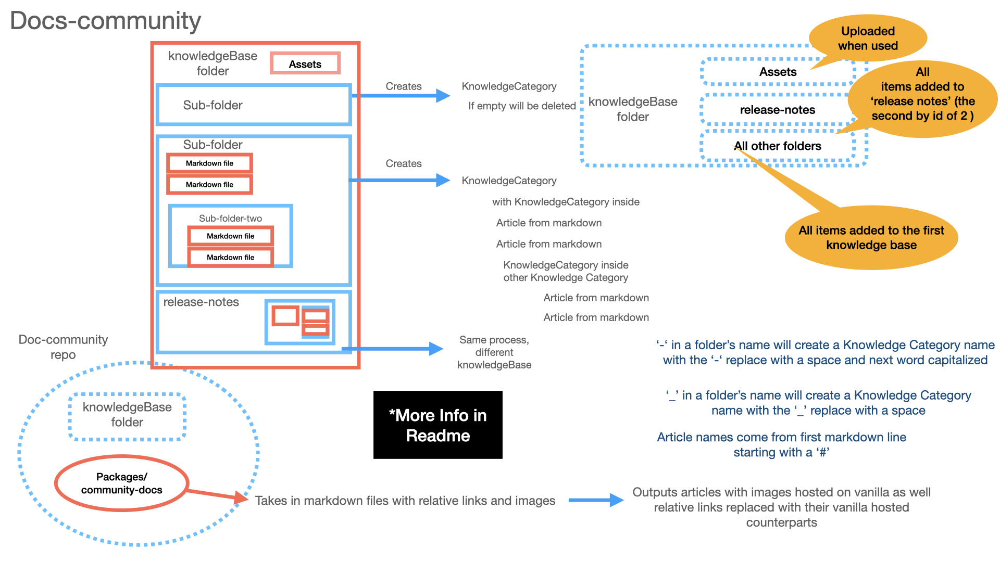
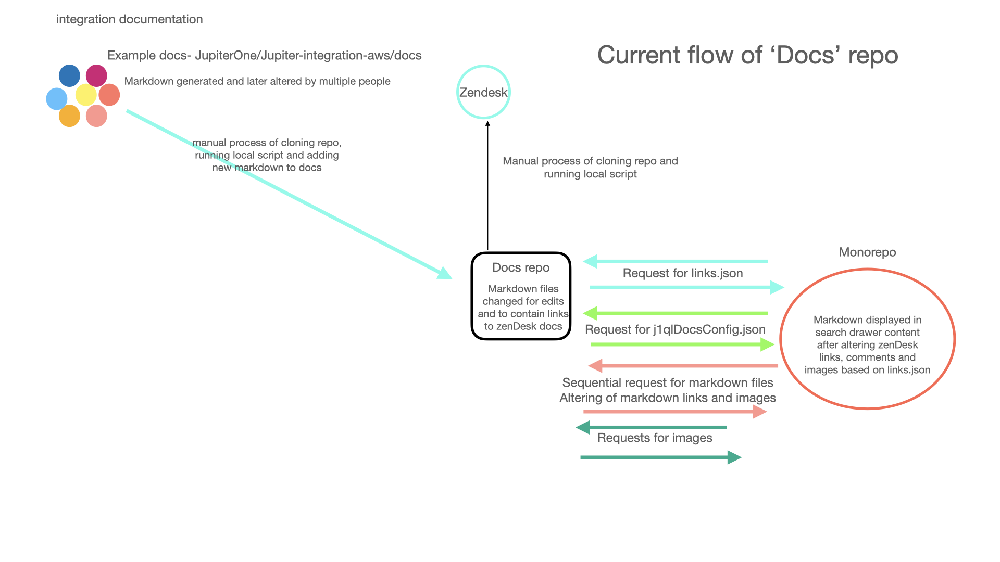
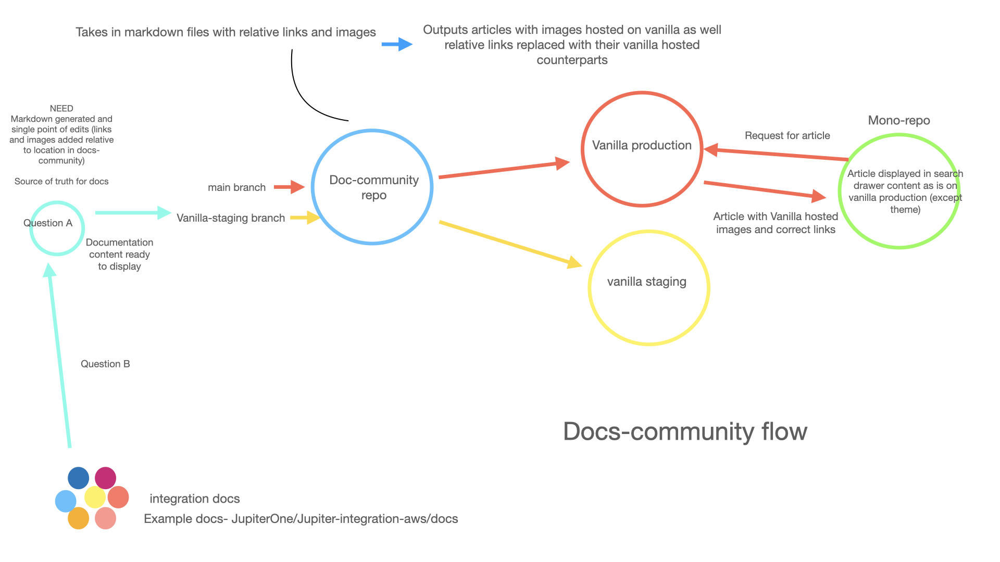

# docs-community

## Please note

- MERGE to `vanilla-staging` will make changes to `https://jupiterone.vanillastaging.com/`
- MERGE to `main` will make changes to `https://jupiterone.vanillacommunities.com/`
- knowledgeBase/Release-Notes Is its own KNOWLEDGEBASE - anything other than `/assets` within this directory will create corresponding items in the knowledgeBase 'Release Notes' which is seperate from the docs
- `When you move a file or folder, make sure to change any links TO that file/folder from other markdown files.`
- For a custom title (and not the file name), the first line `MUST` be "# Some Title". The '# ' will be removed and used for the title. Also, the first line will be removed from the article contents. If the first line is ANYTHING else (including a new line), the file name will be used.

## How to find changes

Vanilla Visable changes can be seen with an update to knowledgeBase folder, which can occur manually or with a run of `yarn updateIntegrations` and a merge to vanilla-staging. Also, at midnight, integration docs are pulled and used to overwrite the contents of their matching articles. The most recent changes will be visable within the `https://jupiterone.vanillastaging.com/kb/docs`'s `Changes From  Updates` article. This will be visable in staging but not in production. It contains each article's name and a link to that article for ease of checking links and images.

## Integrations

To add a new integration

- Make a branch and alter the `integrations.config.yaml`. Add a value for `projectName` (as it appears in the repository name), `displayName`, and `knowledgeCategoriesPaths`.

- Run `yarn updateIntegrations`
  Integrations are added by querying each repository in the `integrations.config.yaml` file.

- Check to make sure a new file has been created in the desired location.
- Add your changes
- Make a commit
- Push and create a pr for vanilla-staging

`knowledgeCategoriesPaths` is the path the where the parsed markdown (from the repositories `jupiterone.md`) is placed within the knowledgeBase. It corresponds to the knowledge categories that will be generated for the article's location in vanilla. Adding a path that does not exist will create new knowledgeCategories for which the article to reside after a merge to vanilla-staging or main.

After staging looks correct, open a pr to merge to main.

After the article appears in vanilla, it will be updated when a new version of that repository's docs is published and changes added to the knowledgeBase will be overridden with next update. The file needs to remain to allow us to keep track of their location on vanilla for structure, moves and deletes.

## To 'Refresh' vanilla staging and/or production

Create a branch from vanilla-staging. I like to use 'refresh-some-date'.

Change runDiff.ts to

```ts
import { refreshVanillaItems } from "./";
import { logger } from "./loggingUtil";

const updateCommunityDocsByMergeChanges = async () => {
  try {
    const completed = await refreshVanillaItems();

    logger.info(
      `UpdateCommunityDocs cssompleted: ${JSON.stringify(completed, null, 2)}`
    );
  } catch (error) {
    logger.error(`UpdateCommunityDocs Errored: \n ${JSON.stringify(error)}`);
  }
};
export default updateCommunityDocsByMergeChanges();
```

Then change the jenkins file to run on pr rather than merge to 'vanilla-staging' and 'main'. Replace the build and scan step with this.

```
  stage('Build and scan') {
      agent { label 'ecs-builder-node14' }
      steps {
        initBuild()
        securityScan()
        sh 'yarn install --frozen-lockfile'

        sh 'yarn lint'

        sh 'yarn test:unit'

        sh 'yarn bundle'

        sh 'jupiterone-build'
            withCredentials([
              string(credentialsId: 'VANILLA_STAGING_ENV_TOKEN', variable: 'TOKEN')
                ]) {
                  sh '''
                    TOKEN="$TOKEN" targetVanillaEnv=staging yarn start
                  '''
                }
                        withCredentials([
            string(credentialsId: 'VANILLA_PROD_ENV_TOKEN', variable: 'TOKEN')
                ]) {
                  sh '''
                    TOKEN="$TOKEN" targetVanillaEnv=prod yarn start
                  '''
                }

      }
    }
```

Create a pull request with the branch. You will have to watch jenkins to see when it is finished. This can take anywhere from 30 mins to an hour.

After jenkins completes running both staging/prod. Delete your branch and close the pr (WITHOUT MERGING). If you merge... Then ANY PR will trigger a refresh rather than just watching changes.

## How to make changes to vanilla forums via the knowledgeBase directory

A Quick rundown


- Add docs(markdown files) and directories to the `knowledgeBase` directory.
- '-' or '\_' in a file or drectory's name become a space in the article or knowledgeCategory and the next letter is capitalized.
  - Example. `knowledgeBase/hello-there/nice_people.md` becomes an article `Nice People` in a knowledge category called `Hello There`
- Assets go into the `knowledgeBase/assets` directory.
- When a merge to docs-community's `knowledgeBase` (non-assets directory) occurs, a series of processes occur to update the corresponding vanilla environment.
  - Files become `articles` in their parent `knowledgeCategory`(the directory in which the markdown file resides)
  - Assets are uploaded to vanilla (with usage in the markdown files) and the vanilla image source replaces the relative source in the markdown.
  - Links to other markdown files add extra steps of ensuring that article exists already (or adds it for you) and replaces the markdown link with that of the vanilla article's location.
- You can reference other docs and assets just like you would normally. If you can see it in a preview while working locally, and it is in the `knowledgeBase` directory, it will work once you merge.
- Assets get uploaded to vanilla on usage. When you add a new image to the assets directory it is only uploaded when it is referenced in a markdown file within the `knowledgeBase` directory.
- Assets should NOT be larger than 10mb (That is already huge).
- Supported assets are `png`, `jpg`, `jpeg` and `gif`
- Supported article files are `.md`
- Categories and Articles all need different names. If you have a `KnowledgeBase/getting-started_and-admin/catalog.md` and a `KnowledgeBase/compliance-reporting/catalog.md` ONLY ONE `Catalog` article will be created! Same thing for directory names.
- After merging, you will need to wait at least 5 mins (depending on changes) for the script to run. After that, you will need to refresh vanilla forums to see the changes (navigation within is not the same).
- If you dont see an image, but you know it exists and is in the correct directory, try adding different size and making a change to the markdown file (so it will re-add it).

## Pipeline helpers

DO NOT USE SPACES IN FILE OR DIRECTORY NAMES

Articles get their name from the first line of the readme (and starts with a '# '). Fallback name is the same as how Knowledge Category names are created.
Knowledge categories names are generated from the file name. The '-' character in a file's name will capitilize the next word and be replaced with a space.
If you do NOT want the next word capitalized, using the '\_' character will just be replaced with a space.Article and

- `the-name_is-big` will create a name of "`The Name is Big`"
- Example `KnowledgeBase/compliance-reporting/index.md` would create an article called "Compliance Reporting" inside a KnowledgeCategory named "Compliance Reporting"

The markdown files used initially had some formatting issues with the way new line characters(`\n`) were used. Now when an article is created, single (`\n`)

## Dos and Donts

Dont name any two directories or markdown with the same name.

- We currently match an article by its file name (after removing dashes/underscores and capitalizing) against what is being returned for the name of the article.

Continue to reference other markdowns as if they lived in the same directory.

- After merging these links get replaced with their location on vanilla forums.

Example usage:

- `[2]: ./jupiterone-api.md#entity-and-relationship-synchronization `

- `[security cyber asset inventory](../asset-inventory-filters.md)`

## Quick Rundown of How it Works

- Check of changes to the KnowledgeBase directory on merge.
- Each change is converted to a series of procedures. (Must be synchronous because we cant add dependants without their parents.)

- Example Change: `knowledgeBase/demo`
  - Check demo directory for children. Markdown files within `demo` become dependant on the creation of `demo`. `sub-category` becomes dependant on the creation of demo. `additional.md` is dependant on demo.
  - This leads to a list of `procedures` that need to be completed in a certain order. The knowledge categories and articles need to be created one at a time. Items that dont exist locally, but exist on vanilla`s platform are flagged for delete.
  - We compare the stucture we have locally against what articles and knowledge categories we have on the vanilla forum.
  - Additional data is added to the procedures for existing items. This allows us to delete/edit items.
- Knowledge Categories are created or flagged for delete if they dont exist locally.
- Articles are deleted if they exist on Vanilla, but not in the knowledgeBase directory
- Articles are created after their parents are successfully created on vanillas platform.
- BEFORE articles are created, We check them for images, upload the image and replace the markdown references to the ones returned by a successful upload to vanilla. The size limit is approximatly 10mb.
- Articles are then added to their already-created knowledge category.
- Articles with internal references are then altered to have the correct link to their now-or-previously-existing-articles.
- Removal of items flagged for delete
  - Non-empty knowledge categories cannot be deleted until they are empty
  - Articles are removed first since they are not dependant
  - Longest flagged for delete `change` removed recursively

## How the scripts functions

- `getDiff` returns the changes in the most recent merge.
- `updateCommunityDocs` cleans up the paths, filters out irrelevant path and converts to consumable array for `diffToProcedures`
- `diffToProcedures` takes a git diff change, and converts it to an array of Article/KnowledgeCategories which is then added in order to the other generated git diff procedures. Order is important as a Knowledge category must be made or referenced before an article can be added to it.
- `procedureToVanillaRequests` takes the created procedures, queries published Vanilla Articles and Knowledge categories and adds reliant info to the procedures. It then uploads referenced images for articles (from links in markdown to local files) and adds the returned uri from Vanilla into the markdown. It then proceeds to synchronously create Articles. Articles with references to other articles (links) are done after their linked article has been located and/or created and much like link media, srcs are swapped out for those of the article locations on vanilla forums.
- `httpClient` is the abstraction layer for https requests. It handles the CRUD operations and debounces(slows) them to not go over vanilla's usage limit.
- `VanillaApi` is the contract layer between the app's buisness logic and vanilla's API.

## Requirements and Gotchas

- When naming new (or renaming) files and directories `-` and `_` are replaced with a space and each first letter in each word is capitaled to become that Knowledge Category's or Article's name.

- References to images in markdown are limited to the knowledgeBase/assets directory.

- Images larger than 10 mb are supported but tend to fail during upload. You can make a change to the markdown file that references the image to try again.

- Vanilla has a limit on the number or requests per hour and will lock out the account for an hour if that limit is exceeded. To prevent this, a delay is added to the requests to Vanilla forums when a merge trigger changes to Vanilla Forums.

- Knowledge Categories are matched on name regardless of WHERE they reside. So if there already exists a category for `hot-to/compliance/making-policies.md` policies and you are merging a change a new directory `getting-started/compliance/policies.md`, the new file policies.md will be added as an article to
  `hot-to/compliance/`

## Dev Info and Notes

Generate procedures per array of paths, default will be for commit changes. Currently targets all of `PATH_OF_DIRECTORY_TO_WATCH` which is the 'knowledgeBase' directory.

`SHOULD_REALLY_UPLOAD_IMAGES` is a constant allowing to skip uploading images when running locally. By default (SHOULD_REALLY_UPLOAD_IMAGES=true) will upload all referenced assets (in markdown files for articles) and replace their link with that of the return from Vanilla's upload media route. This takes far too long to do during debugging and creation but was tested thoroughly.

Deleting of categories handled last. As procedures information is mapped to actual vanilla resources that already exist, articles are deleted and categories are marked for deletion. Vanilla does not support the deleting of categories that have items. To resolve this, articles are deleted first. We then sort the marked Knowledge categories by length of their path structure. Longer paths (deeper nested) get deleted first as deletable procedures are consumed.

Empty knowledge Categories are deleted.

Logging has been added (Logging.ts). This might not be the final solution but will write out error, info and debugging info into the info directories corresponding markdown files. If we change it later we just need to add the new tool to the abstraction layer in logging.ts.

## Past Docs flow for reference



## Docs-community flow

Some questions and comments were posted [here](https://jptrone.slack.com/archives/C01D4KKL7DL/p1640806911129000) in slack.

- A trigger that pulls in integrations docs on a schedule and creates a pr to staging for review is wanted. I tested the script from the docs repo, it needs some improvements but does collect the collection of docs. Simple-git could be used to create a pr via yarn script


