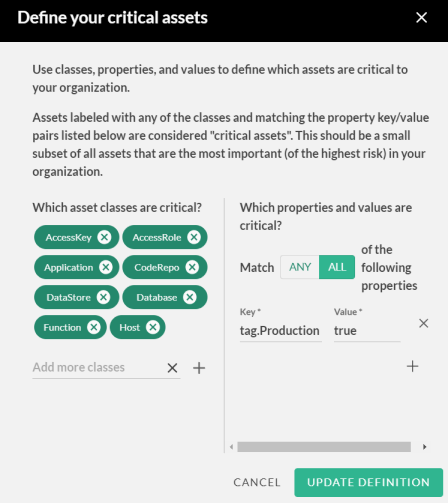

# Enable API Key Access

Follow these steps to enable API Key access:

- Go to **Settings > Users & Access**
- Select the **Group** you want to enable API access (e.g. **Administrators**)
- Check the option "**Enable API key access for users in this group**"

such a test

If you are a user within the group that had API key access enabled, you will see
an API key icon. \_Note that it may take a few minutes for the feature to be
initialized for the first time.\_dd

You generate a new API key or manage existing keys from this view.

