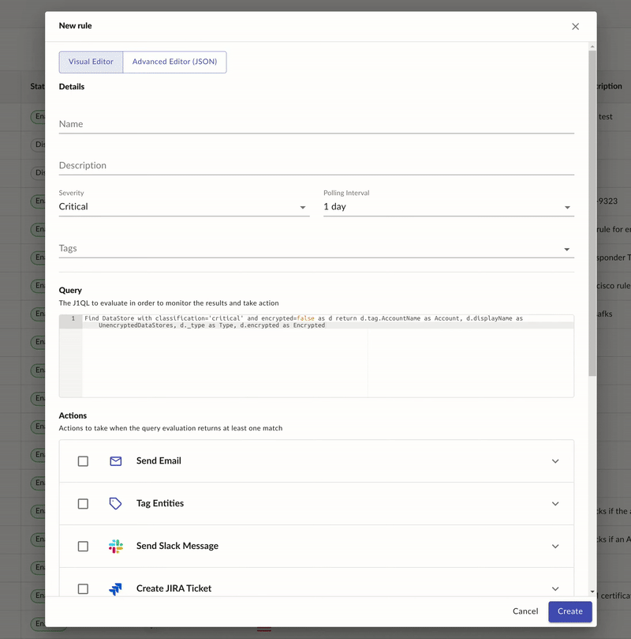

# JupiterOne Alert Rule Schema

A rule uses the results of one or more queries to execute one or more actions. The basic alert workflows are described here: [JupiterOne Alert Rule configuration documentation](https://support.jupiterone.io/hc/en-us/articles/360022720474-6-9-Alerts-and-Alert-Rules). You can also directly edit the JSON that defines a rule for more advanced workflow execution.

## Configuring a Rule

1. Navigate to the JupiterOne alert rule configuration page (https://apps.us.jupiterone.io/alerts/edit)
2. Click **Create Rule**
3. Click **Show Advanced** to open the advanced rule editor.

JSON Example:

```json
{
  "id": "552b2f27-67e2-4351-97f3-083a040350c1",
  "name": "unencrypted-critical-data-stores",
  "description": "Unencrypted data store with classification label of 'critical' or 'sensitive' or 'confidential' or 'restricted'",
  "version": 1,
  "specVersion": 1,
  "pollingInterval": "ONE_DAY",
  "question": {
    "queries": [
      {
        "name": "query0",
        "query": "Find DataStore with classification=('critical' or 'sensitive' or 'confidential' or 'restricted') and encrypted!=true",
        "version": "v1"
      }
    ]
  },
  "operations": [
    {
      "when": {
        "type": "FILTER",
        "condition": "{{queries.query0.total > 0}}"
      },
      "actions": [
        {
          "type": "CREATE_ALERT"
        }
      ]
    }
  ],
  "outputs": ["queries.query0.total", "alertLevel"]
}
```

You can also configure rules to include deleted data in the results. For example:

```
{
  "id": "...",
  "question": {
    "queries": [
      {
        "name": "query0",
        "query": "Find DataStore with classification='critical' and encrypted=false as d return d.tag.AccountName as Account, d.displayName as UnencryptedDataStores, d._type as Type, d.encrypted as Encrypted",
        "version": "v1",
        "includeDeleted": true
      },
      {
        "name": "query1",
        "query": "...",
        "version": "v1",
        "includeDeleted": false
      },
      {
        "name": "query2",
        "query": "...",
        "version": "v1"
      }
    ]
  },
  ...
}
```
## Rule Properties

| Property           | Type              | Description                              |
| ------------------ | ----------------- | ---------------------------------------- |
| `id`               | `string`          | Auto-generated, globally unique ID of each rule. |
| `version`          | `number`          | Current version of the rule. Incremented each time the rule is updated. |
| `name`             | `string`          | Name of the rule, which is unique to each account. |
| `description?`     | `string`          | A description of the rule.               |
| `specVersion`      | `number`          | Rule evaluation version in the case of breaking changes. |
| `pollingInterval?` | `PollingInterval` | Frequency of automated rule evaluation. Options are `DISABLED`, `THIRTY_MINUTES`, `ONE_HOUR`, `FOUR_HOURS`, `EIGHT_HOURS`, `TWELVE_HOURS`, `ONE_DAY`, `ONE_WEEK`. Defaults to `ONE_DAY`. |
| `question`         | `Question`        | Contains properties related to queries used in the rule evaluation. |
| `operations`       | `RuleOperation[]` | Actions that are executed when a corresponding condition is met. |
| `templates?`       | `object`          | Optional key/value pairs of template name to template. |
| `outputs`          | `string[]`        | Names of properties that can be used throughout the rule evaluation process and will be included in each record of a rule evaluation (for example, `queries.query0.total`). |

### Type: PollingInterval

Enumeration of the scheduled frequencies on which rules can automatically be evaluated. Possible values:

```
ONE_DAY
ONE_HOUR
THIRTY_MINUTES
DISABLED
```

### Type: RuleOperation

A `RuleOperation` is a single `condition` and series of `action`s that are executed when the `condition` is met.

| Property  | Type                                     | Description                              |
| --------- | ---------------------------------------- | ---------------------------------------- |
| `when?`   | `RuleOperationCondition\|RuleOperationCondition[]` | Type of conditional used to determine whether the associated actions should be executed. |
| `actions` | `RuleOperationAction[]`                  | Actions that should be executed when the `when` conditions have been met. |

### Type: Question

A Question contains a collection of named queries that should be executed during the rule evaluation process and whose responses can be used in any `RuleOperation`.

| Property  | Type              | Description                              |
| --------- | ----------------- | ---------------------------------------- |
| `queries` | `QuestionQuery[]` | The collection of queries that are used during the rule evaluation. |

### Type: QuestionQuery

A named query that should be executed during the rule evaluation process and whose responses can be used in any `RuleOperation`.

| Property         | Type      | Description                              |
| ---------------- | --------- | ---------------------------------------- |
| `name?`          | `string`  | Optional name to assign the query that will be used when referencing query data in `RuleOperation`s. If not provided, the query name is automatically assigned based on the index in the `queries` array (for example, `query0`, `query1`). |
| `query`          | `string`  | JupiterOne query to execute.             |
| `version`        | `string`  | JupiterOne query language execution version (for example, `v1`). |
| `includeDeleted` | `boolean` | Whether deleted data should be considered for the specific query (defaults to `false`). |

### Type: RuleOperationCondition

The condition that determines whether the associated actions should be executed. The type of `RuleOperationCondition` is determined using the `type` property.

#### Type: FilterRuleOperationCondition

| Property    | Type     | Description                              |
| ----------- | -------- | ---------------------------------------- |
| `type`      | `string` | Rule operation condition type: `FILTER`. |
| `condition` | `string` | Template condition (for example, `{{queries.query0.total > 0}}`). |

### Type: RuleOperationAction

Action that is executed when a corresponding condition is met. The type of `RuleOperationAction` is determined using the `type` property.

---

#### Action: `SET_PROPERTY`

> Includes a property that can be used in rule evaluation input.

| Property         | Type                    | Description                              |
| ---------------- | ----------------------- | ---------------------------------------- |
| `type`           | `string`                | Rule operation action type: `SET_PROPERTY.` |
| `targetProperty` | `string`                | Property to include in the evaluation input. |
| `targetValue`    | `number|string|boolean` | Property to include in the evaluation input. |

Example:

```json
{
  "type": "SET_PROPERTY",
  "targetProperty": "alertLevel",
  "targetValue": "CRITICAL"
}
```

---

#### Action: `CREATE_ALERT`

> Creates a JupiterOne alert that is visible in J1 Alerts.

| Property | Type     | Description                              |
| -------- | -------- | ---------------------------------------- |
| `type`   | `string` | Rule operation action type: `CREATE_ALERT` |

Example:

```json
{
  "type": "CREATE_ALERT"
}
```

---

#### Action: `SEND_EMAIL`

> Sends an email to a list of recipients with details related to alerts that are created during the rule evaluation.

| Property     | Type       | Description                              |
| ------------ | ---------- | ---------------------------------------- |
| `type`       | `string`   | Rule operation action type: `SEND_EMAIL`. |
| `recipients` | `string[]` | Email addresses of the recipients of this alert. |
| `body?`      | `string`   | Optional additional body information of the email. |

Example:

```json
{
  "type": "SEND_EMAIL",
  "recipients": ["no-reply@jupiterone.io"]
}
```

###### Multiple Queries in a Rule

You can pass multiple queries into an alert rule that allows each query to output its results into the same, single alert. 

This example shows multiple queries sending out an email alert to multiple recipients: 

```
{
  "id": "2c5de5c6-592c-4e97-baba-f1cca04bb9c9",
  "name": "ChrisLarson-Test5",
  "description": "Test5",
  "version": 28,
  "specVersion": 1,
  "pollingInterval": "ONE_WEEK",
  "templates": {
    "tempMap": "Project: {{item.Project}}, ProjectFindings: {{item.ProjectFindings}}, RepoFindings: {{item.RepoFindings}}"
  },
  "outputs": [
    "alertLevel"
  ],
  "question": {
    "queries": [
      {
        "name": "query0",
        "query": "Find CodeRepo THAT RELATES TO Project with repoName!=undefined as p THAT HAS Finding as f RETURN p.repoName as Project, count(f) as ProjectFindings",
        "version": "v1",
        "includeDeleted": false
      },
      {
        "name": "query1",
        "query": "Find Project with repoName!=undefined THAT RELATES TO CodeRepo as p THAT HAS Finding as f RETURN p.displayName as Project, count(f) as RepoFindings",
        "version": "v1",
        "includeDeleted": false
      }
    ]
  },
  "operations": [
    {
      "when": {
        "type": "FILTER",
        "specVersion": 1,
        "condition": [
          "OR",
          [
            "queries.query0.total",
            ">",
            0
          ],
          [
            "queries.query1.total",
            ">",
            0
          ]
        ]
      },
      "actions": [
        {
          "targetValue": "INFO",
          "id": "23c3a81a-0de9-41e9-9ec4-200a28a67dd1",
          "type": "SET_PROPERTY",
          "targetProperty": "alertLevel"
        },
        {
          "type": "CREATE_ALERT",
          "id": "f733cd50-6172-4dad-9f2d-0cba236915af"
        },
        {
          "id": "62a4dbcd-5061-4f2e-a166-1a5ed88131a5",
          "type": "SEND_EMAIL",
          "body": "Affected Items: <br><br>* {{queries.query0.data|mapTemplate('tempMap')|join('<br>* ')}} / <br>* {{queries.query1.data|mapTemplate('tempMap')|join('<br>* ')}}",
          "recipients": [
            "christopher.larson@jupiterone.com",
            "erica.nagle@jupiterone.com",
            "akash.ganapathi@jupiterone.com"
          ]
        }
      ]
    }
  ],
  "tags": []
}
```

This example shows multiple queries sending results to Jira to create a single Jira issue:

```
{
  "id": "34c8d517-d0ad-4ca9-93c4-21232300d9f2",
  "name": "ChrisLarson-Jira-Test",
  "description": "Test to see if multiple queries can be alerted into a Jira Alert",
  "version": 8,
  "specVersion": 1,
  "pollingInterval": "ONE_DAY",
  "templates": {
    "tempMap": "Project: {{item.Project}}, ProjectFindings: {{item.ProjectFindings}}, RepoFindings: {{item.RepoFindings}}"
  },
  "outputs": [
    "alertLevel"
  ],
  "question": {
    "queries": [
      {
        "name": "query0",
        "query": "Find CodeRepo THAT RELATES TO Project with repoName!=undefined as p THAT HAS Finding as f RETURN p.repoName as Project, count(f) as ProjectFindings",
        "version": "v1",
        "includeDeleted": false
      },
      {
        "name": "query1",
        "query": "Find Project with repoName!=undefined THAT RELATES TO CodeRepo as p THAT HAS Finding as f RETURN p.displayName as Project, count(f) as RepoFindings",
        "version": "v1",
        "includeDeleted": false
      }
    ]
  },
  "operations": [
    {
      "when": {
        "type": "FILTER",
        "specVersion": 1,
        "condition": [
          "OR",
          [
            "queries.query0.total",
            ">",
            0
          ],
          [
            "queries.query1.total",
            ">",
            0
          ]
        ]
      },
      "actions": [
        {
          "targetValue": "INFO",
          "id": "71d336c0-0d3a-4a99-93e1-1707e3e260d6",
          "type": "SET_PROPERTY",
          "targetProperty": "alertLevel"
        },
        {
          "type": "CREATE_ALERT",
          "id": "2a9b5494-8596-49f1-a2e0-56beff27d08f"
        },
        {
          "summary": "Test5 - 2 Queries, mapTemplate",
          "issueType": "Task",
          "entityClass": "Finding",
          "integrationInstanceId": "53a99eaa-18a5-45ef-b748-2de39d642a91",
          "additionalFields": {
            "description": {
              "type": "doc",
              "version": 1,
              "content": [
                {
                  "type": "paragraph",
                  "content": [
                    {
                      "type": "text",
                      "text": "{{alertWebLink}}\n\n**Affected Items:**\n\n* {{queries.query0.data|mapTemplate('tempMap')|join('\n* ')}} \n\n***************\n\n {{queries.query1.data|mapTemplate('tempMap')|join('\n* ')}}"
                    }
                  ]
                }
              ]
            }
          },
          "project": "CT",
          "id": "f1d85470-41a5-4670-8a70-4c0622f0f1f2",
          "type": "CREATE_JIRA_TICKET"
        }
      ]
    }
  ],
  "tags": []
}
```


---

#### Action `CREATE_JIRA_TICKET`

> Creates a Jira ticket using a specific JupiterOne Jira integration configuration.

| Property                | Type     | Description                              |
| ----------------------- | -------- | ---------------------------------------- |
| `type`                  | `string` | Rule operation action type: `CREATE_JIRA_TICKET.` |
| `integrationInstanceId` | `string` | The `id` of the JupiterOne Jira integration that should be used to create the ticket. |
| `entityClass`           | `string` | The `class` of the new ticket entity that should be created in JupiterOne. (for example,`Vulnerability`) |
| `project`               | `string` | The unique Jira project ID that the ticket is created in. |
| `summary`               | `string` | Summary of the Jira ticket. Used as the ticket title. |
| `issueType`             | `string` | The Jira issue type (for example, `Task`). |
| `additionalFields?`     | `object` | Optional additional fields that are passed directly to the Jira API. |

Example:

```json
{
  "type": "CREATE_JIRA_TICKET",
  "integrationInstanceId": "b59cfa95-2201-4173-bea4-be9b26661553",
  "entityClass": "Vulnerability",
  "project": "81198",
  "summary": "Ticket summary",
  "issueType": "Task",
  "additionalFields": {
    "description": {
      "type": "doc",
      "version": 1,
      "content": [
        {
          "type": "paragraph",
          "content": [
            {
              "type": "text",
              "text": "Jira description here!"
            }
          ]
        }
      ]
    }
  }
}
```

If your query returns multiple results, you can run a second query using the results of the first query to create a Jira ticket for each item in the first query results. You do this by [editing the advanced JSON of the alert rule](##configuring-a-rule) to use the `FOR_EACH_ITEM` action type. It is not recommended that you use this action type if your results sizes are very large. 

For example:

```json
{
  "name": "",
  "description": "",
  "specVersion": 1,
  "pollingInterval": "ONE_WEEK",
  "question": {
    "queries": [
      {
        "name": "query0",
        "query": "Find DataStore with classification='critical' and encrypted=false",
        "version": "v1",
        "includeDeleted": false
      }
    ]
  },
  "operations": [
    {
      "when": {
        "type": "FILTER",
        "specVersion": 1,
        "condition": [
          "AND",
          [
            "queries.query0.total",
            ">",
            0
          ]
        ]
      },
      "actions": [
        {
          "type": "SET_PROPERTY",
          "targetValue": "CRITICAL",
          "targetProperty": "alertLevel"
        },
        {
          "type": "CREATE_ALERT"
        },
        {
          "itemRef": "obj",
          "type": "FOR_EACH_ITEM",
          "items": "{{queries.query0.data}}",
          "actions": [
            {
                "type": "CREATE_JIRA_TICKET",
                "summary": "{{alertRuleDescription}}",
                "issueType": "",
                "entityClass": "{{ obj.entity._type | join(',') }}",
                "integrationInstanceId": "{{ obj.entity._integrationInstanceId }}",
                "additionalFields": {
                  "description": {
                    "type": "doc",
                    "version": 1,
                    "content": [
                      {
                        "type": "paragraph",
                        "content": [
                          {
                            "type": "text",
                            "text": "{{alertWebLink}}\n\n**Affected Items:**\n\n* {{obj.properties.webLink}}"
                          }
                        ]
                      }
                    ]
                  }
                },
                "project": "{{param.MySpecialProject}}"
              }
          ]
        }
      ]
    }
  ],
  "outputs": [
    "alertLevel"
  ],
  "templates": {}
}
```


---

#### Action: `SEND_SLACK_MESSAGE`

> Sends a Slack message to a given Slack webhook URL.

| Property                | Type     | Description                              |
| ----------------------- | -------- | ---------------------------------------- |
| `integrationInstanceId` | `string` | The `id` of the JupiterOne Jira integration used to create the ticket. |
| `type`                  | `string` | Rule operation action type: `SEND_SLACK_MESSAGE`. |
| `channels`              | `string` | A string or list of strings beginning with a `#` to denote Slack channels to send to. |
| `webhookUrl`            | `string` | Webhook URL for the account/channel that this message should be delivered to. |
| `severity`              | `string` | Optional severity of this alert that determined the color of the message shown in Slack. |

**NOTE**: By default, the color of the alert in Slack is derived from the 
value of the `alertLevel` that is created in a `SET_PROPERTY` action. 
You can override the color of the alert using the `severity` property.

Example:

After you have configured the integration, copy the integration ID from the
integration instance page, which looks similar to `d1549f40-b9fd-447a-bec5-4360c9ca7e8c`.


1. Configure a rule with the `SEND_SLACK_MESSAGE` action and specify the
   `integrationInstanceId` with the unique identifier of the integration and `channels`
   denoting the destinations. The following is an example alert rule configuration with the
   `SEND_SLACK_MESSAGE` action:

**NOTE**: For the JupiterOne Slack bot to deliver messages to a private Slack channel, 
the JupiterOne Slack bot must be a member of that private channel.

```json
{
  "name": "slack-alert-test",
  "description": "Testing Slack Messages",
  "specVersion": 1,
  "pollingInterval": "ONE_DAY",
  "templates": {
    "slackBody": "JupiterOne Account: {{item.displayName}}\n\n"
  },
  "question": {
    "queries": [
      {
        "name": "query0",
        "query": "Find DataStore with classification=('critical' or 'sensitive' or 'confidential' or 'restricted') and encrypted!=true",
        "version": "v1"
      }
    ]
  },
  "operations": [
    {
      "when": {
        "type": "FILTER",
        "specVersion": 1,
        "condition": "{{queries.query0.total > 0}}"
      },
      "actions": [
        {
          "targetValue": "HIGH",
          "type": "SET_PROPERTY",
          "targetProperty": "alertLevel"
        },
        {
          "type": "CREATE_ALERT"
        },
        {
          "integrationInstanceId": "d1549f40-b9fd-447a-bec5-4360c9ca7e8c",
          "channels": ["#random"],
          "type": "SEND_SLACK_MESSAGE",
          "body": "{{queries.query0.data|mapTemplate('slackBody')|join(' ')}}"
        }
      ]
    }
  ],
  "outputs": ["queries.query0.total", "alertLevel"]
}
```

---

#### Action: `WEBHOOK`

> Sends an HTTP request to a given endpoint.

| Property   | Type     | Description                                                  |
| ---------- | -------- | ------------------------------------------------------------ |
| `type`     | `string` | Rule operation action type: `WEBHOOK`                        |
| `endpoint` | `string` | Webhook endpoint to send the request to.                     |
| `method`   | `string` | HTTP method to use when making the request Allowed values: `POST`, `PUT`, `GET`, `HEAD`, `PATCH`, `DELETE`. |
| `body?`    | `object` | Body data to include in the request. Can only be used with `POST`, `PUT`, and `PATCH`. |
| `headers?` | `object` | HTTP headers to include in the request.                      |

#### Webhook Reference Variables

You can reference the following variables via a template pattern (such as *{{alertLevel}}*) inside the webhook action:

| Property               | Type     | Description                                  |
| ---------------------- | -------- | -------------------------------------------- |
| `alertLevel`           | `string` | Level of severity of the rule.               |
| `alertRuleName`        | `string` | Name of the alert rule.                      |
| `alertRuleId`          | `string` | Identifier for the alert in the J1 platform. |
| `alertRuleDescription` | `string` | Description saved in the rule.               |

Example:

```json
{
  "type": "WEBHOOK",
  "method": "POST",
  "body": {
    "myApiPayload": " {{alertLevel}} alert has been triggered: {{alertRuleName}} "
  },
  "headers": {
    "Authorization": "Bearer abc123"
  }
}
```

##### Tines Trigger

If you opt to use a Tines alert action when you create a rule, J1 creates a webhook with the Tines URL you provided and pushes the data to that endpoint. You can use any of the [Tines APIs](https://www.tines.com/api/actions/create) to configure the webhook action.


 

---

#### Action: `PUBLISH_SNS_MESSAGE`

> Publishes a message to the specified SNS topic.

| Property                | Type     | Description                              |
| ----------------------- | -------- | ---------------------------------------- |
| `type`                  | `string` | Rule operation action type: `PUBLISH_SNS_MESSAGE`. |
| `integrationInstanceId` | `string` | The ID of the AWS integration instance to use. The integration role must have `sns:Publish` permission. |
| `topicArn`              | `string` | The ARN of the SNS topic to publish the message to. |
| `data`                  | `object` | User-provided data to include in the message. See [Operation Templating](#operationtemplating) for details on using variable data. |

Example:

```json
{
  "type": "PUBLISH_SNS_MESSAGE",
  "integrationInstanceId": "...",
  "topicArn": "arn:aws:sns:<REGION>:arn:aws:sns:<ACCOUNT_ID>:<SNS_TOPIC_NAME>",
  "data": {
    "query0Data": "{{queries.query0.data}}",
    "anotherCustomProperty": true
  }
}
```

```
!!! Note:
```

`data` is stringified in the payload. For example:

```js
{
  Sns: {
    Message: '{"data":{"query0Data": ..., "anotherCustomProperty": true}}'
  }
}
```

---

#### Action: `SEND_SQS_MESSAGE`

> Publishes a message to the specified SQS queue.

| Property                | Type     | Description                              |
| ----------------------- | -------- | ---------------------------------------- |
| `type`                  | `string` | Rule operation action type: `SEND_SQS_MESSAGE`. |
| `integrationInstanceId` | `string` | The ID of the AWS integration instance to use. The integration role must have `sqs:SendMessage` permission. |
| `queueUrl`              | `string` | The URL of the SQS queue to publish the message to. |
| `data`                  | `object` | User-provided data to include in the message. See [Operation Templating](#operationtemplating) for details on using variable data. |

Example:

```json
{
  "type": "SEND_SQS_MESSAGE",
  "integrationInstanceId": "...",
  "queueUrl": "https://sqs.<REGION>.amazonaws.com/<ACCOUNT_ID>/<SQS_QUEUE_NAME>",
  "data": {
    "query0Data": "{{queries.query0.data}}",
    "anotherCustomProperty": true
  }
}
```

!!! warning
      `data` is stringified in the payload. For example:

```js
{
  body: '{"data":{"query0Data": ..., "anotherCustomProperty": true}}'
}
```

## Operation Templating

You can use templates inside any property under the `operations` property on a rule. 
The templates can contain a JavaScript-like syntax that automatically 
have input variables injected for usage.

For example, `FilterRuleOperationCondition`s are often used with rules as the 
condition for whether rule actions should be executed. 
You can use query response data inside of the rule conditions:

```js
{
  "operations": [
    {
      "when": {
        "type": "FILTER",
        // Use the `.total` property from query named `query0`.
        "condition": "{{queries.query0.total > 0}}"
      },
      "actions": [
        {
          "type": "CREATE_ALERT"
        }
      ]
    }
  ]
}
```

You can use data from query results inside of rule operations by referencing the 
`query.query0.data` property and custom templating transforms. For example:

```js
{
  "name": "lambda-function-settings-check-runtime-nodejs610",
  "description": "Node.js 6.10 is end of life (EOL) and should no longer be used.",
  "specVersion": 1,
  "pollingInterval": "ONE_DAY",
  "templates": {
    // The email template that we will use later
    "emailBody": "({{itemIndex+1}} of {{itemCount}}) [{{item.account}}] Function Name: {{item.functionName}}<br>"
  },
  "question": {
    "queries": [
      {
        "name": "query0",
        "query": "Find aws_lambda_function with runtime='nodejs6.10' as f return f.name 
        as functionName, f.version as version, f.tag.AccountName as account, f.tag.Project as project order by account",
        "version": "v1"
      }
    ]
  },
  "operations": [
    {
      "when": {
        "type": "FILTER",
        "specVersion": 1,
        "condition": "{{queries.query0.total > 0}}"
      },
      "actions": [
        {
          "targetValue": "HIGH",
          "type": "SET_PROPERTY",
          "targetProperty": "alertLevel"
        },
        {
          "type": "CREATE_ALERT"
        },
        {
          "type": "SEND_EMAIL",
          // Reference the `query0` data and include it in a template
          "body": "Affected Functions: <br><br>{{queries.query0.data|mapTemplate('emailBody')|join(' ')}}",
          "recipients": ["no-reply@jupiterone.io"]
        }
      ]
    }
  ],
  "outputs": ["queries.query0.total", "alertLevel"]
}
```

## Rule Evaluation Templating Language

You can create a template in any `RuleOperation` using the `{{...}}` syntax. 
Inside the `{{...}}` is a JavaScript-like language that allows for powerful 
rule evaluation functionality. Additionally, if the template contains exactly 
one expression and nothing else, the original type of the computed value is 
preserved. If multiple expressions are used, the entire value is casted to a string.

The following is an example where the type `boolean` is preserved because 
there is only a single expression:

```
{{true}}
```

The following is an example where the entire value would be cast to a 
string because it contains multiple expressions:

```
{{age + 10}} is my age and my name is {{firstName + " " + lastName}}
```

All templating expressions support references to  [account parameters](#parametersinrules):

```
My name is {{param.myFirstName}} and I am {{age}}
```

### Unary Operators

| Operation | Symbol |
| --------- | :----: |
| Negate    |  `!`   |

### Binary Operators

| Operation        | Symbol |
| ---------------- | :----: |
| Add, Concat      |  `+`   |
| Subtract         |  `-`   |
| Multiply         |  `*`   |
| Divide           |  `/`   |
| Divide and floor |  `//`  |
| Modulus          |  `%`   |
| Power of         |  `^`   |
| Logical AND      |  `&&`  |
| Logical OR       |  `||`  |

### Comparisons

| Comparison                 | Symbol |
| -------------------------- | :----: |
| Equal                      |  `==`  |
| Not equal                  |  `!=`  |
| Greater than               |  `>`   |
| Greater than or equal      |  `>=`  |
| Less than                  |  `<`   |
| Less than or equal         |  `<=`  |
| Element in array or string |  `in`  |

### Ternary operator

| Expression                          | Result |
| ----------------------------------- | ------ |
| `"" ? "Full" : "Empty"`             | Empty  |
| `"foo" in "foobar" ? "Yes" : "No"`  | Yes    |
| `{agent: "Archer"}.agent ?: "Kane"` | Archer |

### Native Types

| Type     |              Examples              |
| -------- | :--------------------------------: |
| Booleans |          `true`, `false`           |
| Strings  | `"Hello \"user\""`, `'Hey there!'` |
| Numerics |    `6`, `-7.2`, `5`, `-3.14159`    |
| Objects  |        `{hello: "world!"}`         |
| Arrays   |       `['hello', 'world!']`        |

### Groups

Grouping operations with parentheses:

| Expression                  | Result |
| --------------------------- | :----- |
| `(83 + 1) / 2`              | 42     |
| `1 < 3 && (4 > 2 || 2 > 4)` | true   |

## Custom Templating Transforms

Some custom transforms are exposed in the rule templating language.  These are
functions that perform actions on an input, and can be chained together to accomplish
some powerful actions.

#### `mapTemplate(templateName: string)` Custom Transform

`mapTemplate` is separates and reuses templates inside of a rule. 
The transform expects a single array and the first argument should 
be a string whose value matches a template in rule `templates` object.

The `mapTemplate` transform exposes additional input variable to the template:

| Property    | Type     | Description                              |
| ----------- | -------- | ---------------------------------------- |
| `item`      | `any`    | The individual item of this iteration.   |
| `itemCount` | `number` | The total count of items in the array.   |
| `itemIndex` | `number` | The index of the current `item` in the array |

!!! note 
The properties that are accessible on the `item` property are pulled 
from the `properties` object and the `entity` object if the `item` matches the schema for an entity.

Example operation:

```js
{
  "type": "SEND_EMAIL",
  // Reference the `query0` data and include it in a template
  "body": "{{queries.query0.data|mapTemplate('emailBody')|join(' ')}}",
  "recipients": ["no-reply@jupiterone.io"]
}
```

Example `templates`:

```js
{
  "emailBody": "({{itemIndex+1}} of {{itemCount}}) [{{item.account}}] Function Name: {{item.somePropertyOnItem}}<br>"
}
```

#### `mapProperty(...properties: string)` Custom Transform

Allows for mapping individual properties from an array. You can supply 
a single or multiple properties. The properties that are
accessible are pulled from the `properties` object and the 
`entity` object if the `item` matches the schema for an entity.
If the array that is being evaluated with `mapProperty` matches the 
schema of an entity, the the rule evaluator attempts to pull 
properties passed to `mapProperty` from the entity properties.

Example query data:

```js
{
  "query": "FIND Person",
  "data": [
    {
      "id": "",
      "entity": {
        "_createdOn": 1234
        // ...
      },
      "properties": {
        "firstName": "Jon"
        // ...
      }
    },
    {
      "id": "",
      "entity": {
        "_createdOn": 12345
        // ...
      },
      "properties": {
        "firstName": "Jane"
        // ...
      }
    }
  ]
}
```

This is an example of accessing `properties` data using `mapProperty` and the above data:

```js
{
  "type": "SEND_EMAIL",
  // This would return: `Jon,Jane`
  "body": "{{queries.query0.data|mapProperty('firstName')|join}}",
  "recipients": ["no-reply@jupiterone.io"]
}
```

This is an example accessing `entity` data using `mapProperty` and the above data:

```js
{
  "type": "SEND_EMAIL",
  // This would return: `1234,12345`
  "body": "{{queries.query0.data|mapProperty('_createdOn')|join}}",
  "recipients": ["no-reply@jupiterone.io"]
}
```

#### `merge(...data: array)` Custom Transform

Allows for merging 1 or more arrays together to create a new array of
the combined results.  This transform does not perform any deduplication; all elements
of the input arrays are present in the output. This is usually used to combine the
results of two or more J1QL queries into a common set of query results.

Example query configuration:

```js
{
  "queries": [
    {
      "query": "Find User with name ~=\"first.last\" as a RETURN a.displayName as DisplayName",
      "name": "query0",
      "version": "v1",
      "includeDeleted": false
    },
    {
      "query": "Find User with name ~=\"firstLast\" as b RETURN b.displayName as DisplayName",
      "name": "query1",
      "version": "v1",
      "includeDeleted": false
    }
  ]
}
```

This is an example of merging the results of these two queries together, and getting
the number of total results.

```js
{
  "type": "SEND_EMAIL",
  "body": "{{queries.query0.data|merge(queries.query1.data)|length}}",
  "recipients": ["no-reply@jupiterone.io"]
}
```

#### `join(separator?: string)` Custom Transform

This function is similar to the `Array.prototype.join` function in JavaScript. 
It returns a new string by concatenating all of the elements in an array. 
If the `separator`argument is not passed to `join`, the array elements 
are separated by a comma, by default.

This transform is often used with `mapTemplate` or `mapProperty`.

Example:

```json
{
  "type": "SEND_EMAIL",
  "body": "{{queries.query0.data|mapTemplate('emailBody')|join(' ')}}",
  "recipients": ["no-reply@jupiterone.io"]
}
```

Example of default if no `separator` is passed to `join`:

```json
{
  "type": "SEND_EMAIL",
  "body": "{{queries.query0.data|mapTemplate('emailBody')|join}}",
  "recipients": ["no-reply@jupiterone.io"]
}
```

#### `uniquePropertyValues(propertyName: string)` Custom Transform

Creates a set of unique values for the given property name.  The transform
will pull all properties from the `entity` and `properties` sub-properties to
the top level to try to access the passed in `propertyName`.

Example query data:

```js
{
  "query": "FIND Person",
  "data": [
    {
      "id": "1",
      "entity": {
        "_createdOn": 1234
        // ...
      },
      "properties": {
        "firstName": "Jon"
        // ...
      }
    },
    {
      "id": "2",
      "entity": {
        "_createdOn": 12345
        // ...
      },
      "properties": {
        "firstName": "Jane"
        // ...
      }
    },
    {
      "id": "3",
      "entity": {
        "_createdOn": 5555
        // ...
      },
      "properties": {
        "firstName": "Jon"
        // ...
      }
    },
  ]
}
```

This is an example of accessing deduplicating a property of an array of entities:

```js
{
  "type": "SEND_EMAIL",
  // This would return: ["Jon","Jane"]
  "body": "{{queries.query0.data|uniquePropertyValues('firstName')}}",
  "recipients": ["no-reply@jupiterone.io"]
}
```


### Common Templating Examples

Merging multiple query results to generate a unique set of values for a given property printed on a new line
```js
"{{queries.query0.data|merge(queries.query1.data)| uniquePropertyValues('firstName')|join('\n')}}"

// Will display something like:
//
// firstName1
// firstName2
// ...
```

Using a template to display multiple properties from a set of query results
```js
// In the templates definition
myTemplateName: "Property1: {{item.propertyName1}} - Property2: {{item.propertyName2}}"

// In your rule action
"{{queries.query0.data|mapProperty('propertyName1', 'propertyName2')|mapTemplate('myTemplateName')|join('\n')}}"

// Will display something like:

// Property1: value1 - Property2 - value2
// Property1: value3 - Property2 - value4
// ...
```

## Filtering Collections
Collections, or arrays of objects, can be filtered by including a filter expression in brackets. Properties of each collection can be referenced by prefixing them with a leading dot. The result will be an array of the objects for which the filter expression resulted in a truthy value.

Example context:

```js
{
  employees: [
    {first: 'Sterling', last: 'Archer', age: 36},
    {first: 'Malory', last: 'Archer', age: 75},
    {first: 'Lana', last: 'Kane', age: 33},
    {first: 'Cyril', last: 'Figgis', age: 45},
    {first: 'Cheryl', last: 'Tunt', age: 28}
  ],
  retireAge: 62
}
```

|Expression                             |	Result                                       |
|:--------------------------------------|:---------------------------------------------|
|employees[.first == 'Sterling']        |	[{first: 'Sterling', last: 'Archer', age: 36}]
|employees[.last == 'Tu' + 'nt'].first	| Cheryl
|employees[.age >= 30 && .age < 40]	    | [{first: 'Sterling', last: 'Archer', age: 36},{first: 'Lana', last: 'Kane', age: 33}]
|employees[.age >= 30 && .age < 40][.age < 35] |	[{first: 'Lana', last: 'Kane', age: 33}]
| employees[.age >= retireAge].first    |	Malory

## Parameters in Rules

Rules support reference to parameter values stored at the account-level.
These parameters simplify the task of referencing long, sensitive, or 
widely reused values in rules or queries.  For example, the following 
action trigger is nearly identical to [the slack webhook](#actionwebhook) example:


```json
{
  "type": "WEBHOOK",
  "method": "POST",
  "body": {
    "name": "Jon"
  },
  "headers": {
    "Authorization": "Bearer {{param.SlackAuthToken}}"
  }
}
```

This showcases a primary use case of parameter storage: a value that is 
long, not human-readable, and may represent a sensitive value which 
should not be leaked in the configuration.

`param.SlackAuthToken` invokes a parameter stored at the account level, 
which is referenced when the rule is evaluated. These parameters are 
always referenced with the preceding token `param.`. The subsequent 
string (without special characters) identifies the name of a parameter.

Parameters are supported anywhere that [Operation Templating](#operationtemplating) 
is supported, and the value of a parameter can be any type of 
[native type](#nativetypes) with the **exclusion of objects**, 
which support comparison *against* parameters but cannot be the 
contents of a parameter.  Additionally, parameters can store 
lists of native types, and template expressions can invoke 
parameter lists similarly to examples above. For example, 
[using the email example](#actionsend_email), we can parameterize the recipient list:

```js
{
  "type": "SEND_EMAIL",
  "body": "{{queries.query0.data|mapTemplate('emailBody')|join(' ')}}",
  // a stored list of email strings:
  "recipients": "{{param.alertEmailRecipientList}}" 
}
```

For more info on JupiterOne parameters, [reference the documentation](../jupiterOne-data-model/parameters.md).

