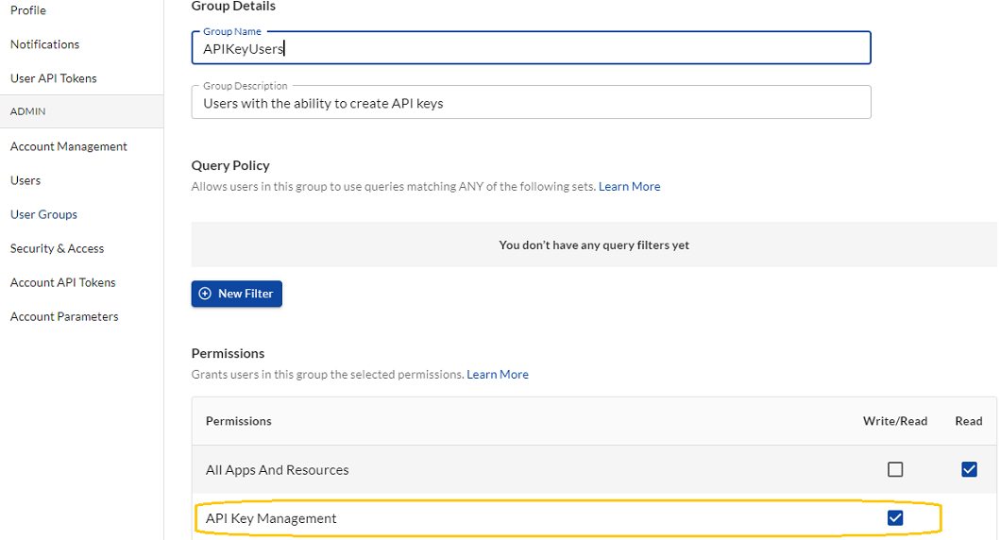
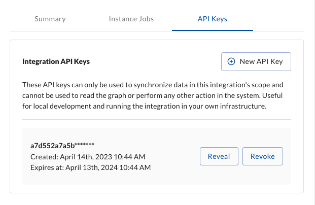

# Creating User and Account API Keys

API keys enable users to use the J1 APIs in queries and with integrations. You can enable the use of API keys for a group of users and create API keys for your organization account.

## Enable User-Level API Key Access

You must have the Administrator permission to enable API key access.

To enable API key access for a group of users:

1. Go to **Settings  > User Groups**.
2. Select the group for whom you want to enable API access.
3. Scroll to the Permissions section and select **API Key Management**.
   ​




## API Key Permissions Policy

You must set a permission policy in JSON for account-level API keys, similar to an IAM policy in AWS. 
Currently we support `*` actions and `*` resources, this grants the account API key administrative access to the account.

```
{
  "permissions": [
    {
      "effect": "ALLOW",
      "actions": [
        "*"
       ],
      "resources": [
         "*"
      ]
    }
  ]
}
```

## Create Integration API Keys

Integration API keys can only be used to synchronize data in this integration's scope and cannot be used to read the graph or 
perform any other action in the system. This can be useful for local development and running the integration in your own infrastructure.

You must have administrator permissions to be able to create keys and the selected integration must have at least one
configuration.

To create an Integration API key:

1. From the top navigation of the J1 Search homepage, select **Integrations**.
2. Select the integration and then the instance for which you want to create an API key.
3. Select the **API Keys** tab and then click **New API Key**.
4. When prompted, click **Create** again to confirm your action.

The key is now available for you to use to synchronize data in this integrations.


 


To delete the API key at any time, click **Revoke**.

## Create API Keys Using the GraphQL API

You can use GraphQL queries to create account-level API keys.

To create an account-level API key, enter:

```
POST `https://graphql.us.jupiterone.io/`
```

```
mutation CreateToken($token: TokenInput!) {
  createToken(token: $token) {
    secret
    id
    name
    category
    policy
    revoked
    createdAt
    expiresAt
    __typename
  }
}
```

```
{
  "variables": {
    "token": {
      "name": "Token Name",
      "category": "tags",
      "policy": "{\n\t\"permissions\": [{\n\t\t\"effect\":\"ALLOW\",\n\t\t\"actions\":[\"*\" ],\n\t\t\"resources\": [ \"*\" ]\n\t}]\n}"
    }
  }
}
```

It is also possible to constrain the account tokens through a conditions block `queryFilters` condition.  The `queryFilters` work the same as a group query policy.

```
{
  "permissions": [
    {
      "effect": "ALLOW",
      "actions": ["*"],
      "resources": ["*"],
      "condition": {
        "queryFilters": [{
          "_type": ["github_repo"]
        }]
      }
    }
  ]
}
```

### Revoke Account-Level API Keys

To revoke an account-level key, enter:

```
POST `https://graphql.us.jupiterone.io/`
```

```
mutation RevokeToken($id: String!) {
  revokeToken(id: $id) {
    id
    name
    category
    policy
    revoked
    createdAt
    expiresAt
    __typename
  }
}
```

```
{
  "variables": {
    "id": "<tokenId>"
  }
}
```
