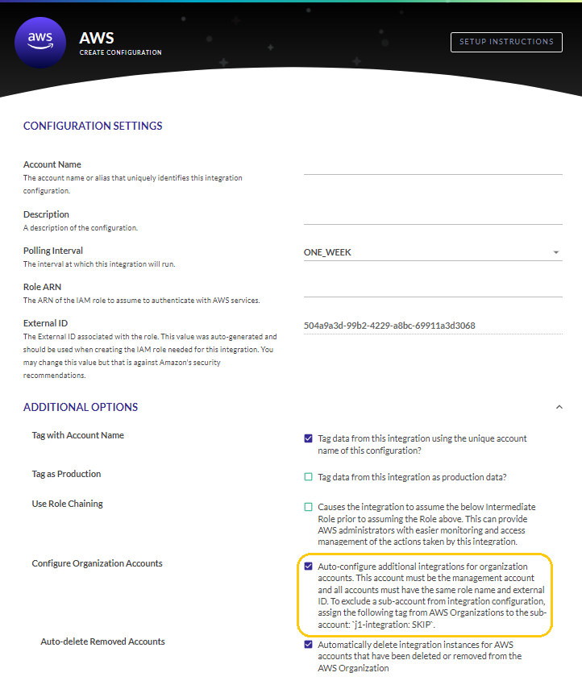

# AWS Organizations

The JupiterOne Application supports the ability to ingest multiple AWS Accounts that are managed by AWS Organizations by configuring a single Integration on the AWS master account of the Organization. 

## Organizations Setup

Before selecting the checkbox, you will want to make sure that each AWS account in the organization is configured with the same JupiterOne IAM role, policies, and external trust ID. If you are using Terraform in your AWS environment, there are setup instructions within the JupiterOne app under the AWS Setup
Instructions. 

For more detailed instructions, see [How can I add/configure all the sub-accounts in my AWS Organization?](./faqs-aws.md) 
in the AWS Specific Questions article. After all sub-accounts are configured correctly in AWS, if you check the option *Configure Organization Accounts*, data for each sub-account will be pulled into your JupiterOne account. 

To exclude an AWS account, you can assign the tag `j1-integration:SKIP` to that specific account within AWS Organizations. See the question [How can I skip certain sub-accounts when auto-configuring my AWS Organization?](./faqs-aws.md) 

### Account Email Address Property 

The CIS Benchmark expects that a contact email is associated with an AWS account in the case of a breach or security compromise. The `email` property for an `aws_account` is only ingested when an AWS integration configuration for the master account has the box checked to enable auto configuration of AWS organization accounts. 

If an incorrect/unexpected email address is tied to an AWS account, refer to the following AWS article: 
[How do I change the email address that's associated with my AWS account?](https://aws.amazon.com/premiumsupport/knowledge-center/change-email-address/)

## Properties 

The following properties are created on the master account and sub-accounts:

| Properties                               |
| ---------------------------------------- |
| `accountId`: The unique identifier (ID) of the account |
| `active`: True or false value if the status is equal to active |
| `arn`: The Amazon Resource Name (ARN) of the account |
| `displayName`: The friendly name of the account (multiple values) |
| `email`: The email address associated with the AWS account |
| `id`: The unique identifier (ID) of the account |
| `joinedMethod`: The method by which the account joined the organization |
| `joinedOn`: The date the account became a part of the organization |
| `name`: The friendly name of the account |
| `orgAccountArn`: The ARN of this Account within the Organization |
| `orgAccountName`: The name of this Account as seen in the Organizations UI |
| `status`: The status of the account in the organization |

## Relationships 

The following relationships are mapped:

| Relationships                            |
| ---------------------------------------- |
| `aws_account` (master) **HAS** `aws_account` (sub-account) |
