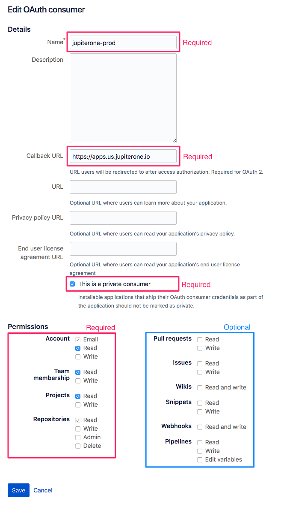

# Bitbucket Integration with JupiterOne

## Bitbucket + JupiterOne Integration Benefits

- Visualize Bitbucket workspaces, projects, repositories, pull requests, and users in the JupiterOne graph.
- Bitbucket users will be mapped to employees in your JupiterOne account.
- Monitor changes to Bitbucket users using JupiterOne alerts.
- Produce compliance evidence using Bitbucket Pull Requests ingested into
  JupiterOne.

## How it Works

- JupiterOne periodically fetches workspaces, projects, repositories, pull
  requests, and users from Bitbucket to update the graph.
- The Bitbucket user will be mapped to employees by matching
  `bitbucket_user.nickname === Person.bitbucketNickname`.
- Write JupiterOne queries to review and monitor updates to the graph.
- Configure alerts to take action when the JupiterOne graph changes.

## Requirements

- JupiterOne requires a Bitbucket OAuth Consumer in the target Workspace. You
  need permission to create an OAuth Consumer.
- You must have permission in JupiterOne to install new integrations. 

## Support

If you need help with this integration, please contact
[JupiterOne Support](https://community.askj1.com).

## Integration Walkthrough

### In Bitbucket

1. From your profile avatar in the bottom left, click on the workspace in the
   Recent workspaces list or click All workspaces to open an entire list from
   which to choose.

2. Click Settings on the left sidebar to open the Workspace settings.

3. Click OAuth consumers under Apps and features on the left navigation.

4. Click the Add consumer button.

Pull requests read permission is needed to ingest PRs. The PR entities serve as
code review records for security and compliance.

5. Click Save.

The system generates a key and a secret for you. Toggle the consumer name to see
the generated Key and Secret value for your consumer.

### In JupiterOne

1. From the configuration **Gear Icon**, select **Integrations**.
2. Scroll to the **Bitbucket** integration tile and click it.
3. Click the **Add Configuration** button.
4. Enter the **Account Name** by which you'd like to identify this Bitbucket
   account in JupiterOne. Ingested entities will have this value stored in
   `tag.AccountName` when **Tag with Account Name** is checked.
5. Enter a **Description** that will further assist your team when identifying
   the integration instance.
6. Select a **Polling Interval** that you feel is sufficient for your monitoring
   needs. You may leave this as `DISABLED` and manually execute the integration.
7. Enter the **Bitbucket OAuth Consumer credentials** generated for use by
   JupiterOne.
8. Click **Create Configuration** once all values are provided.

# How to Uninstall

1. From the configuration **Gear Icon**, select **Integrations**.
2. Scroll to the **Bitbucket** integration tile and click it.
3. Identify and click the **integration to delete**.
4. Click the **trash can** icon.
5. Click the **Remove** button to delete the integration.

## Data Model

### Entities

The following entities are created:

| Resources    | Entity `_type`           | Entity `_class` |
| ------------ | ------------------------ | --------------- |
| Workspace    | `bitbucket_workspace`    | `Account`       |
| Project      | `bitbucket_project`      | `Project`       |
| Pull Request | `bitbucket_pull_request` | `Review`, `PR`  |
| Repository   | `bitbucket_repo`         | `CodeRepo`      |
| User         | `bitbucket_user`         | `User`          |

### Relationships

The following relationships are created/mapped:

| Source Entity `_type` | Relationship `_class` | Target Entity `_type`    |
| --------------------- | --------------------- | ------------------------ |
| `bitbucket_workspace` | **OWNS**              | `bitbucket_project`      |
| `bitbucket_workspace` | **OWNS**              | `bitbucket_repo`         |
| `bitbucket_workspace` | **HAS**               | `bitbucket_user`         |
| `bitbucket_project`   | **HAS**               | `bitbucket_repo`         |
| `bitbucket_repo`      | **HAS**               | `bitbucket_pull_request` |
| `bitbucket_user`      | **OPENED**            | `bitbucket_pull_request` |
| `bitbucket_user`      | **REVIEWED**          | `bitbucket_pull_request` |
| `bitbucket_user`      | **APPROVED**          | `bitbucket_pull_request` |
