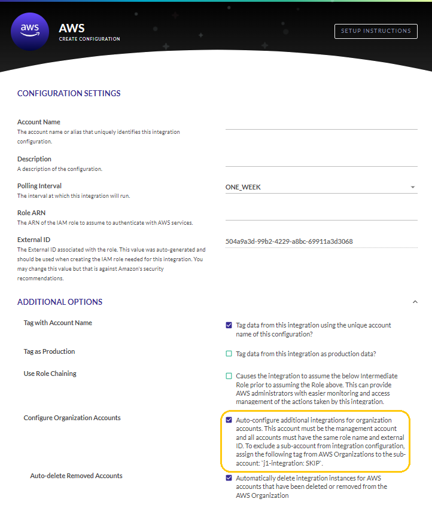
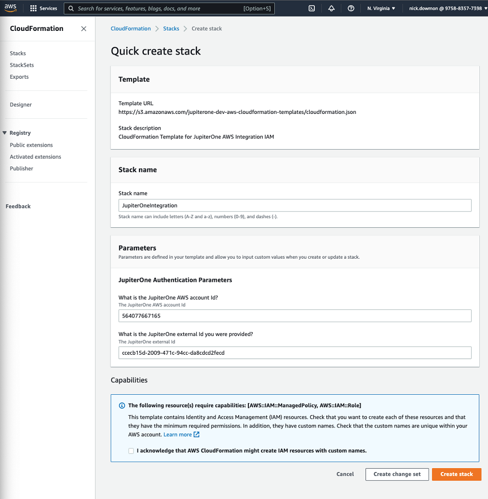
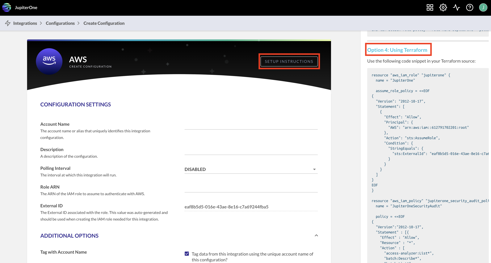
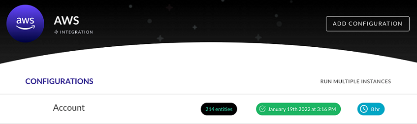
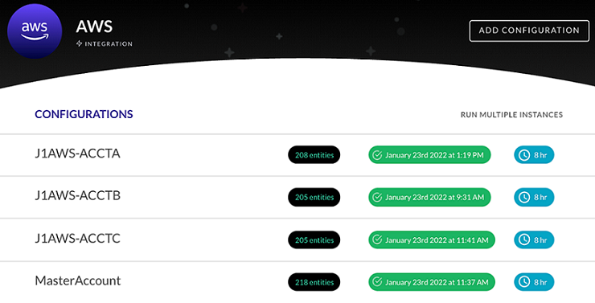
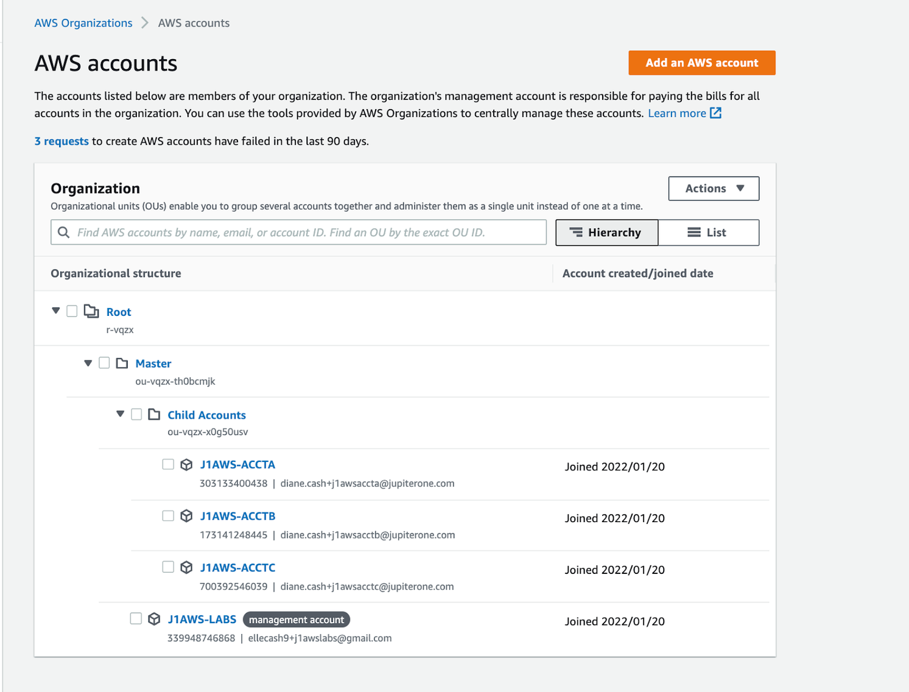

# AWS Organizations

JupiterOne supports the ingestion of multiple AWS accounts that AWS Organizations manages by configuring a single integration on the AWS master account of the Organization. 

When you create an AWS configuration in the [J1 AWS Integrations UI](./graph-aws.md), in the Configure Organization Accounts section, select to auto-configure additional integrations for organization accounts. 

 

## Obtaining the AWS Role ARN

When you create an AWS configuration, you must provide an AWS role Amazon Resource Name (ARN) to uniquely identify AWS resources for J1. You obtain the role ARN from the JupiterOne Integration role that is created in your main AWS account

Select one of the four options for obtaining the role ARN that is most suitable for your devops process:

- CloudFormation
- AWS Management Console
- AWS CLI
- Terraform

**Note**: J1 recommends that you keep the configuration creation window open in the J1 UI while you use another window to obtain your role ARN to be able to transfer and confirm information between J1 and the option you use to obtain your role ARN.

### Using CloudFormation

To use CloudFormation:

1. Go to the CloudFormation [Quick create stack page](https://console.aws.amazon.com/cloudformation/home?region=us-east-1#/stacks/new?stackName=jupiterone-integration&templateURL=https%3A%2F%2Fs3.amazonaws.com%2Fjupiterone-prod-us-jupiter-aws-integration%2Fiam-cloudformation.json).

2. Enter a name for the stack.

3. In the JupiterOne Authentication Parameters section of the stack page, enter your J1 AWS account ID.

4. Go to your J1 Configuration Settings page, and copy your External ID.

5. Go back to the CloudFormation page and paste your J1 External ID in the second field of the JupiterOne Authentication Parameters section.

6. Continue going through each page, providing stackset and deployment options according to your requirements.

7. Select the acknowledge box in the Capabilities section, and click **Create stack**.

   The new CloudFormation stack then creates a role in your AWS account and returns an role ARN of the role in the Outputs section.
   ​

   

   ​

8. Copy the `RoleARN` value and paste it in the Role ARN field on the  J1 Configuration Settings page. 

   It should look similar to:  

   `arn:aws:iam:: <your_aws_account_number>:role/JupiterOneIntegration-JupiterOneRole-<random_value>`

9. You can now complete the Create Configuration task to finish creating your J1 AWS integration.

Under the stack instance in CloudFormation, you can see the list of AWS accounts. 

### Using Terraform

The first step is to ensure that each AWS account in the AWS Organization is configured with the same JupiterOne IAM role, policies, and external trust ID. If you are using Terraform in your AWS environment, there are setup instructions in  J1 Integrations under the AWS Setup Instructions. 

For more detailed instructions, see [How can I add/configure all the sub-accounts in my AWS Organization?](./faqs-aws.md) 
in the AWS Specific Questions article. After all sub-accounts are configured correctly in AWS, if you select the **Configure Organization Accounts** option, J1 pulls in data for each sub-account into your J1 account. 

You can now complete the Create Configuration task to finish creating your J1 AWS integration.

To exclude an AWS account, you can assign the tag `j1-integration:SKIP` to that specific account within AWS Organizations. See the question [How can I skip certain sub-accounts when auto-configuring my AWS Organization?](./faqs-aws.md) 

### Account Email Address Property 

The CIS Benchmark requires that you associate a contact email address with an AWS account in the event of a breach or security compromise. The `email` property for an `aws_account` is only ingested when an AWS integration configuration for the master account has the option selected to enable auto-configuration of AWS organization accounts. 

If an incorrect/unexpected email address is associated with an AWS account, refer to the following AWS article: [How do I change the email address that's associated with my AWS account?](https://aws.amazon.com/premiumsupport/knowledge-center/change-email-address/)

## Management Account

After creating the configuration for the organization, you see confirmation of a successful integration of the  management account for the JupiterOne AWS integration in the list of configurations. The management account shows how many assets it has in the system.

J1 automatically ingests and configures all the AWS member (child) accounts that are managed by the management account using the CloudFormation stackset.

 

The child accounts in J1 should match those in your AWS Organization hierarchy.

## Properties 

The following properties are created on the management account and  member accounts:

| Properties                               |
| ---------------------------------------- |
| `accountId`: The unique identifier (ID) of the account |
| `active`: True or false value if the status is equal to active |
| `arn`: The Amazon Resource Name (ARN) of the account |
| `displayName`: The friendly name of the account (multiple values) |
| `email`: The email address associated with the AWS account |
| `id`: The unique identifier (ID) of the account |
| `joinedMethod`: The method by which the account joined the organization |
| `joinedOn`: The date the account became a part of the organization |
| `name`: The friendly name of the account |
| `orgAccountArn`: The ARN of this account within the Organization |
| `orgAccountName`: The name of this account as seen in the Organizations UI |
| `status`: The status of the account in the organization |

## Relationships 

The following relationships are mapped:

| Relationships                            |
| ---------------------------------------- |
| `aws_account` (management account) **HAS** `aws_account` (member account) |
