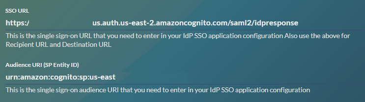

# How to Configure SAML SSO Integration with JupiterOne

Single sign-on is supported using a custom authentication client configured within a J1 account. This feature is available to all Enterprise customers.

## Supported Features

- **SP-initiated SSO**

  Service Provider-Initiated (SP-initiated) SSO means when the service provider (SP) initiates SAML authentication. SP-initiated SSO is triggered when you try to access a resource in J1.

- **JIT (Just In Time) Provisioning**

  Users are created and updated instantly using the SAML attributes sent as part of the SAML response coming from the Identity Provider (IdP). The user is created during the initial sign-in to J1 and updated during subsequent sign-ins. 

**Note**: IdP-initiated SSO is currently unsupported due to a limitation of Amazon Cognito.

## Configuring SSO

You must be a member of the Administrators group to perform configurations.

1. Sign in to your JupiterOne account.

2. Go to the **Single Sign On** setup from the Settings menu . 
   ​

    

   ​

3. Click **Configure**.
   ​

    

   ​

4. In the J1 Single Sign-on page, copy the following two variables to use when adding J1 as an application in your SAML IdP account:

    - SSO URL
    - Audience URI (SP Entity ID)
      ​

    
    ​

5. In your IdP account, add a new SAML application and name it JupiterOne.

    - Copy the SSO URL and Audience URI values in the SAML settings.
    - Use the same J1 single sign-on URL string value for Recipient URL and Destination URL.
    - Leave the Default Relay State field empty.
    - Select EmailAddress for the name ID format.
    - Select Email or Username for the application username.
    - See the next section for details on attribute mappings.

6. Complete the configuration of the SAML application in your IdP account, and copy the identity provider metadata link.

   In Okta, you can find this link on the **Sign On** tab of the application, under View Setup Instructions.
   ​

   
   ​

7. Go back to the JupiterOne single sign-on page, and paste the identity provider metadata link in the SAML Metadata File field.

8. Enter a client name, such as Okta.

9. Under Allowed OAuth Flows, select the **Authorization code grant** and **Implicit Grant** checkboxes.
   ​

    

   ​
   Save your settings to complete the configuration. Next time you access your JupiterOne account using your organization custom URL (for example, https://your_company.apps.us.jupiterone.io), you are redirected to your SAML IdP for authentication.

## Attribute Mappings

JupiterOne supports the following SAML attribute mappings:

- `email`: User email address (required)
- `family_name`: User last name
- `given_name`: User first name
- `name`: User display name
- `group_names`: Dynamically assigns the user to the specified groups within JupiterOne.

J1 highly recommends that if you are a large organization, you should use the [J1 API](../../jupiterone-api.md) to create group names and then use the `group_names` attribute to more easily synchronize all username data with J1 on a regular basis.  You can use the `group_names` attribute to equate to a filtered list of groups that match the names of the J1 groups (case-sensitive). For example, create a group name to contain all the users who have administrative privileges in J1.

**NOTE:**  Users without `group_names` mapping are assigned to the **Users** group within your J1 account, by default.

## Okta Configuration

To configure SSO for Okta, you must have administrator access. In addition, ensure you can access the SSO URL and your Audience URI before proceeding.

1. From the Okta Applications menu, select **Create App Integration**.
  ​

  
  ​

2. Select **SAML 2.0** and click **Next**.
  ​

  
  ​

3. Enter a name in the **App Name** field. The name JupiterOne is used in the example below, and click **Next**.
  ​

  
  ​

4. In the SAML Settings sections: 
    - In the Single sign on URL field, enter your SSO URL.
    - In the Audience URI (SP Entity ID) field, enter your Audience URI.
    - In the Name ID format field, select EmailAddress.
    - In the *Application username* field, select Email.

  


5. Configure the attribute mappings in the Attribute Statements section. Only the email attribute is mandatory.

    - `email` > `user.email`
    - `family_name` > `user.lastName`
    - `given_name` > `user.firstName`
    - `name` > `user.displayName`
    - `group_names` > `appuser.jupiterone_groups` where `jupiterone_groups` is optional naming. 
      ​

      You must configure the group attribute in the Profile Editor in the **Directory** menu, and then assign it after completing the configuration.
      ​

    
    ​

6. After mapping the attributes, click **Next**.
    ​

    
    ​

7. In the Feedback menu, select *I'm an Okta Customer adding an internal app*, and click **Finish**.
    ​

    
    ​

8. In the Settings section of the Sign On menu, right-click the **ddd** link and select **Copy Link Address**.
    ​

    
    ​

9. Paste the link into the SAML Metadata Document URL field.

    ​

    
    ​

10. Click the floppy disk icon to save your configuration. A green confirmation message displays in the lower-left corner of the screen.
  ​

  
  ​
  ​


### Okta Group Attribute Configuration

JupiterOne recommends adding a custom group attribute to the JupiterOne profile in your IdP account (such as Okta). You can add the attribute with the Profile Editor for the app. Provide a name for the custom group attribute. such as jupiterone_groups.

An example in Okta:


You can then use this custom app attribute to assign group memberships to your users based on their IdP group assignments. The actual value for the attribute is typically configured on the groups assigned to the app.

An example in Okta:


## Azure AD Example

An example of an attribute mapping configuration in Azure AD:


An example of group assignment in Azure AD:


By adding the user.assignedroles -> group_names mapping to Azure AD, the app roles assigned to the user are mapped to the groups in JupiterOne that have the same name as the group/role. Read 
<https://docs.microsoft.com/en-us/azure/active-directory/develop/howto-add-app-roles-in-azure-ad-apps>
for more information on adding app roles and assigning them to users and groups.

In Azure AD, go to https://portal.azure.com/#blade/Microsoft_AAD_IAM/ActiveDirectoryMenuBlade/RegisteredApps>, click JupiterOne, and then click **Manifest**. 

Add an entry to appRoles that is similar to:

```json
{
  "allowedMemberTypes": [
    "User"
  ],
  "description": "Administrators",
  "displayName": "Administrators",
  "id": "e6421657-3af5-4488-831f-7989175e3e35",
  "isEnabled": true,
  "lang": null,
  "origin": "Application",
  "value": "Administrators"
}
```

Assigning an app role to a user in Azure AD:


## Google Workspace Configuration

Before beginning a configuration through Google Workspace, ensure you have access to the SSO URL and your audience URI. Go to the Google Admin Console:


The IdP configuration page on the Google Admin Console is at: <https://admin.google.com/ac/apps/unified?hl=en>.

1. From the **Add App** dropdown menu, select **Add custom SAML app**.
   ​


2. In the App name field, enter JupiterOne.
  ​

  
  ​

3. Click **DOWNLOAD METADATA** to download an XML metadata file to use later.
  ​

  
  ​

4. Paste your SSO URL in the ACS URL field. 

5. In the Entity ID field, paste your Audience URI. In the Name ID format field, select **EMAIL**, and select **Primary email** in the Name ID field.

  
  ​
  ​

6. When mapping directory attributes, ensure you use the following names in the App attributes fields. group_names is optional.

    - *Primary email* > `email`

    - *Last name* > `family_name`

    - *First name* > `given_name`

  


5. Paste the downloaded XML metadata file contents into the SAML Metadata File field.
  ​

  
  ​

## Removing Users

When you unassign or remove a user from the JupiterOne app within your IdP, the user can no longer log in to your JupiterOne account because the authentication is done by your IdP. However, the user memberships remain in the Groups. You can manually remove them from the groups in JupiterOne.


## Current Limitations

### IdP-initiated sign-on flow is not supported

J1 uses Amazon Cognito service to manage authentication, including SSO. Cognito currently does _not_ support IdP-initiated sign-on. This means you can _not_ click on the app icon in your IdP account (such as JumpCloud, Okta, OneLogin). Instead, you must initiate single sign-on by going to your JupiterOne account URL:

```text
https://<your_j1_account_id>.apps.us.jupiterone.io
```

This URL redirects to your configured SSO provider for authentication.

You can find your J1 account ID by running the following query:

```j1ql
Find jupiterone_account as a return a.accountId
```

**Workaround**

If your SSO provider supports configuring a bookmark or secure web authentication (SWA) app, you can work around this limitation by doing the following:

- Hide the app icon to users for the configured JupiterOne SAML SSO app.
- Configure a Bookmark/SWA app with your JupiterOne account URL and assign it to the same users and groups that are assigned the JupiterOne SAML app.

## Troubleshooting

Different SSO providers have varying UIs and nomenclature, therefore, ultimately the SAML response and attribute statement should look similar.

### **Common Problems**

**Infinite Redirect Loop**

An infinite redirct loop can occur if the SAML subject is incorrect or missing or if the required SAML attribute `email` (case-sensitive) is not present.

**SAML Subject**

A common problem during SSO configuration is an incorrect SAML subject. Here is an example of a correct subject:

```xml
<saml2:Subject>
    <saml2:NameID Format="urn:oasis:names:tc:SAML:1.1:nameid-format:emailAddress">john.smith@example.com</saml2:NameID>
    ...
</saml2:Subject>
```

**SAML Attribute Statement**

Another common problem during SSO configuration is an incorrect SAML attribute statement. An example of a correct attribute statement is:

```xml
<saml2:AttributeStatement>
    <saml2:Attribute Name="email">
        <saml2:AttributeValue xmlns:xs="http://www.w3.org/2001/XMLSchema" xmlns:xsi="http://www.w3.org/2001/XMLSchema-instance" xsi:type="xs:anyType">john.smith@example.com</saml2:AttributeValue>
    </saml2:Attribute>
    <saml2:Attribute Name="family_name">
        <saml2:AttributeValue xmlns:xs="http://www.w3.org/2001/XMLSchema" xmlns:xsi="http://www.w3.org/2001/XMLSchema-instance" xsi:type="xs:anyType">Smith</saml2:AttributeValue>
    </saml2:Attribute>
    <saml2:Attribute Name="given_name">
        <saml2:AttributeValue xmlns:xs="http://www.w3.org/2001/XMLSchema" xmlns:xsi="http://www.w3.org/2001/XMLSchema-instance" xsi:type="xs:anyType">John</saml2:AttributeValue>
    </saml2:Attribute>
    <saml2:Attribute Name="group_names">
        <saml2:AttributeValue xmlns:xs="http://www.w3.org/2001/XMLSchema" xmlns:xsi="http://www.w3.org/2001/XMLSchema-instance" xsi:type="xs:anyType">Administrators,Users</saml2:AttributeValue>
    </saml2:Attribute>
</saml2:AttributeStatement>
```

**Viewing the SAML Response**

To view the SAML response, you can use browser plugins to capture the POST to `/saml2/idpresponse`. For example, in the Chrome browser the plugin, you can use [SAML-tracer](https://chrome.google.com/webstore/detail/saml-tracer/mpdajninpobndbfcldcmbpnnbhibjmch?hl=en) to decode and view the SAML response and, therefore, the SAML attribute statement.

The following is an example of what SAML-tracer looks like after logging in by SSO. The `SAML` tab is active to view the XML. Calls that have SAML are also flagged with a yellow `SAML` tag on the right of the HTTP request.


