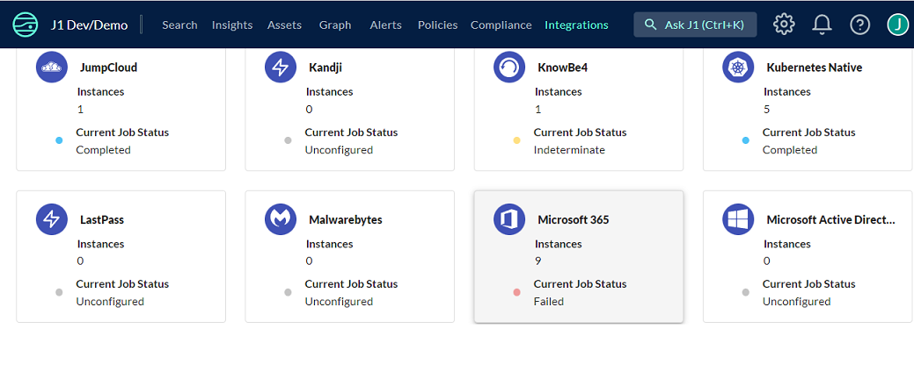
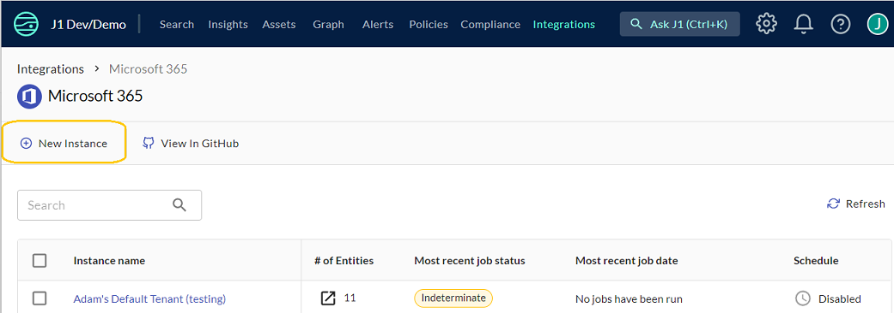
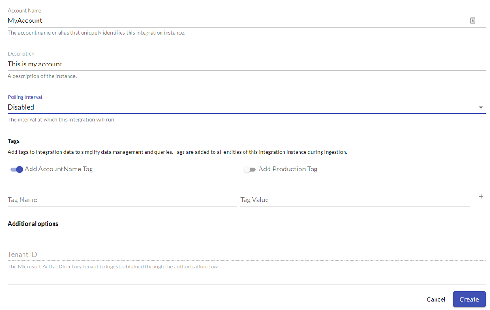
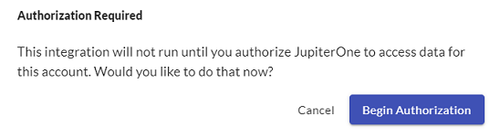
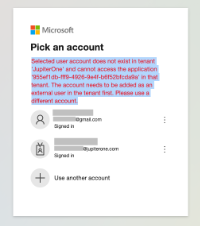
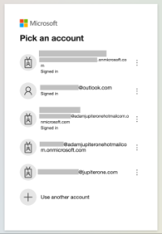

# Microsoft 365

JupiterOne provides a managed integration for Microsoft 365. The integration
connects directly to Microsoft Graph APIs to obtain metadata about the target
organization and analyze resource relationships.

## Microsoft 365 + JupiterOne Integration Benefits

- Visualize Microsoft 365 services, groups, and users in the JupiterOne graph.
- Map Microsoft 365 users to employees in your JupiterOne account.
- Monitor changes to Microsoft 365 users using JupiterOne alerts.

## How it Works

- JupiterOne periodically fetches account information, users, groups, and group
  members from Microsoft 365 to update the graph.
- You write JupiterOne queries to review and monitor updates to the graph.
- You configure alerts to take action when JupiterOne graph changes.

## Requirements

- An organizational Active Directory tenant to target for ingestion. The
  integration does not support the use of other tenant types.
- An account in the tenant you want to target for ingestion that has global
  administrator access. You will login with this account to grant the JupiterOne
  application API permissions that can read data across all users (admin
  consent).
- You must have permission in JupiterOne to install new integrations.

## Support

If you need help with this integration, please contact
[JupiterOne Support](https://support.jupiterone.io).

## Integration Walkthrough

### In JupiterOne

1. From the top navigation of the J1 Search homepage, select **Integrations**.

   ​	
   

2. Select the **Microsoft-365** integration tile.
   

   

3. Click **New Instance**.
   

   
   

4. Enter the **Account Name** by which to identify this Microsoft 365 account in
   J1. Ingested entities will have this value stored in `tag.AccountName` when
   **Tag with Account Name** is selected.

5. Enter a **Description** that assists your team to identify the integration
   instance.

6. Select a **Polling Interval** that you feel is sufficient for your monitoring
   needs. You can leave this as `DISABLED` and manually execute the integration.

   

7. Click **Create** after you have provided all the values.

8. When prompted, click **Begin Authorization**.
   

   
    

9. You are then directed to the Microsoft identity platform where you must log
   in as a global administrator of the organizational Active Directory tenant
   you intend to integrate with.

   You must select an account belonging to an organizational tenant. When you
   are already logged into an account, the badge icons indicate the nature of
   the tenant the account belongs to.

   Selecting a personal account produces the following error message:
   
   
   
    
   
10. Review requested permissions (which are described below) and grant consent.
   

   
    

## Permissions

1. `DeviceManagementApps.Read.All`
   - Read Microsoft Intune apps
   - Needed for creating `Application` entities
1. `DeviceManagementConfiguration.Read.All`
   - Read Microsoft Intune device configuration and policies
   - Needed for creating `Configuration` and `ControlPolicy` entities
1. `DeviceManagementManagedDevices.Read.All`
   - Read Microsoft Intune devices
   - Needed for creating `Device` and `HostAgent` entities
1. `Organization.Read.All`
   - Read organization information
   - Needed for creating the `Account` entity
1. `APIConnectors.Read.All`
   - Read API connectors for authentication flows
   - Needed for enriching the `Account` entity with Intune subscription
     infomation
1. `DeviceManagementServiceConfig.Read.All`
   - Read Microsoft Intune configuration
   - Also needed for enriching the `Account` entity with Intune subscription
     information
1. `Directory.Read.All`
   - Read directory data
   - Needed for creating `User`, `Group`, and `GroupUser` entities

## How to Uninstall

1. From the top navigation of the J1 Search homepage, select **Integrations**.
2. Select the **Microsoft 365** integration tile.
3. Identify and click the **integration to delete**.
4. Click the **trash can** icon.
5. Click the **Remove** button to delete the integration.

## Setup

Authorize access to JupiterOne:

1. Log in to JupiterOne as a user with permission to set up an integration.
1. Add a Microsoft 365 integration instance.
1. After you have finished configuring your new instance, you will be directed
   to Microsoft's identity platform, where you must login in as an administrator
   in the organization you intend to integrate.
1. Review requested permissions and grant consent.

<!-- {J1_DOCUMENTATION_MARKER_START} -->
<!--
********************************************************************************
NOTE: ALL OF THE FOLLOWING DOCUMENTATION IS GENERATED USING THE
"j1-integration document" COMMAND. DO NOT EDIT BY HAND! PLEASE SEE THE DEVELOPER
DOCUMENTATION FOR USAGE INFORMATION:

https://github.com/JupiterOne/sdk/blob/main/docs/integrations/development.md
********************************************************************************
-->

## Data Model

### Entities

The following entities are created:

| Resources             | Entity `_type`                 | Entity `_class`                  |
| --------------------- | ------------------------------ | -------------------------------- |
| Compliance Policy     | `intune_compliance_policy`     | `Configuration`, `ControlPolicy` |
| Detected Application  | `intune_detected_application`  | `Application`                    |
| Device Configuration  | `intune_device_configuration`  | `Configuration`, `ControlPolicy` |
| Intune Host Agent     | `intune_host_agent`            | `HostAgent`                      |
| Managed Application   | `intune_managed_application`   | `Application`                    |
| Managed Device        | `user_endpoint`                | `Device`, `Host`                 |
| Managed Device        | `workstation`                  | `Device`, `Host`                 |
| Managed Device        | `laptop`                       | `Device`, `Host`                 |
| Managed Device        | `desktop`                      | `Device`, `Host`                 |
| Managed Device        | `computer`                     | `Device`, `Host`                 |
| Managed Device        | `server`                       | `Device`, `Host`                 |
| Managed Device        | `smartphone`                   | `Device`, `Host`                 |
| Noncompliance Finding | `intune_noncompliance_finding` | `Finding`                        |
| [AD] Account          | `microsoft_365_account`        | `Account`                        |
| [AD] Group            | `azure_user_group`             | `UserGroup`                      |
| [AD] Group Member     | `azure_group_member`           | `User`                           |
| [AD] User             | `azure_user`                   | `User`                           |

### Relationships

The following relationships are created:

| Source Entity `_type`         | Relationship `_class` | Target Entity `_type`          |
| ----------------------------- | --------------------- | ------------------------------ |
| `azure_user_group`            | **HAS**               | `azure_user_group`             |
| `azure_user_group`            | **HAS**               | `azure_group_member`           |
| `azure_user_group`            | **HAS**               | `azure_user`                   |
| `azure_user`                  | **HAS**               | `computer`                     |
| `azure_user`                  | **HAS**               | `desktop`                      |
| `azure_user`                  | **HAS**               | `laptop`                       |
| `azure_user`                  | **HAS**               | `server`                       |
| `azure_user`                  | **HAS**               | `smartphone`                   |
| `azure_user`                  | **HAS**               | `user_endpoint`                |
| `azure_user`                  | **HAS**               | `workstation`                  |
| `azure_user`                  | **USES**              | `computer`                     |
| `azure_user`                  | **USES**              | `desktop`                      |
| `azure_user`                  | **USES**              | `laptop`                       |
| `azure_user`                  | **USES**              | `server`                       |
| `azure_user`                  | **USES**              | `smartphone`                   |
| `azure_user`                  | **USES**              | `user_endpoint`                |
| `azure_user`                  | **USES**              | `workstation`                  |
| `computer`                    | **ASSIGNED**          | `intune_managed_application`   |
| `computer`                    | **HAS**               | `intune_noncompliance_finding` |
| `computer`                    | **INSTALLED**         | `intune_detected_application`  |
| `desktop`                     | **ASSIGNED**          | `intune_managed_application`   |
| `desktop`                     | **HAS**               | `intune_noncompliance_finding` |
| `desktop`                     | **INSTALLED**         | `intune_detected_application`  |
| `intune_compliance_policy`    | **IDENTIFIED**        | `intune_noncompliance_finding` |
| `intune_device_configuration` | **IDENTIFIED**        | `intune_noncompliance_finding` |
| `intune_host_agent`           | **ASSIGNED**          | `intune_compliance_policy`     |
| `intune_host_agent`           | **ASSIGNED**          | `intune_device_configuration`  |
| `intune_host_agent`           | **MANAGES**           | `computer`                     |
| `intune_host_agent`           | **MANAGES**           | `desktop`                      |
| `intune_host_agent`           | **MANAGES**           | `laptop`                       |
| `intune_host_agent`           | **MANAGES**           | `server`                       |
| `intune_host_agent`           | **MANAGES**           | `smartphone`                   |
| `intune_host_agent`           | **MANAGES**           | `user_endpoint`                |
| `intune_host_agent`           | **MANAGES**           | `workstation`                  |
| `laptop`                      | **ASSIGNED**          | `intune_managed_application`   |
| `laptop`                      | **HAS**               | `intune_noncompliance_finding` |
| `laptop`                      | **INSTALLED**         | `intune_detected_application`  |
| `microsoft_365_account`       | **HAS**               | `azure_user_group`             |
| `microsoft_365_account`       | **HAS**               | `azure_user`                   |
| `server`                      | **ASSIGNED**          | `intune_managed_application`   |
| `server`                      | **HAS**               | `intune_noncompliance_finding` |
| `server`                      | **INSTALLED**         | `intune_detected_application`  |
| `smartphone`                  | **ASSIGNED**          | `intune_managed_application`   |
| `smartphone`                  | **HAS**               | `intune_noncompliance_finding` |
| `smartphone`                  | **INSTALLED**         | `intune_detected_application`  |
| `user_endpoint`               | **ASSIGNED**          | `intune_managed_application`   |
| `user_endpoint`               | **HAS**               | `intune_noncompliance_finding` |
| `user_endpoint`               | **INSTALLED**         | `intune_detected_application`  |
| `workstation`                 | **ASSIGNED**          | `intune_managed_application`   |
| `workstation`                 | **HAS**               | `intune_noncompliance_finding` |
| `workstation`                 | **INSTALLED**         | `intune_detected_application`  |

<!--
********************************************************************************
END OF GENERATED DOCUMENTATION AFTER BELOW MARKER
********************************************************************************
-->
<!-- {J1_DOCUMENTATION_MARKER_END} -->
