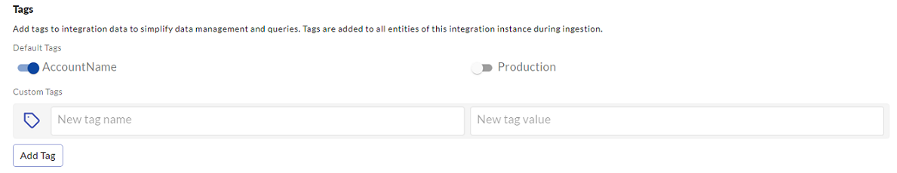

# Integration and mapping related FAQs

## How do I get my custom / on-premise data into JupiterOne?

JupiterOne's asset inventory, search and visualization supports any data imported that follows the [reference data model](../jupiterOne-data-model/jupiterone-data-model.md), not limited to data ingested by managed integrations.

This is easily done via the API or CLI. Each entity object can be represented in a few lines of JSON or YAML code. The [J1 API Client or CLI](../APIs/j1-client-and-cli.md) can create/update them to your JupiterOne account. You can also develop a script to run on a schedule (such as via a cron job) or integrate into your DevOps automation.

## Where do these `Person` entities come from? Why are they not tagged with an integration?

The Person entities are “mapped” from `User` entities. They are considered "shared" entities that multiple integrations can map to and contribute properties to. For example, a `Person` can be created by a Google integration (from a `google_user`). Or from a Github User, AWS IAM User, etc.

The `Person` entities represent actual individuals in the organizations, whereas the `User` entities are the logical user accounts within each digital environment/account (i.e. from an integration).

## What is the difference between automated J1 tags and source tags?

When configuring a JupiterOne integration, you can add tags to simplify data management and queries. The two default tags you can add are `Production` and `AccountName`, and if you select one or both tags, they are added to all entities of the integration instance during ingestion. 

These tags exist in JupiterOne only and are not applied back to the source resources. You can query them just like tags from the source within JupiterOne.

## How are `Person` entities (i.e. `employees`) created?

A `Person` entity is created by the "mapper" process -- when a `User` entity is ingested/updated from an identity provider integration (e.g. Okta, OneLogin, Google), a `Person` entity is "mapped" with the user's information (first and last name, email address, etc.).

## How can I avoid creating a `Person` entity for a generic/system user account?

Certain properties are used to determine if the user is a system user or an actual individual. This depends on the integration.

For **Okta**, you can set the `userType` property for the user to one of the following to avoid it being mapped to a `Person`:

- `bot`
- `generic`
- `service`
- `system`

## Why can I only see integration jobs for the past 30 days?

JupiterOne uses a Time to Live (TTL) of 30 days for all integration jobs. Jobs older than 30 days are no longer available for review in JupiterOne.
