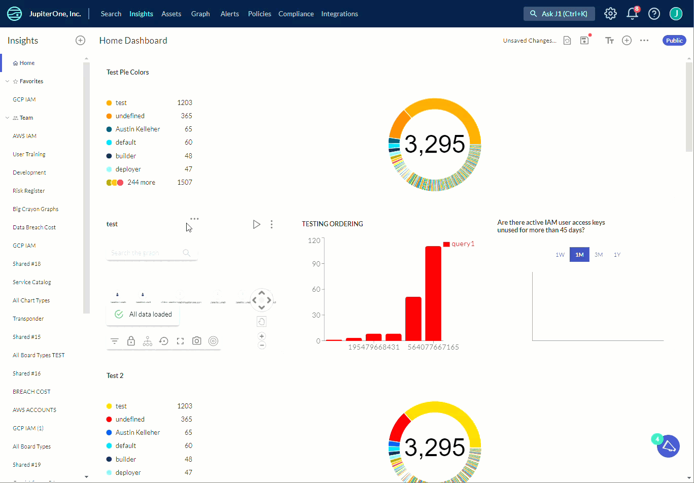

# Getting Started with Insights Dashboards

This guide will walk through how to:

1. Import prebuilt Insights Dashboards
2. Create your own custom Insight dashboard

JupiterOne Insights app allows users to build reporting dashboards using J1QL queries.

Each dashboard can be configured as either a Team board that is shared with other account users or a Personal board for the individual user. 

The layout of each board is individually saved per user, including the layout for Team boards, so that each user may configure layouts according to their own preferences without impacting others. Administrators can save a Team board layout as "default" for other users.

You can build your own custom dashboards or utilize any of the existing boards that have already been built.

Here are a few example boards and their configurations: [https://github.com/JupiterOne/insights-dashboards](https://github.com/JupiterOne/insights-dashboards).

## Import Prebuilt Insights Dashboards (from GitHub)

1. Navigate to the specific prebuilt dashboard you’d like to import into your JupiterOne account:

   <https://github.com/JupiterOne/insights-dashboards>.

2. Pick the specific board, for example, "AWS Accounts".

3. Click into ‘board.json’

4. Right click on **Raw** -> **Save File**

   

5. Navigate within JupiterOne to **Apps** -> **Insights** to add a board.

   

6. Expand the left sidebar by hitting the **>** carrot .

7. Hit the **Add** button + choose whether you want a personal or team board.

8. Click **Upload From JSON Schema** + select the file you previously saved.

   

   ​

   For more information about J1 standard Insights dashboards, [watch this video](https://try.jupiterone.com/blog/video-how-to-modify-out-of-the-box-dashboards).

## Creating a Custom Insights Dashboard with Custom Charts Based on Queries

You can build your own custom dashboard with customized individual charts. Each chart is powered by one or more J1QL queries.

1. Navigate within JupiterOne to **Apps** -> **Insights** to add a board

   

2. Expand the left sidebar by clicking the ‘>’ carrot .

3. Hit the **Add** button’ + choose whether you want a personal or team board.

4. Click **Start Adding Charts**. This will open up the **Add Chart** workflow where you can customize the details of your query/chart, which include, but aren't limited to:

   - type of visual chart, such as number, pie, line, bar.
   - the chart’s query or queries
   - formatting options 

     

For more information about custom Insights dashboards, [watch this video](https://try.jupiterone.com/blog/how-to-create-customized-dashboards).

### Additional support documentation/resources for writing queries:

[J1QL query tutorial](../jupiterOne-query-language_(J1QL)/tutorial-j1ql.md)
[Search quickstart](../Getting-Started_and-Admin/quickstart-search.md)
[J1QL language specs](../jupiterOne-query-language_(J1QL)/jupiterOne-query-language.md)
[All questions + queries](https://ask.us.jupiterone.io/filter?tagFilter=all)

## General Insights Dashboard Functionality 

- Rename, clone, or delete boards:

  

- Download board schema, share boards (create public links), save or reset board layout, add charts:

  

- Delete charts:

  

- Reorder either charts within a specific board, or the board within the side panel by dragging the chart or board to the desired spot:

  

To see more examples of editing charts and graphs in an Insights dashboard, [watch this video](https://try.jupiterone.com/blog/how-to-use-charts-and-graphs-widgets).

