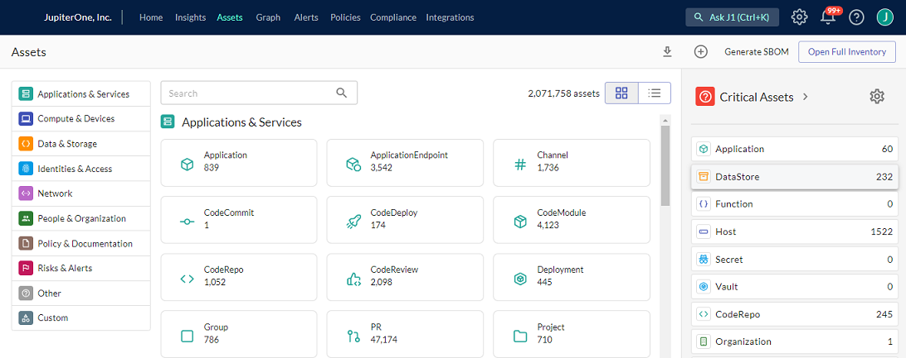
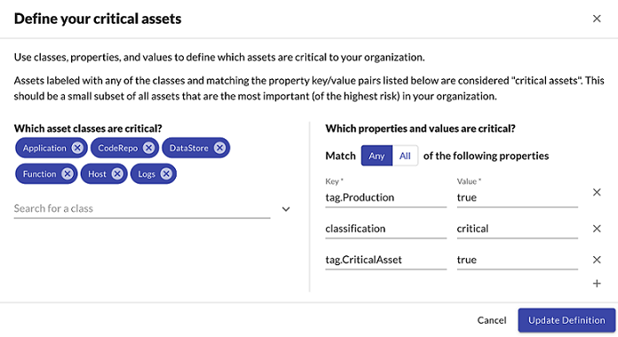
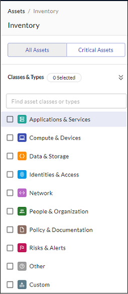
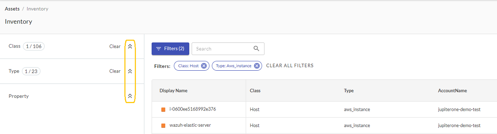
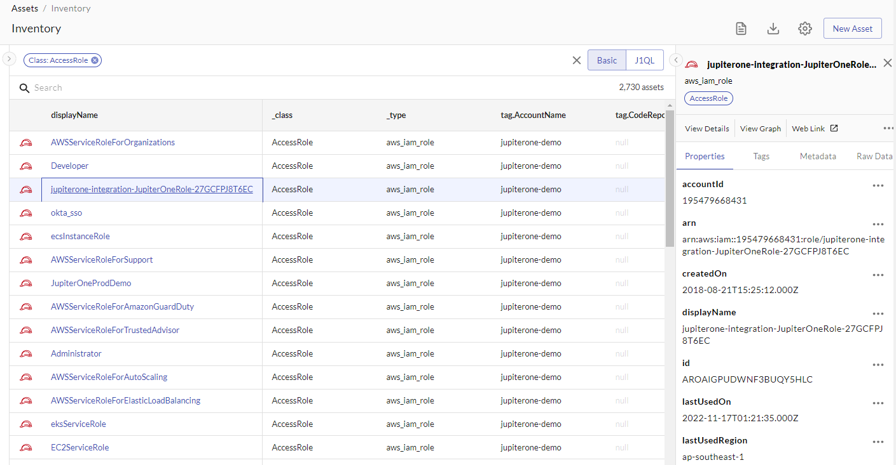
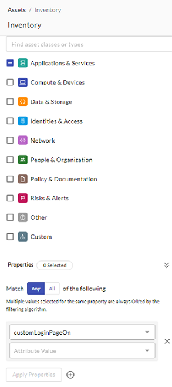
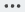
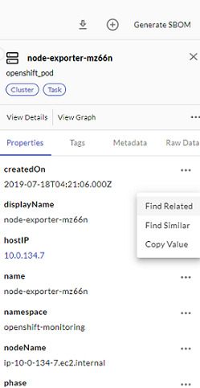

# Using JupiterOne Assets

To see all the digital assets (entities) you have, in the top J1 navigation bar, click **Assets**. There are several ways to filter the large list of entities displayed in Assets:

- Quick filter the critical assets
- Additional filters by class and/or type
- Granular filters by properties

## Quick Filtering the Critical Assets

Click **Critical Assets** at the top-right of the page to go directly to the most important of your assets, or click any of the asset classes listed below the Critical Assets button.

 

Critical assets is a class of asset for which you can create queries and alerts to quickly access the most crucial data. By default, JupiterOne determines which criteria defines an asset as the most important and, therefore, the most at risk but an administrator can edit this definition.

Click  to edit the critical asset definition default values. You can use classes, properties, and values to define what is critical.

 

Add asset classes and properties that your organization considers a critical asset, and click **Update Definition**. Default critical asset classes include `Application`, `CodeRepo`, `Datastore`, `Function`, `Host`, and `Logs`.

## Quick Filtering of All Assets

Assets are organized into the categories you see listed in the left pane of the Asset landing page. Click any of those categories to bring the category into focus in the middle pane. 

 

Each category has classes of assets, and each class has types. In the following example, the category is Applications & Services, the class is Application, and the selected type is kandji_app.

 

The class of an asset is an abstract label that defines what the asset is within the concept of security operations. The type of an asset represents its specific type of entity as defined by its source. For more details, see the [JupiterOne Data Model documentation](../jupiterOne-data-model/jupiterone-data-model.md).

When you select any of the assets in the filtered results table, its detailed properties side panel opens on the right.

If you want to filter even further, you can filter on properties in a couple of ways. You can use the Properties section at the bottom of the left category pane. Select the property and attributes from the dropdown menus, and then click **Apply Properties**.

    

The second way to return a list of assets with a specified property, click the three-dot icon    to the right of the tabs in the detailed properties side panel. You can search for assets with related or similar properties.

 

#### Download Assets List

Click the download icon  in the top-right of the window to download all assets or a selected asset as a CSV file. You are notified in the Notifications  panel in the top-right of the top navigation bar when your download is complete and ready for you to download.

 

 
