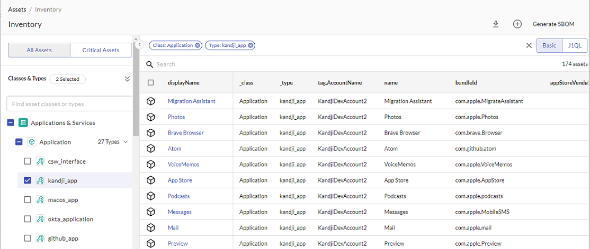

# Using Filters in JupiterOne Assets

To see all the digital assets (entities) you have, in JupiterOne, in the top J1 navigation bar, click **Assets**. There are several ways to filter the large list of entities displayed in Assets:

- Quick filter the critical assets
- Additional filters by class and/or type
- Granular filters by properties

## Quick Filtering the Critical Assets

Click the **Critical Assets** tab at the top of the page to go directly to the most important of your assets.

Critical assets is a class of asset for which you can create queries and alerts to quickly access the most crucial data. By default, JupiterOne determines which criteria defines an asset as the most important and, therefore, the most at risk but an administrator can edit this definition.

Click  to edit the critical asset definition default values. You can use classes, properties, and values to define what is critical.

Add asset classes and properties that your organization considers a critical asset, and click **Update Definition**. Default critical asset classes include `Application`, `CodeRepo`, `Datastore`, `Function`, `Host`, and `Logs`.

## Quick Filtering of All Assets

From the Assets landing page, you can filter all your assets by Class, Type, or Property in the left pane.

Click the double-arrows in the Class row to display all the possible asset classes. The class of an asset is an abstract label that defines what the asset is within the concept of security operations. For more details, see the [JupiterOne Data Model documentation](../jupiterOne-data-model/jupiterone-data-model.md).

By default, all the classes are represented by an icon. To see the names of the classes, click the eye icon. Select all the classes by which you want to filter your assets.

In addition, you can click the double arrows next to Type to further filter the assets by their type. The type of an asset represents its specific type of entity as defined by its source. For more details, see the [JupiterOne Data Model documentation](../jupiterOne-data-model/jupiterone-data-model.md).

You can also filter your assets by property by clicking the double arrows at the bottom of the pane. Drop down the options for each property to set it. If you select more than one value for the same property, the filtering algorithm uses OR.

 

When you select any of the assets in the filtered results table, its detailed properties side panel opens on the right.

