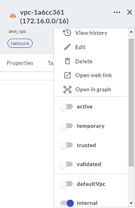
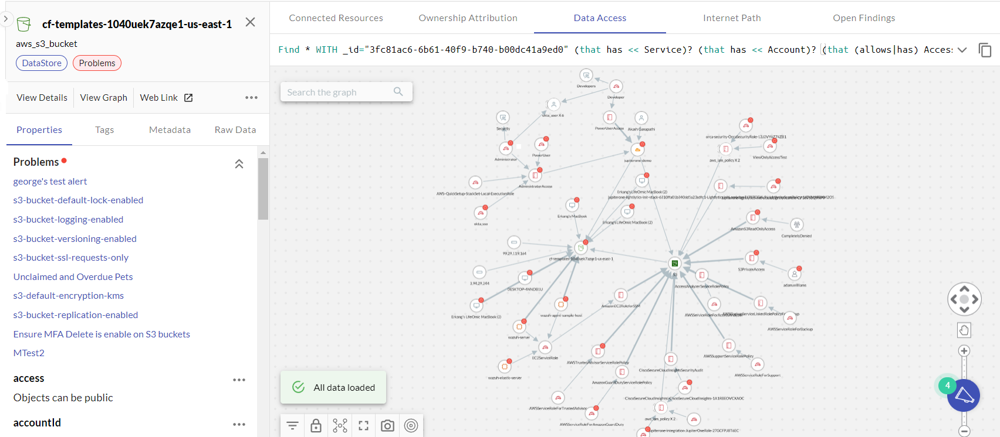
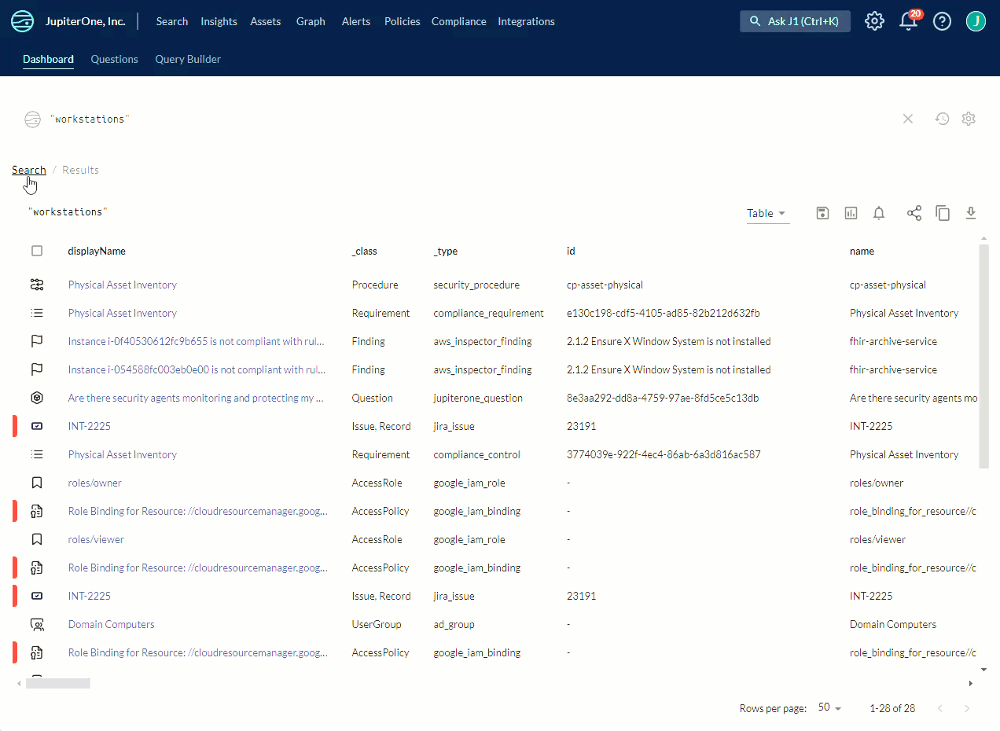

# Asset Properties

When you select any of the assets anywhere in J1, its detailed properties side panel opens on the right.

Click the three-dot icon    to the right of the tabs to see more options and to edit any of the asset properties.

  

Click the **<** symbol to the left of the asset name to open the extension of the detailed properties side panel. This extended view provides graph visualizations of asset properties such as connected resources, ownership attribution, data access, the Internet path, and open findings. The types of properties shown in the graphs depend on the type of asset.

The extended detailed properties panel is available wherever you view assets in query or search results.

## Bulk-editing Assets

To edit several assets at a time to assign an owner or add tags, select all the assets you want to edit, and click either **Set Owner** or **Set Tags**.  

 

