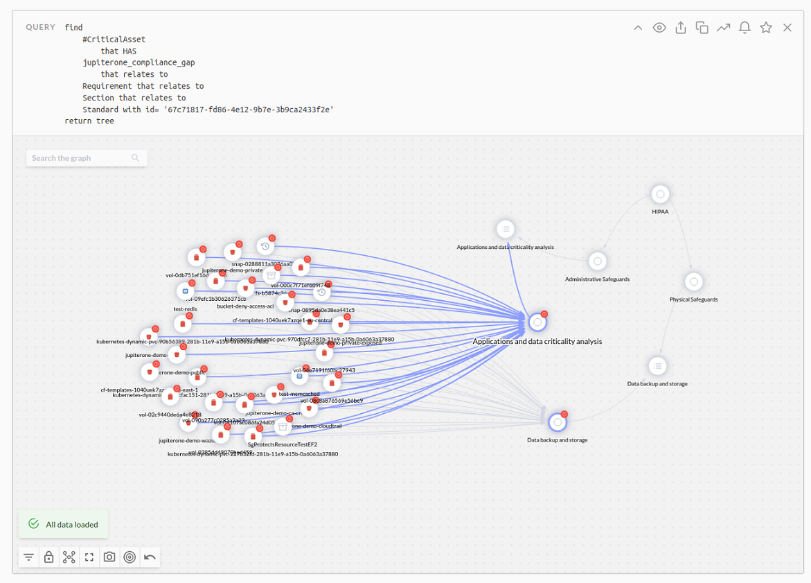

# Understanding Critical Assets

Critical assets is a class of asset for which you can create queries and alerts to quickly access the most crucial data. By default, JupiterOne determines which criteria defines an asset as the most important and, therefore, the most at risk but an administrator can edit this definition.

## Quick Filtering the Critical Assets

In J1 Assets, there are two tabs: All Assets and Critical Assets. Click the **Critical Assets** tab at the top of the page to go directly to the most important of your assets.


Click  to edit the critical asset definition default values. You can use classes, properties, and values to define what is critical.

 

Add asset classes and properties that your organization considers a critical asset, and click **Update Definition**. Default critical asset classes include `Application`, `CodeRepo`, `Datastore`, `Function`, `Host`, and `Logs`.

## Query Critical Assets

To know which critical assets related to compliance gaps may need remediation, you can run queries such as:  `find #CriticalAsset that has jupiterone_compliance_gap` as shown in this example:





## Mapping the Critical Assets Definition

J1 uses [smart classes](../jupiterOne-query-language_(J1QL)/jupiterOne-query-language.md#smart-classes-beta) as a mechanism for applying a set of asset filters with a shorthand syntax. The J1 application smart class has an instance called `#CriticalAsset`. You can use this instance to map to the configured definition of critical assets in J1 Assets:

```j1ql
FIND #CriticalAsset that has Finding
```

The default definition of a critical asset is an entity with one of the following classes:

- Application
- CodeRepo
- DataStore
- Function
- Host
- Logs

and the following attributes:

- tag.Production = 'true'
- classification = 'critical'

## Critical Asset Tag

When [creating alerts](../security-operations/manage-alerts.md), you can use the critical asset tag when you want the alert to include critical asset findings. 