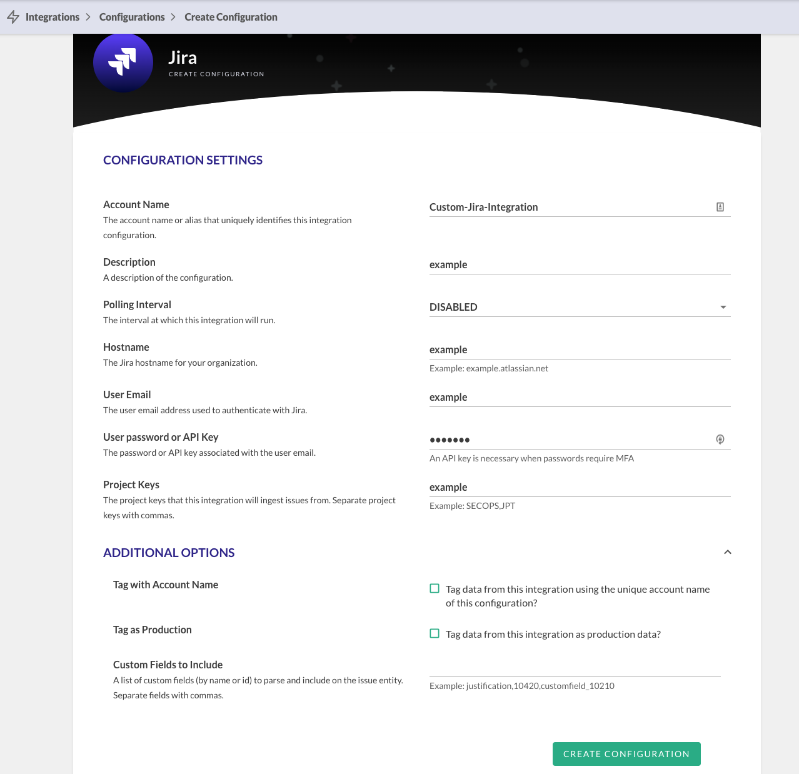
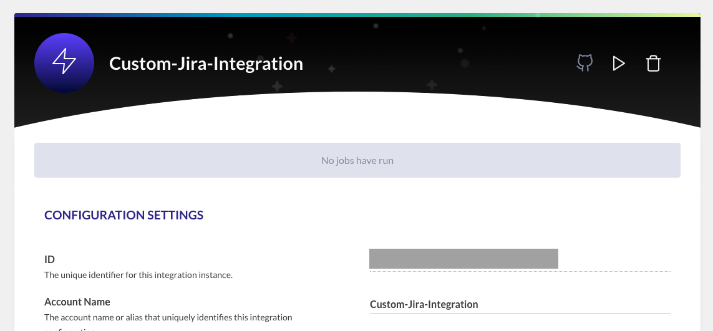
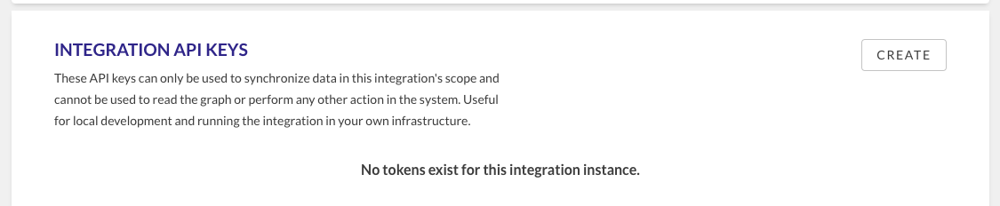
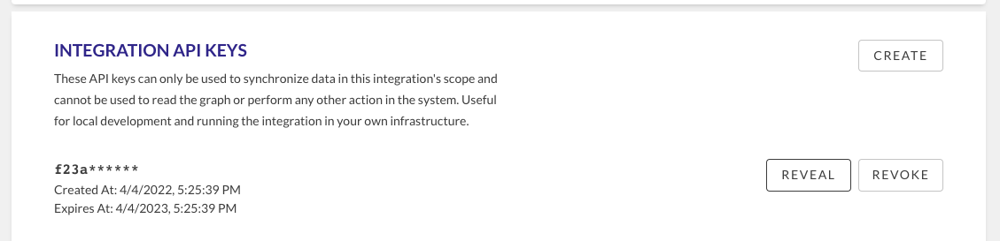
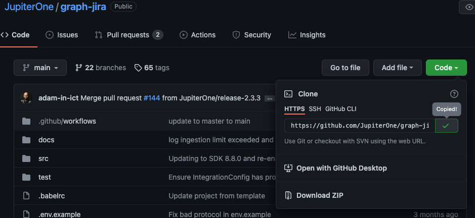

# How to configure and run a managed integration locally

There are a number of reasons why a JupiterOne managed integration should be run locally. Some examples include the tool is running within a VPC, firewall rules don’t allow external access, or the tool is running on-prem. This article outlines the steps for running an integration locally. These steps include extracting the data, viewing them as a graph, and loading the data back into JupiterOne’s graph.

You can find additional developer documentation here in our JupiterOne SDK. This documentation, along with some of the commands we’ll review and pre-requisites in the JupiterOne platform will be needed when creating your own custom integrations.

## Set up in JupiterOne

Before you can send the integration results into JupiterOne, you will need your **JupiterOne Account ID** and you will need to create a Mock Integration Instance so that you can capture the **Integration Instance ID** and create an **Integration API Key**.

1. Your JupiterOne Account ID

Find this ID by navigating to the account management page or running this query:  

`FIND jupiterone_account as a return a._accountId`

2. An Integration Instance ID
3. An Integration API Key

For 2 and 3, follow these steps:

### Create a template integration instance using dummy data:

1. Navigate to the integrations page and select the integration you are going to configure and click the add integration instance button (we’ll use Jira as an example throughout this article).
2. Fill in the all required fields (see the screenshot for an example)
- Fill in the Account Name field with a value that includes the word custom, manual, or local. You especially want a descriptive name if you have multiple integration instances configured for the same tool. 
- Set the Polling Interval to be Disabled so that the JupiterOne platform does not try to run the integration at a specific interval.
- Fill in the rest of the fields with dummy data. The create configuration button is not clickable until all required fields have been filled in or selected.

3. After you create the configuration, you should see an ID field appear. This is the Integration Instance ID. You’ll need this value later.

4. You will also see towards the bottom of the page a section to create an integration API key. Click the create button.

You can now click to reveal the Integration API Key. You'll also need this value later.

## Cloning and Running the Integration

Next you'll clone the repository of the integration you are trying to run locally. Integration repositories are public and can be found under the [JupiterOne Organization](https://github.com/JupiterOne). When you search for an integration repository, you'll notice each follows a naming convention of **graph-\***. We’ll continue with our Jira example by navigating to the [Jira Repository](https://github.com/JupiterOne/graph-jira).

Copy the link under Code so we can clone the repository.

We'll describe two methods for installing dependencies and running the integrtion: running the job locally using a Mac terminal or using a provided Dockerfile to run the job from within a Docker container. 

### Using the Mac Terminal

1. Make sure all prerequisites are installed.

- Install [Homebrew](https://brew.sh/) (this will take a moment)
- Install [Node.js](https://nodejs.org/en/) using the [installer](https://nodejs.org/en/download/) or a version manager such as [nvm](https://github.com/nvm-sh/nvm) or [fnm](https://github.com/Schniz/fnm)
- Install yarn or npm: `brew install yarn` or `brew install npm`

2. Next, open a terminal in the location where you'd like the repo to live. Type in `git clone` followed by the url copied from GitHub. 

`git clone https://github.com/JupiterOne/graph-jira.git` 

Remember which directory you clone the repo to. You’ll want to perform the next steps in the root of the cloned repository.

3. Install dependencies (you can skim through the package.json file to see which dependencies are being installed)

`yarn install` or `npm install`

4. Copy the contents of the environment example file to a new environment file which will be used when running the integration. 

`cp .env.example .env`

5. Open the environment file to edit the values of the listed parameters (and add additional environment variables as needed).

`vi .env`

If not listed, these parameters are required across all integrations:

- JUPITERONE_API_KEY
- JUPITERONE_ACCOUNT
- INTEGRATION_INSTANCE_ID

There are also some integration specific values that are listed in the .env.example file. For example, Jira requires:

- JIRA_HOST
- JIRA_USERNAME
- JIRA_PASSWORD
- PROJECTS
- JIRA_API_VERSION
- BULK_INGEST_ISSUES

*You may notice a few examples where the .env.example file is outdated and does not list out all of the required parameters. There may also be times when it is not clear what format the value of a parameter should be. In these situations, please skim through the config.ts file in the src folder of a graph-\* integration repo. Here is an [example config.ts](https://github.com/JupiterOne/graph-jira/blob/main/src/config.ts) file from the graph-jira repo. Parameters use the UPPERCASE_EXAMPLE_SYNTAX.*

**Now that everything is set up, you are ready to trigger the integration job.**

1. Collect data from the source tool

`yarn start or yarn j1-integration collect`

2. Push the data into JupiterOne

`yarn j1-integration sync`

3. (Optional) Visualize the collected data

`yarn graph or yarn j1-integration visualize`

4. For most repositories, you can skip steps 1 and 2 and instead just call the run command which includes both the start and sync steps

`yarn j1-integration run`

**Finally, navigate to the integration instance in JupiterOne to view the data that has been pushed into the platform.**

### Using a Dockerfile 

Docker is just one example of how you can automate the environment setup and execution of the previous steps. [This Docker repo](https://github.com/ajahoda/j1-graph-docker) walks you through the process of copying over its contents into your cloned integration repository, building a Docker image, and running a Docker container to collect information from the integration and sync it with the JupiterOne platform.

## Resources

The [JupiterOne SDK](https://github.com/JupiterOne/sdk/blob/main/docs/integrations/development.md) describes how graph-\* integration repositories are configured and provides information on how to build, test, and execute. The section [supported commands](https://github.com/JupiterOne/sdk/blob/main/docs/integrations/development.md#supported-commands) is especially useful because it describes what options you can pass to execute different scripts.
