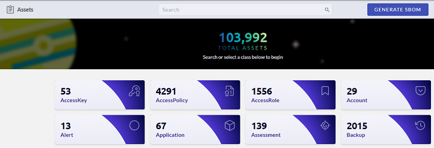

# Generating a Software Bill of Materials (SBOM)

A software bill of materials (SBOM) allows you to quickly see and assess vulnerability and security risks in your organization. JupiterOne generates a SBOM for the assets you have configured with J1, examining the list of vulnerabilities in relation to your assets.

### Prerequisite

To generate the SBOM file, you must have Administrator access to your assets. Your environment must also contain:

- An active GitHub, BitBucket, or GitLab integration in J1
- An active NPM or Artifactory integration in J1
- `CodeRepo that USES CodeModule` relationships for your integrated GitHub, BitBucket, or GitLab integrations

### SBOM File

To generate an SBOM:

1. In J1, go to **Apps  > Assets**.

2. In the top-right corner, click **Generate SBOM**.
   ​

   

   ​

3. If you have met the prerequisite criteria above, then you can click Generate Download, and J1 downloads the SBOM in the form of a JSON file.

If you do not meet any of the prerequisite criteria, you see a red X next to the criteria. Click the red X for more information about the error.

Follow the corrective instructions in the error message, and try to generate your SBOM again.

