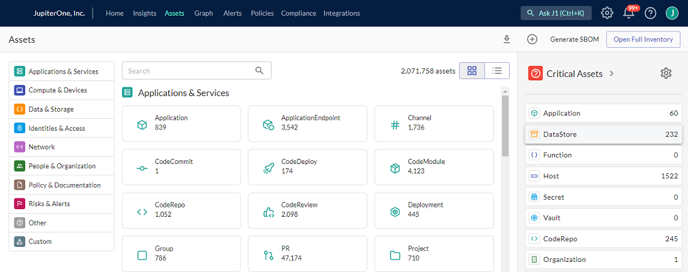

# Generating a Software Bill of Materials (SBOM)

A software bill of materials (SBOM) allows you to quickly see and assess vulnerability and security risks in your organization. JupiterOne generates a SBOM for the assets you have configured with J1, examining the list of vulnerabilities in relation to your assets.

### Prerequisite

To generate the SBOM file, you must have Administrator access to your assets. Your environment must also contain:

- An active GitHub, BitBucket, or GitLab integration in J1

- An active NPM or Artifactory integration in J1

- `CodeRepo that USES CodeModule` relationships for your integrated GitHub, BitBucket, or GitLab integrations

- Installed version of [CycloneDX](cyclonedx-bom) or something similar


The instructions in this article are based on using NPM as a package manager of node.js and the [OWASP CycloneDX Software Bill of Materials (SBOM) Standard](https://cyclonedx.org/).

### Install and Invoke the CycloneDX SBOM Tool

To install the tool

1. Run  `npm install -g @cyclonedx/bom`, if you have not already installed the tool. 

2. Run  `cyclonedx-bom -o sbom.json` to change the format of the SBOM from the default XML format to JSON. 

   If you want to include developer dependencies, you can use  `cyclonedx-bom -o sbom.json -d`. Developer dependencies helps us understand if there are developer machines that may have been compromised as a result of an NPM package being compromised. 


### Pull Dependency Distinctions

The CycloneDX file does not maintain which developer dependencies are direct vs, transitive or developer vs productions, therefore, it is necessary to add annotations.

The `package.json` file of the NPM project is a JSON structure that contains `devDependencies` and `dependency` arrays that represent the distinctions you need to make. Use a command-line JSON processor to extract these arrays and redirect them to an output file that you use as for the input parameters for the ingestion script. The following code uses the [jq tool](https://github.com/stedolan/jq).

```
jq '.devDependencies | keys' package.json > devDeps.json
```

```
jq '.dependencies | keys' package.json > directDeps.json
```

### Ingest the CycloneDX SBOM into J1

The ingestion script required two arguments. One is the SBOM and a path to your SBOM file that CycloneDX generated. The other required argument is the repository, which specifies the name of the code repository that you are ingesting against. Include the two optional arguments for developer dependencies and direct dependencies.

**Note**: For the purposes of this ingestion script, the repo you ingest against must already exist in the JupiterOne graph database, so ensure you integrate your source code management (SCM) tool of choice, such as GitHub, Bitbucket, or GitLab.

Ingestion script:


The full command for this example:

```
ingest-cyclonedx –sbom ./sbom.json –repo jupiter-mapper –devDeps ./devDeps.json –directDeps ./directDeps.json
```

Alternatively, if you are also using an NPM project, and you do not want to perform the first two steps above, you can invoke the [`npm-inventory` script. ](https://github.com/JupiterOne/secops-automation-examples/tree/main/npm-inventory) This script only ingests direct dependencies by default, but is an equivalent method to ingesting NPM dependency data into the JupiterOne graph database.

### Extract Data from the J1 Graph Database by Script

JupiterOne, like other graph databases, looks at relationships between assets. In this specific example, you are looking at the `CodeRepo -USES-> CodeModules` relationship because the `USES` relationship provides the distinctions of developer vs. production and direct vs. transitive dependencies.

This script generates the SBOM. In this example, the alias `generate-sbom` initiates a query of the J1 graph database to `Find CodeModule THAT USES CodeRepo`. You can filter the query to only show direct dependencies that are production.

```
generate-sbom "Find npm_package THAT USES as u CodeRepo WHERE u.directDependencies=true and u.devDependencies=false"
```

 if you annotate your code repos in GitHub with tagging information, you can adjust the query to build a tag-specific SBOM:

```
generate-sbom "Find CodeModule THAT USES CodeRepo WITH tag.Component='<insert tag name>'"
```

### Extract Data from the J1 Graph Database in J1 Assets

To generate an SBOM:

1. In J1, at the top of the navigation bar, click **Assets**.

2. In the top-right of the Assets window, click **Generate SBOM**.
   ​

   

   

3. If you have met the prerequisite criteria above, then you can click **Generate Download**, and J1 downloads the SBOM in the form of a JSON file.

If you do not meet any of the prerequisite criteria, you see a red X next to the criteria. Click the red X for more information about the error. 


 


Follow the corrective instructions in the error message, and try to generate your SBOM again.


 