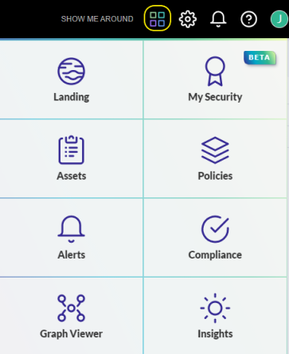

# test post refactor

slkdjfj
The first step in using J1 is to bring your data into J1. There are numerous ready-made integrations that are easy to install and use to achieve end-to-end cyber asset visibility, context, and automation across every dimension of your digital universe. J1 provides [instructions](../getting-started_and-admin/configure-integrations.md) on how to import the data to J1 and understand the data model and mapping.

## J1 Apps

JupiterOne has separate apps that assist you in all the major components of security management. Click  to view the apps.

