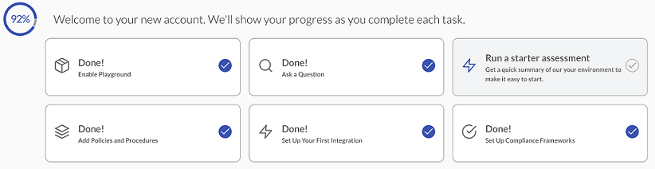
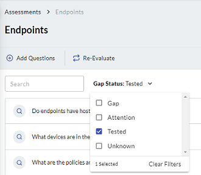
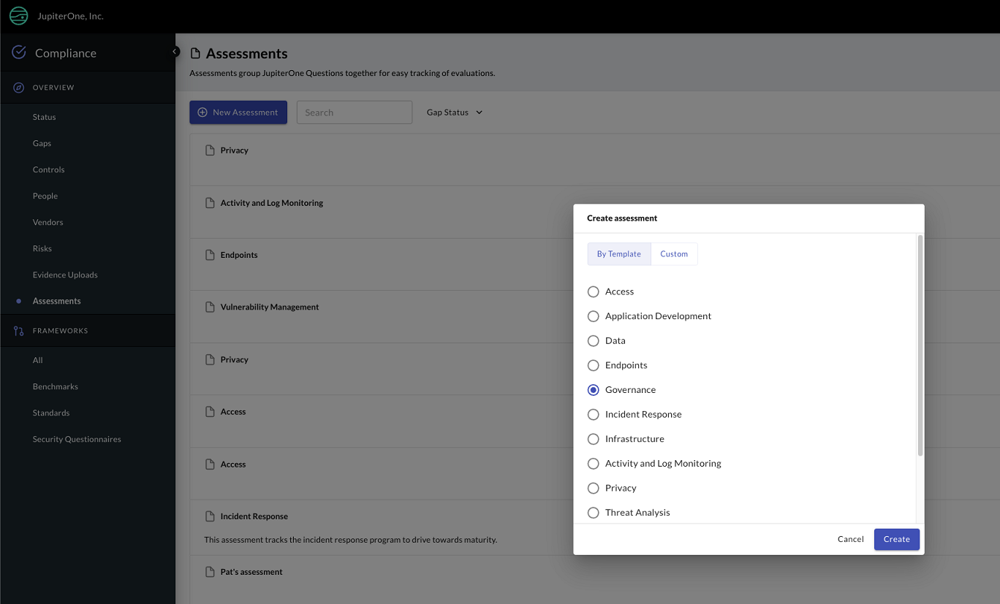
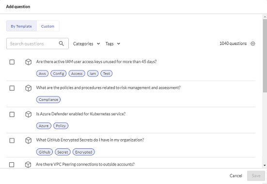
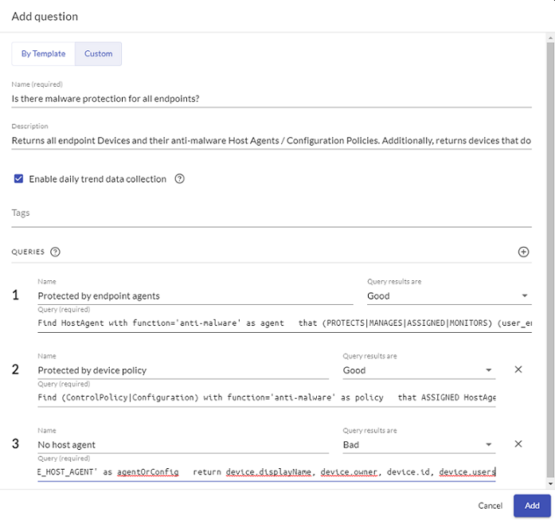
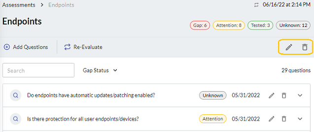

# Using JupiterOne Assessments

JupiterOne Assessments enable you to run multiple questions at the same time to evaluate your security posture based on template, category, or tag. You can also create your own custom assessment by selecting any questions from the J1 managed questions library. Each selected question is evaluated similar to a compliance requirement in the assessment. You access J1 Assessments from the left navigation pane in J1 Compliance.

### Running a Starter Assessment

If you are a new user, you see on the J1 landing page, the option to run a starter assessment. 

J1 provides starter assessments, grouped by subject-matter categories, such as access, data, and privacy. 

You can also filter existing assessments for your organization by compliance gap status. Click the **Gap Status** dropdown menu and select Gap, Attention, Tested, or Unknown to find existing assessments whose results reveal where there are:

- Gaps in compliance.
- Areas that potentially need remediation.
- Requirements are met and being monitored.
- A manual review of a compliance issue is necessary.
  ​

  

### Creating an Assessment

To create an assessment:

1. Go to **Compliance > Assessments**, and click **New Assessment**.

2. To use a template, click the **By Template** tab, select the assessment category from the list, and click **Create**.

   
   ​

3. If you want to create a custom assessment, click the Custom tab, enter a name for the assessment and, optionally, a description, and click **Create**. 

4. If you want to add more questions to the ones already in a template assessment, click **Add Questions**.

   The questions in assessments check your environment for criteria that your organization must meet. Each time you add a question to an assessment, J1 runs an evaluation of your environment to report where there are deviations from the expected outputs.

5. From the **By Template** tab, select the additional questions you want to include, and click **Save**.

   ​

    
   ​

6. If you want to add custom questions to an assessment, click the **Custom** tab and enter the following information:

   - Name in the form of a question (required)
   - Description to explain what the question should answer (optional)
   - Any tags you want to add to the question (optional)
   - Queries with the name and J1QL query syntax, indicating if you want the query results to be informative, good, bad, or unknown (required).

7. Click **Add**.
   ​

   

You can easily edit or delete assessments and questions by using the pencil and trash can icons next to them. 

 