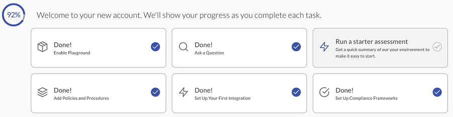

# Using Compliance Assessments

JupiterOne Compliance provides assessments that contain compliance questions that enable you to see the power of J1 when you run this assessment. You can also create your own custom assessment by selecting any questions from the J1 question library. Each selected question creates one associated compliance requirement in the assessment. Access the assessments from the left navigation pane in J1 Compliance.

### Running a Starter Assessment

If you are a new user, you see on the J1 landing page, the option to run a starter assessment. 

J1 Compliance provides starter assessments, grouped by security categories, such as access, data, and privacy. 

### Creating an Assessment

To create an assessment:

1. Click **New Assessment**.

2. To use a template, click the By Template tab, select the assessment category from the list, and click **Create**.
   ​

   

   ​

   To more easily find assessments, you can filter the list by whether there is a security gap, basically presence of deficiencies in the security framework of your organization between fulfilled compliance requirements and outstanding remediation.
   ​

    
   ​

3. If you are using a template assessment, select which of the provided questions to be part of your assessment, and click **Save**.
4. If you want to create a custom assessment, click the Custom tab, enter a name for the assessment and, optionally, a description, and click **Create**. 

### Adding Questions to Assessments

The questions in assessments add compliance requirements that your organization must meet. Each time you add a question to an assessment, J1 runs an evaluation of your environment to report where there are gaps in compliance.

To add questions: 

1. If you want to add more questions to a template assessment, click **Add Questions**.

2. From the **By Template** tab, select the additional questions you want to include, and click **Save**. You can filter the available questions by security category, such as access, data, and privacy or filter on tags that are added to questions.

    

3. If you want to add questions to a custom assessment, click the Custom tab and enter the following information:

   - Name in the form of a question (required)

   - Description to explain what the question should answer (optional)

   - Any tags you want to add to the question (optional)

   - Queries with the name and J1QL query syntax, indicating if you want the query results to be informative, good, bad, or unknown (required).

4. Click **Add**.

 

#### Editing and Deleting Assessments and Questions

You can easily edit or delete assessments and questions by using the pencil and trash can icons next to them. 

 