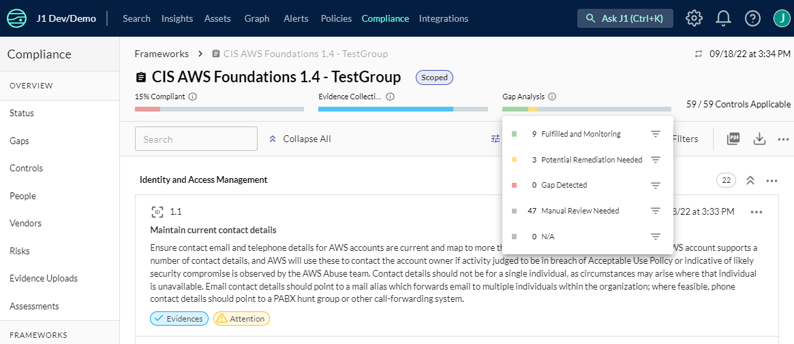

# Compliance Gap Analysis

Compliance gaps are defined as deficiencies in the security framework of your organization between fulfilled compliance requirements and outstanding remediation.

Your compliance department, your compliance officer, or security lead decides the security frameworks with which your organization must be compliant. Frameworks comprise benchmarks, standards, and security questionnaires as part of your comprehensive compliance program. 

You have compliance gaps when:

- There is no external evidence (such as notes, links, file uploads) that you have completed a framework requirement.
- There are J1QL question queries whose results show there is no evidence that a framework requirement is complete.

At any time, you can review where the gaps are in your compliance by clicking the information icon next to gap analysis in a selected framework.

## Accessing Gap Analysis

If you have access to J1 Compliance, you have access to the gap analysis view. If you do not have access to J1 Compliance, your J1 administrator can grant you access to the gaps table by adding a special, read-only permissions role to the group permissions for group to which you belong. With this role, you can see the compliance gap information but are not able to perform any other actions in J1 Compliance.  

From the selected framework details view, click the filter icon next to the gap category to see where the gaps are in your compliance status. 





Each query in a saved question has a property to indicate whether the results from the query are good, bad, unknown, or informative. You can configure this property in the J1Query Language UI or via the J1 API.

At the API level, this value is set with the `resultsAre` property. For example:

```yaml
- id: managed-question-access-password-policy
  title: Show me the current password policy and compliance status.
  queries:
    - name: Compliant policies
      resultsAre: GOOD
      query: |
        Find PasswordPolicy with
          minLength >= 8 and
          requireLowercase = true and
          requireUppercase = true and
          requireSymbols = true and
          maxAgeDays <= 90 and
          historyCount >= 12
    - name: Non-compliant policies
      resultsAre: BAD
      query: |
        Find PasswordPolicy with
          minLength < 8 or
          requireLowercase != true or
          requireUppercase != true or
          requireSymbols != true or
          maxAgeDays > 90 or
          historyCount < 12
```

## Gap Analysis Queries

Queries with the `resultsAre` property in a question that is mapped to a compliance requirement trigger automated gap analysis, as follows:

- `GOOD`:

  Results from a "good" query indicates **expected configuration is present**.

  For example, a list of critical data stores that are encrypted.

  ```j1ql
  Find DataStore with classification='critical' and encrypted=true
  ```

- `BAD`:

  Results from a "bad" query indicates **gaps or misconfigurations**.

  For example, a list of critical data stores that are _not_ encrypted.

  ```j1ql
  Find DataStore with classification='critical' and encrypted!=true
  ```

- `UNKNOWN`:

  Results from an "unknown" query indicates **resources with an unknown scope or state**.

  For example, a list of data stores that do _not_ have classification tags.

  ```j1ql
  Find DataStore with classification=undefined
  ```

`INFORMATIVE` queries are not used in compliance gap analysis.

A question can have one or all of the above named queries.

## Gap Analysis Status

J1 Compliance performs regular, automated gap analysis based on your compliance status. In the Compliance UI, the gap analysis statuses are color-coded:

- Green = All controls are in place and being monitored by J1
- Orange = You may potentially have items to remediate
- Red = There are gaps in your compliance that you must remove
- Grey = Manual review of a compliance issue is necessary

You can also use J1QL to query each framework requirement or control, which return the following statuses:

- `TESTED`

  The framework requirement is complete and being monitoring.

- `ATTENTION`

  Potential remediation is needed because J1 has detected a potential gap, with a mix of properly configured resources and misconfigurations, such as partially fulfilled.

- `GAP`

  A control gap is detected with no properly configured resources identified.

- `UNKNOWN`

  Manual review is needed because J1 was unable to auto-determine the status with the queries provided.

  This status also appears when the requirement or control has no mapped query question _and_ no external evidence provided.

The status is determined by the presence and output of the named queries in the mapped questions, as shown in this matrix:


**Note**: A single query in a question without the `resultsAre` property set is implicitly interpreted as a `GOOD` query.