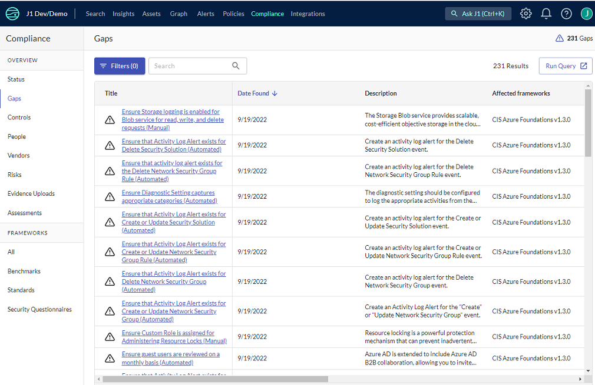

# Compliance Gaps Table

JupiterOne provides a compliance gaps table for a direct view into the gaps across your environment that impact your compliance posture. The gaps table offers immediate insights into all gaps, across all frameworks, accounts, and entities in your environment, removing the need to look at various separate gaps in each individual framework. 

### Accessing the Gaps Table

By default, the gaps table is enabled in your environment and if you have access to J1 Compliance, you can view and interact with the gaps table. 

If you do not have access to J1 Compliance, you can have the gaps-only role, which provides access to the gaps table. Your J1 administrator should add this role to an existing group, instead of creating a new group for gaps-only access. Gaps-only access enables you to perform open searches and queries for gaps without  interacting with the rest of J1 Compliance. 

### **Filtering Results**

The gaps table displays all deficiencies and weaknesses within your environment, as well the total count of affected assets, enabling you to identify and address specific gaps. You can filter the gaps on one or more of the following:

- Affected frameworks: displays only the frameworks within your environment that have deficiencies.
- Integration accounts: accounts that are linked to the one with gaps.
- AWS account ID: the AWS accounts in your environment with gaps. 
- Azure subscription ID: the Azure accounts in your environment with gaps. 
- GCP project ID: Google Cloud Platform accounts in your environment with gaps.

### **Finding Affected Assets**

The gaps view helps you identify affected assets so that you can take corrective action. For each gap, the affected assets are shown in the Gaps Detail tabs. There are two methods to finding all impacted assets: 

1. Click **Run query** to see all assets that have gaps. The query opens the search page with the query prepopulated. If you apply all filters, such as affected frameworks or account IDs, they are included in the query. After the query loads, you can export the findings to view all assets. 
2. Export assets for a single gap. When, clicking in to a gap, you can select the affected entities tab to view all assets impacted by that gap. From this tab, click **Export CSV** to download the list of affected assets for the gap (such as approved software). 

### Viewing Gaps in the Graph

For a specific gap, you can view the gap and the associated problems in the J1 graph. There are two options to open the graph. Running the gaps query from the main gaps table opens all gaps, from which you can drill down on certain gaps you want to open in the graph. Alternatively, you can open a single gap from the Gaps details by clicking **View in the graph**. 