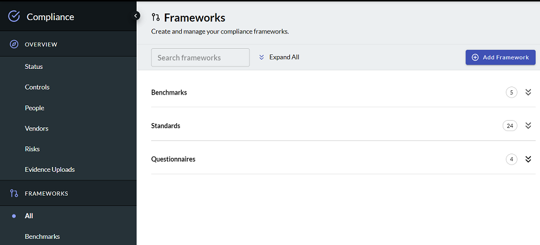
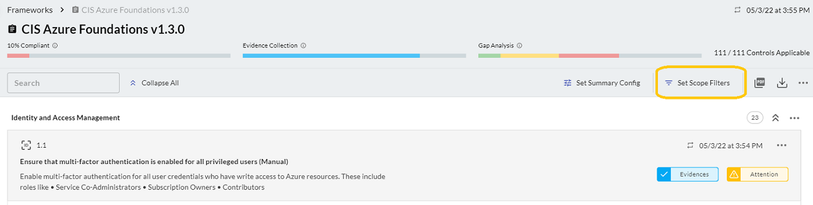
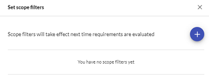
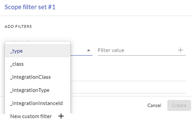
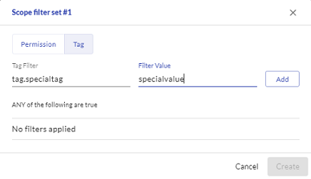

# Adding Compliance Frameworks

A security compliance framework is a structured set of guidelines that details the processes and procedures your organization implements to be in accordance with established regulations, specifications or legislation. Frameworks can include communication processes, risk controls, and governance practices for maintaining compliance.

The first step in compliance management is to select the frameworks with which you want to be compliant. You can select the preset standards provided by J1 or import your own configuration. 

**Note:** You must have the adminCompliance permission to be able to import frameworks.

Open J1 Compliance from the top J1 navigation bar.  To add a framework:

1. Select **Frameworks** from the left navigation panel and click **Add Framework**.
   ​
   ​
   
   
   
2. Choose one of the templates that J1 provides, or click **Import JSON/CSV** and paste your compliance framework file in JSON or CSV format. 
   ​
   J1 provides [community example files](https://github.com/JupiterOne/security-policy-templates/tree/main/templates/standards) for you to use as references.

**Note**: You must have the necessary license and permission to use a framework for your organization. **Licensing is not provided by JupiterOne**, except for CIS Controls and Benchmarks.

### JSON Structure

If you want to import a JSON file, follow [this schema](https://github.com/JupiterOne/security-policy-templates/tree/main/templates/standards).

### CSV Import

If you want to import a compliance standard specification from a CSV file, the CSV header must contain the following as column headers:

- `ID`
- `Requirement` or `Control`
- `Section` or `Domain`

## Filter on Scope

Scoping frameworks allows you to control against which assets you want to evaluate your framework within your environment, giving you control over the level of detail you see. At its most basic level, setting the scope means filtering a framework to only look and evaluate against the things you want it to, saving time and resources. Some examples of scoping include specific integration instances, `_tags`, `_class`, and other filters. 

#### Before You Begin

- You must have Administrator privileges to J1 Compliance.
- Depending on your filter value, you must know the `_tag` value as this is not automatically populated.
- You can set levels of filters. Be aware that the filters are hierarchical, and all other filters are inherent in the values of the first set of filters. 

Scoping a framework does limit the chain of relationships between entities. A scoped framework only looks at the root entity, not at relationships. For example, if a framework were scoped to `-tag = red`, then it only returns values with that tag. The value of scoping frameworks is the limitations it places on the filtering value, allowing you to point frameworks only to evaluate specific CPS instances or a group of integrations. 

To set the scope of a framework:

1. In J1 Compliance, select the framework you want to scope.

2. Click **Set Scope Filters**.
   

   

    

3. In the Set scope filters dialog, click the blue + icon.
   

   
    

4. To select permission filters, in the scope filter set dialog, click the Permission tab. From the dropdown menu, select a permission filter.

   You can filter on the following:

   - `_type`:  Type of asset, such as datastore or persons

   - `_class`:  Class of asset, such as requirement or image

   - `_integrationClass`:  Category of integration, such as Data Loss Prevention or App Hosting

   - `_integrationType`:  Type of integration, such as Jira or GovCloud

   - `integrationInstanceId`:  Your integration account ID

   - A custom filter of your own
     ​

​			  

​			You can also set scope filters using `_tag` values, giving you the ability to filter frameworks to assets
​	   	 with that tag. This feature is useful if you are using critical assets or tags to manage your 
​			integrations. Enter the name of the tag you want to use and the values that pertain to the tag you
​			are using.

​			 

After you set the filters, they take effect the next time J1 evaluates the framework requirements.