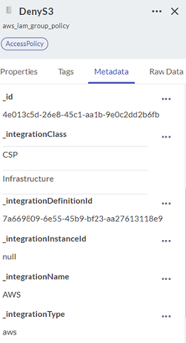

# Using J1 Metadata

JupiterOne adds metadata properties to all data in the J1 system, regardless of how the data was created. All metadata properties begin with an underscore `_` and are visible when you click on any asset in J1 Assets. The asset properties drawer opens, and the Metadata tab displays all the metadata for that asset.

 

You can query metadata properties like any other property in J1QL or via the API. Metadata properties include: 

| Property                    | Definition                               |
| --------------------------- | ---------------------------------------- |
| `_accountId`                | JupiterOne account ID associated with the asset. |
| `_beginOn`                  | Last time the asset was updated in JupiterOne in millisecond epoch time. |
| `_class`                    | String value of the JupiterOne class of the asset (such as 'DataStore'). |
| `_createdOn`                | First time the asset was created in JupiterOne (not the source) in millisecond epoch time. |
| `_deleted`                  | Boolean value if the asset is in a deleted state or not (such as false). |
| `_endOn`                    | Time the asset was deleted in JupiterOne (not the source) in millisecond epoch time (is null/undefined if deleted = false). |
| `_fromEntityId`             | `_id` of the asset with which the "from" relationship exists. |
| `_fromEntityKey`            | `_key` of the asset with which the "from" relationship exists. |
| `_id`                       | UUID value for the asset (string).       |
| `_integrationClass`*        | If the asset came from an integration, this property is an array of string values containing the tags attributed to the integration (such as ['CSP', 'Infrastructure'']). |
| `_integrationDefinitionId`* | UUID for the specific JupiterOne integration. Every integration, such as AWS, has a unique `integrationDefinitionId` (string). |
| `_integrationInstanceId`*   | UUID for the specific integration configuration the asset came from in your environment (string). |
| `_integrationName`*         | Your choice of common name (string) for the integration configuration the asset came from (such as 'Prod-US-East-1 AWS Environment'), and  maps 1:1 with a unique `integrationDefinitionId`. |
| `_integrationType`*         | JupiterOne internal development name (string, all lowercase, no spaces) for an integration (such as 'aws', 'azure', 'google_cloud'). |
| `_key`                      | Locally unique value (string) for the asset within the `_scope` of the integration or API ingestion job it came from. These properties are set by JupiterOne for integrations, and by you for custom uploads. Two assets can have the same` _key` or the same `_scope`, but not both. |
| `_scope`                    | Value (string) to define a group of assets that are ingested together via an integration or API (such as all entities uploaded via API in the same synchronization job would have the same user-defined `_scope` value). |
| `_source`                   | Can be one of three values ('integration-managed', 'system-mapper', 'api') (string). |
| `_toEntityId`               | `_id` of the asset with which the "to" relationship exists. |
| `_toEntityKey`              | `_key` of the asset with which the "to" relationship exists. |
| `_type`                     | Value of the JupiterOne type of  asset (string) (such as 'aws_s3_bucket'). |
| `_version`                  | Value of the number (integer) of times the asset has been updated in JupiterOne (such as 59). |

*All metadata properties beginning with _integration are null/undefined if the asset did not come from an integration.
