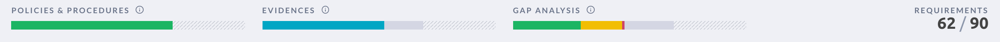

# Compliance Management in JupiterOne

JupiterOne provides a flexible platform for users to import and manage any compliance standard / framework as a set of controls or requirements. The platform provides the following capabilities: 

- [Import a compliance standard or security questionnaire](./compliance-import.md)

- [Map policy procedures to each control or requirement](./compliance-mapping-policies.md)

- [Map data-driven compliance evidence by query questions](./compliance-mapping-evidence.md)

- [Perform automated gap analysis based on query results](./compliance-gap-analysis.md)

- [Export compliance artifacts (summary or full evidence package)](./compliance-gap-analysis.md)

## Compliance Status and Maturity

JupiterOne compliance app provides measurements and status indicators at three different maturity levels for each compliance standard and its requirements/controls: 

1. Has documented policies and procedures
2. Has implementation evidence (either via data-driven queries or external evidence)
3. Continuous monitoring and remediation

Here is an example screenshot:

[Watch this video](https://try.jupiterone.com/blog/video-managing-grc-with-jupiterone) for more information about managing compliance with automated policies and procedures.
