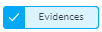
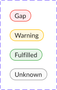

# Compliance Status and Maturity

The J1 Compliance Status view provides measurements and status indicators at four different maturity levels for each compliance framework and its requirements and controls:

- Documented policies and procedures
- Implementation evidence, either via data-driven queries or external evidence
- Gap analysis between fulfilled requirements and outstanding remediation
- Continuous monitoring and remediation
  ​

## Status Symbols

The J1 Compliance UI uses status symbols to help you quickly scan your status view to see the level of compliance for each of the frameworks in your environment. 

In J1 Compliance, click Status to 

| Symbol                                  | Meaning                                  |
| --------------------------------------- | ---------------------------------------- |
|     | Filters are applied to a framework to narrow the scope of what the linked evidence looks at |
| Policies                                |                                          |
|  |                                          |
| Attention                               |                                          |
| Unknown                                 |                                          |
| Warning                                 |                                          |
| Fulfilled                               |                                          |

## Gap Analysis Status

J1 Compliance performs regular, automated gap analysis based on your compliance status. In the Compliance UI, the gap analysis statuses are color-coded:

- Red - Gap = There are gaps in your compliance that you must remove
- Orange - Warning = You may potentially have items to remediate
- Green - Fulfilled = All controls are in place and being monitored by J1
- Grey - Unknown = Manual review of a compliance issue is necessary

 

You can also use J1QL to query each framework requirement or control, which return the following statuses:

- `TESTED`

  The framework requirement is complete and being monitoring.

- `ATTENTION`

  Potential remediation is needed because J1 has detected a potential gap, with a mix of properly configured resources and misconfigurations, such as partially fulfilled.

- `GAP`

  A control gap is detected with no properly configured resources identified.

- `UNKNOWN`

  Manual review is needed because J1 was unable to auto-determine the status with the queries provided.

  This status also appears when the requirement or control has no mapped query question _and_ no external evidence provided.

The status is determined by the presence and output of the named queries in the mapped questions, as shown in this matrix:

**Note**: A single query in a question without the `resultsAre` property set is implicitly interpreted as a `GOOD` query.

[Watch this video](https://try.jupiterone.com/blog/video-managing-grc-with-jupiterone) for more information about managing compliance with automated policies and procedures.