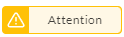
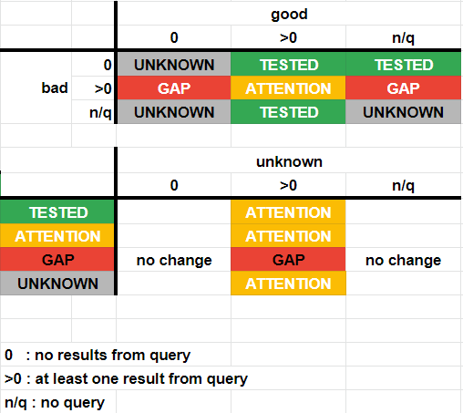

# Compliance Status and Maturity

The J1 Compliance Status view provides measurements and status indicators at four different maturity levels for each compliance framework and its requirements and controls:

- Documented policies and procedures
- Implementation evidence, either via data-driven queries or external evidence
- Gap analysis between fulfilled requirements and outstanding remediation
- Continuous monitoring and remediation
  ​

## Status Symbols

The J1 Compliance UI uses status symbols to help you quickly scan your compliance status view to see the level of compliance for each of the frameworks in your environment. Click any of the requirements under a framework to see those statuses.

### Requirements and Evidences Statuses

Compliance is measured by requirements and evidence that you have met those requirements. The different statuses indicate where action and attention is needed.

| Symbol                                   | Meaning                                  |
| ---------------------------------------- | ---------------------------------------- |
|  | Potential remediation is needed because J1 has detected a potential gap in compliance. |
|  | Linked evidence files provide proof of compliance. |
|  | No linked evidence files to prove compliance. |
|  | A manual review of a compliance issue is necessary. |
|   | There are [gaps in your compliance](../compliance-gap-table.md) that you must remove. |
|  | The framework requirement is complete and being monitoring. |
|     | A manual review of a compliance issue is necessary. |

Click any of these symbols from the frameworks view to see more details about the status.

If you see the symbol next to a framework, it indicates that filters are applied to this framework to narrow the scope of what the linked evidence looks at.

## Query Statuses

If there are compliance gaps in the results of any of the queries in linked questions, these gaps also have color-coded statuses.

| Symbol                                           | Meaning                                              |
| ------------------------------------------------ | ---------------------------------------------------- |
|     | You may potentially have items to remediate.         |
|      | You must remove these gaps in your compliance.       |
|  | All controls are in place and being monitored by J1. |
|  | Manual review of a compliance issue is necessary.    |

You can also use J1QL to query each framework requirement or control, which return similar statuses:

- `TESTED`

  The framework requirement is complete and being monitoring.

- `ATTENTION`

  Potential remediation is needed because J1 has detected a potential gap, with a mix of properly configured resources and misconfigurations, such as partially fulfilled.

- `GAP`

  A control gap is detected with no properly configured resources identified.

- `UNKNOWN`

  Manual review is needed because J1 was unable to auto-determine the status with the queries provided.

  This status also appears when the requirement or control has no mapped query question _and_ no external evidence provided.

The status is determined by the presence and output of the named queries in the mapped questions, as shown in this matrix:

 

**Note**: A single query in a question without the `resultsAre` property set is implicitly interpreted as a `GOOD` query.

[Watch this video](https://try.jupiterone.com/blog/video-managing-grc-with-jupiterone) for more information about managing compliance with automated policies and procedures.