# General Insights Dashboard Functionality 

- Click a pie or bar chart to open a detailed table of the selected data point:
  
  
  
  
  
  
  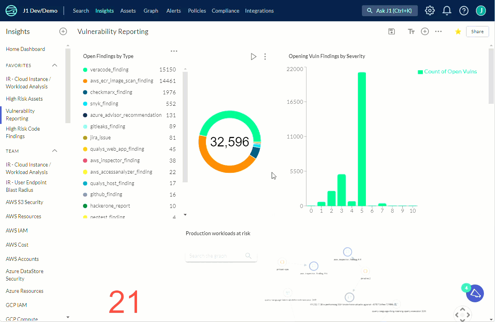
  

- Click any row in a dashboard table to see more detailed information about the entity in that row. 

  

  

  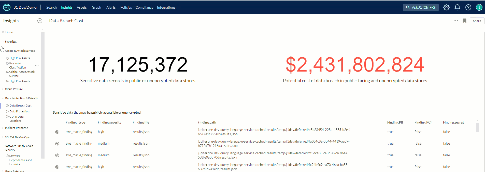 

- Download any widget on any board to either a PNG, CSV, or format.

    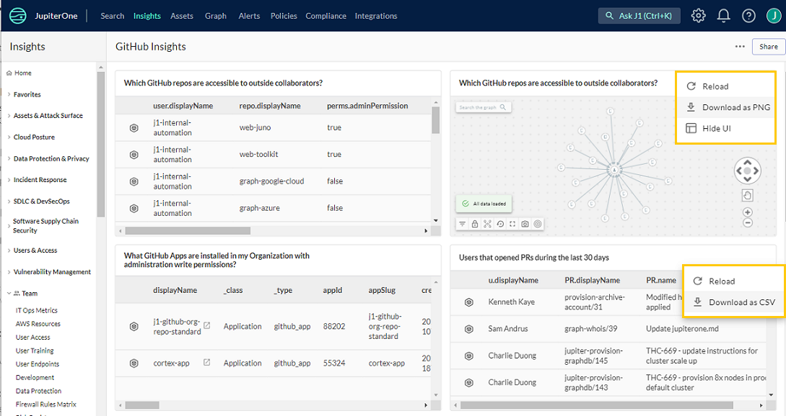 

​	

​	

- Duplicate or delete boards:
  
  
  
  
  
  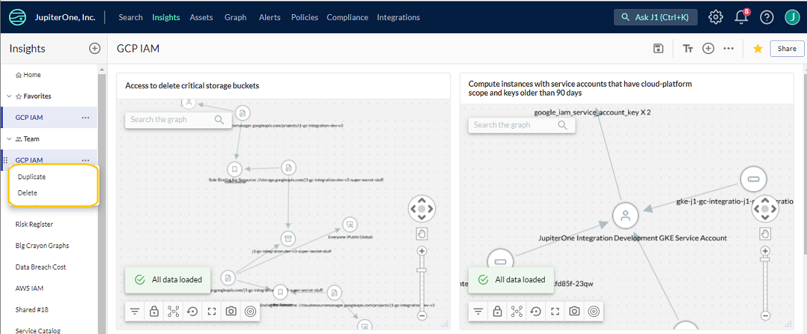
  

- Download a board as a PDF or JSON schema, share boards, or duplicate boards, as well as edit the board layout, including adding charts:

  

  

  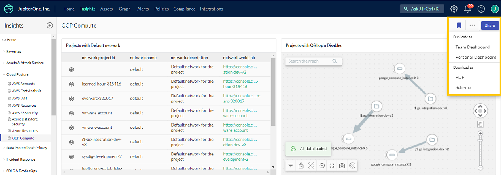 

  

  If you have the J1 Admin permission, you see a Share button that enables you to control access to your Insights board to specific internal users or groups. When determining the public access, you have the option of creating a public link you can share or list a range of IP addresses that you want to allow access to the dashboard, blocking any users from IP addresses outside of that range. 

   

  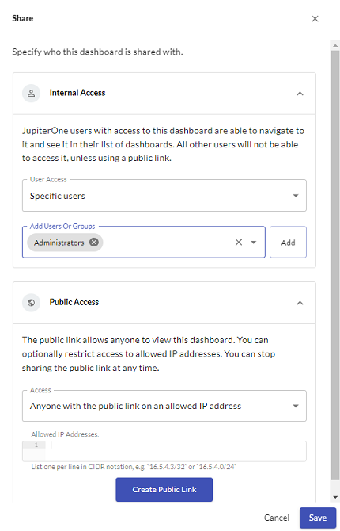     

  

- Delete charts:

  

  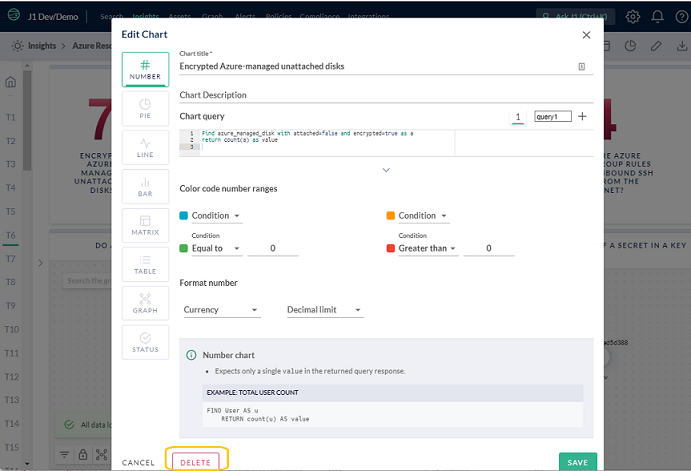 

  

- Reorder either charts within a specific board, or the board within the left navigation by dragging the chart or board to the desired location:

  

  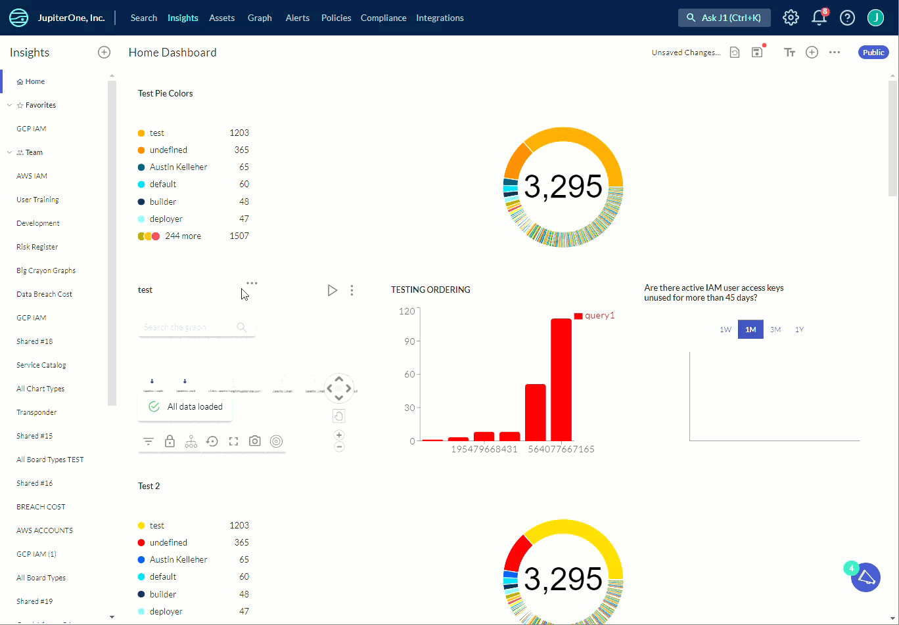

  

- Use variable placeholders in queries within a chart

​		You can use one or more variable placeholders in J1 Insights  to prompt a user for a specific value(s) to
​		be input into an Insights Chart . Variable placeholders can be leveraged in saved J1QL queries using the
​		double curly bracket syntax, such as `{{variable-placeholder-name}}`.

​		For example, the following query is saved as an insights chart. The query searches for a
​		`macAddress or hostname or email or ipAddress` associated with a device to evaluate the blast
​		radius.

​		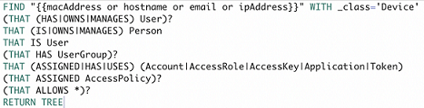 

​		Running the above query in an Insights chart displays a modal that prompts the user to enter a value.
​		The query will show no results until you enter a value and click **Save**.

		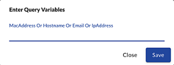 

- Hide UI controls in a graph:

  

  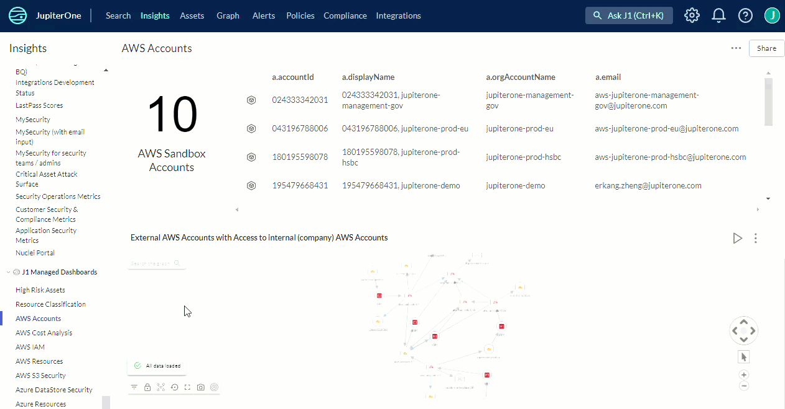 

  

  

To see more examples of editing charts and graphs in an Insights dashboard, [watch this video](https://try.jupiterone.com/blog/how-to-use-charts-and-graphs-widgets).