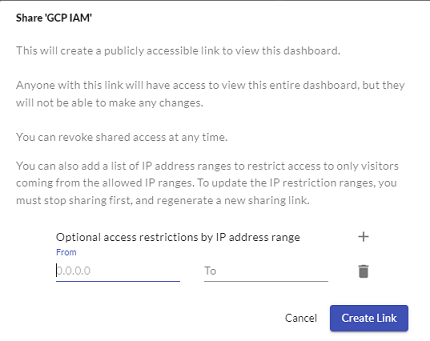

# General Insights Dashboard Functionality 

- Click a pie or bar chart to open a detailed table of the selected data point:
  
  
  
   
  
- Rename, clone, or delete boards:
  ​

  

  

- Download a board schema, share boards (create public links), save or reset the board layout, and add charts:
  ​

   
  
  

  When you create public links, anyone using a link is able to see the entire Insights dashboard but cannot make any changes. If you want to restrict access, you can list a range of IP addresses that you want to allow access to the dashboard, blocking any users from IP addresses outside of that range. To use this setting, you must unshare the link and then regenerate one, using the option to restrict access to an IP address range.
  

    

  

- Delete charts:
  ​

   

  

- Reorder either charts within a specific board, or the board within the left navigation by dragging the chart or board to the desired location:
  ​

   

To see more examples of editing charts and graphs in an Insights dashboard, [watch this video](https://try.jupiterone.com/blog/how-to-use-charts-and-graphs-widgets).