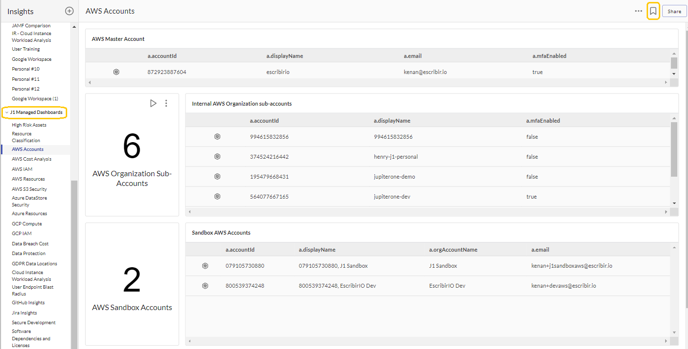
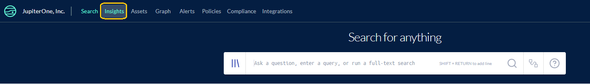
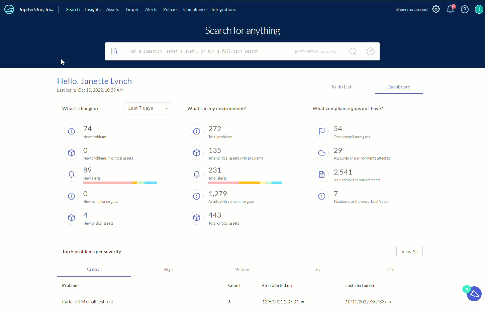
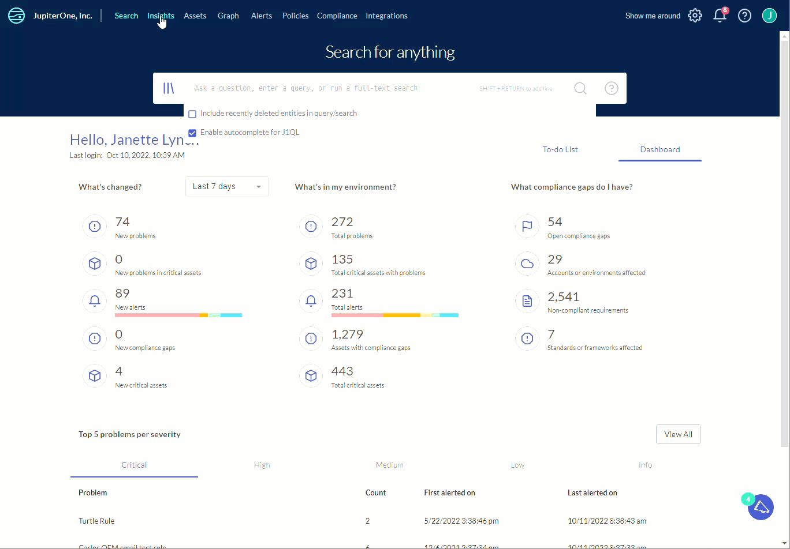
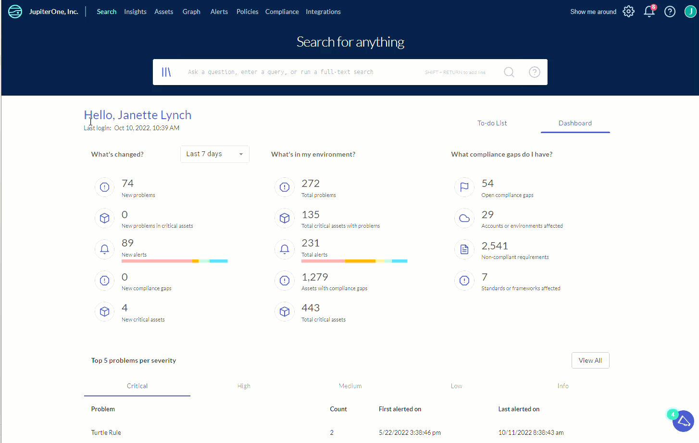
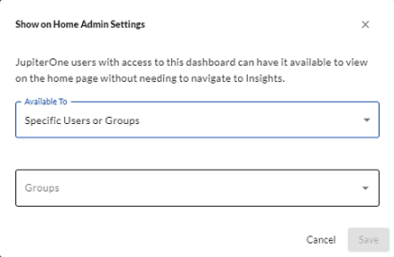

# Getting Started with Insights Dashboards

J1 Insights enables you to build reporting dashboards using J1QL queries. You can either import prebuilt Insights dashboards or create a custom one of your own.

You can configure each dashboard either as a team dashboard that you share with other account users or a personal dashboard for a single user. 

The layout of each dashboard is individually saved per user, including the layout for team boards, so that you can configure layouts according to your own preferences without impacting others. Administrators can save a team board layout as a default for other users.

Here are a few example boards and their configurations: [https://github.com/JupiterOne/insights-dashboards](https://github.com/JupiterOne/insights-dashboards).

J1 provides premade dashboards called J1 Managed Dashboards. You can duplicate/clone them so you can edit and customize the dashboards. Click the bookmark icon  to save a dashboard as a favorite. You must select which subcategory you want to save it in. 

 

To learn more about how to use the dashboards, see [General Insights Dashboard Functionality](../insights-dashboards-general.md).

## Creating Insights Dashboards

There are three ways to create a new Insights dashboard:

- Create a customized dashboard based on your queries
- Import a J1 prebuilt dashboard template that you can edit
- Upload the schema of a previously created dashboard

### Create a Custom Insights Dashboard with Custom Charts

You can build your own custom dashboard with customized, individual charts. Each chart is powered by one or more J1QL queries.

1. Go to **J1** **Insights**.
   ​

   

   

2. At the top of the left navigation pane, click **Add**and choose whether you want to add a personal or team board.

3. In the left column, select the type of visual chart, such as number, pie, line, bar that you want to create.

4. Enter the details of your chart, which include information such as:

   - Title and description

   - Chart query or queries

   - Chart colors and other formatting
     ​ 

       

For more information about custom Insights dashboards, [watch this video](https://try.jupiterone.com/blog/how-to-create-customized-dashboards).

### Import Prebuilt Insights Dashboards

1. Navigate to J1 **Insights** to add a board.

2. At the top of the left navigation pane, click **Add**and choose whether you want to add a personal or team board.

3. In the **Start with a JupiterOne dashboard template** section, select the template you want to use. Dependent on which template you choose, you may have to provide more information.

   

   
   

   ## Upload a Dashboard Schema

   If there is a dashboard schema you want to use that you or someone else in your team previously created, you can upload it your Insights.
   

    

   

   For more information about J1 standard Insights dashboards, [watch this video](https://try.jupiterone.com/blog/video-how-to-modify-out-of-the-box-dashboards), and read more [here](./insights-dashboards-starters.md).

### Publishing J1 Insights Dashboards

If you have the J1 Admin role, you can publish J1 Insights dashboards to the landing page of a user or a group. At the top-right of the Insights landing page, click the  icon. In the Show on Home dialog, select the user or group to whom you want to push the dashboard, and click **Save**. Ensure the users you select have permission to view the dashboard.

 

The specified user or users in a specified group receive a notification in the top-right of the J1 navigation bar informing them that an Insights dashboard is available to them.

  

#### Additional support documentation/resources for writing queries:

- [J1QL query tutorial](../jupiterOne-query-language_(J1QL)/tutorial-j1ql.md)
- [Search quickstart](../getting-started_and-admin/quickstart-search.md)
- [J1QL language specs](../jupiterOne-query-language_(J1QL)/jupiterOne-query-language.md)
- [All questions and queries](https://ask.us.jupiterone.io/filter?tagFilter=all)

