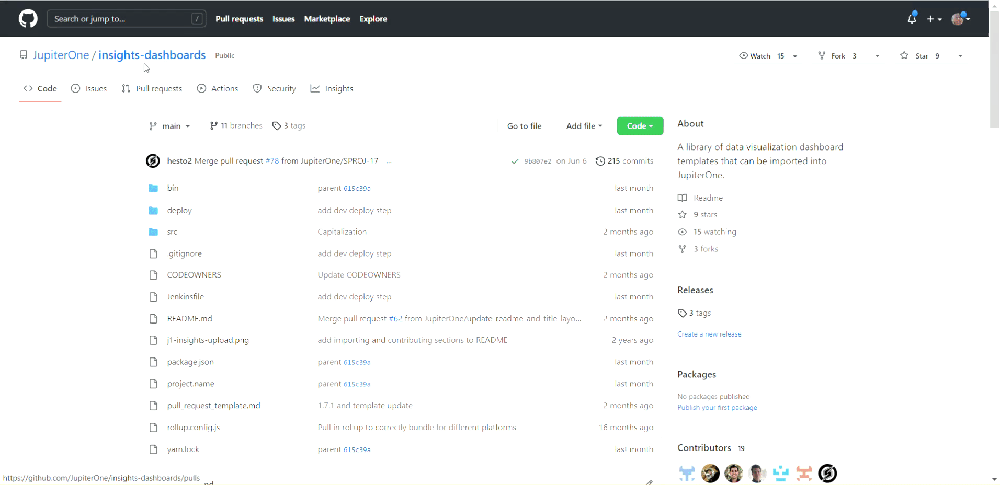
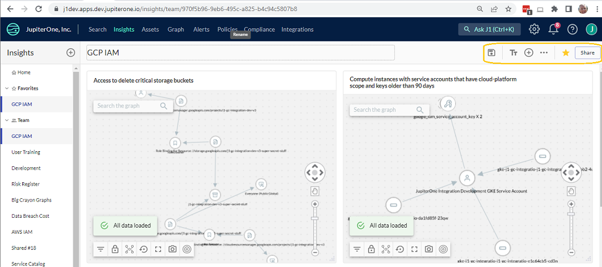
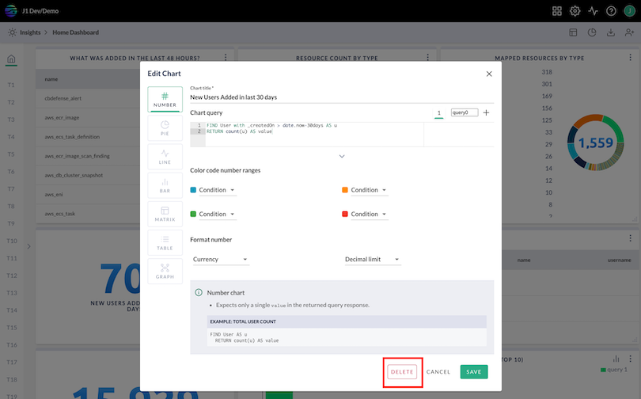

# Getting Started with Insights Dashboards

J1 Insights enables you to build reporting dashboards using J1QL queries. You can either import prebuilt Insights dashboards or create a custom one of your own.

You can configure each dashboard either as a team dashboard that you share with other account users or a personal dashboard for a single user. 

The layout of each dashboard is individually saved per user, including the layout for team boards, so that you can configure layouts according to your own preferences without impacting others. Administrators can save a team board layout as a default for other users.

Here are a few example boards and their configurations: [https://github.com/JupiterOne/insights-dashboards](https://github.com/JupiterOne/insights-dashboards).

## Import Prebuilt Insights Dashboards

1. Go to https://github.com/JupiterOne/insights-dashboards to see the list of prebuilt dashboards available for you to import into your JupiterOne account

2. Select a prebuilt dashboard.

3. Click `board.json`.

4. Right-click **Raw** -> **Save link as...**.

   

   

   

5. Navigate to J1 **Insights** to add a board.
   

   
    
   
6. Click the ‘>’ carrot to expand the left sidebar.

7. Click **Add**  and choose whether you want to add a personal or team board.

8. Click **Upload From JSON Schema** and navigate to the `board.json` file you previously saved.
   ​

    

   

   Alternatively, you can just click the tile for a starter configuration. 
   
   
    
   
   
   
   For more information about J1 standard Insights dashboards, [watch this video](https://try.jupiterone.com/blog/video-how-to-modify-out-of-the-box-dashboards).

## Creating a Custom Insights Dashboard with Custom Charts

You can build your own custom dashboard with customized, individual charts. Each chart is powered by one or more J1QL queries.

1. Go to **J1** **Insights**.
   ​

   

   

2. Click the ‘>’ carrot to expand the left sidebar.

3. Click **Add**  and choose whether you want to add a personal or team board.

4. Click **Start Adding Charts** and in the **Add Chart** workflow.

5. Enter the details of your query/chart, which include information such as:

   - Type of visual chart, such as number, pie, line, bar.

   - The chart query or queries.

   - Formatting options 
     ​

      

For more information about custom Insights dashboards, [watch this video](https://try.jupiterone.com/blog/how-to-create-customized-dashboards).

### Additional support documentation/resources for writing queries:

[J1QL query tutorial](../jupiterOne-query-language_(J1QL)/tutorial-j1ql.md)
[Search quickstart](../getting-started_and-admin/quickstart-search.md)
[J1QL language specs](../jupiterOne-query-language_(J1QL)/jupiterOne-query-language.md)
[All questions + queries](https://ask.us.jupiterone.io/filter?tagFilter=all)

## General Insights Dashboard Functionality 

- Rename, clone, or delete boards:
  ​

  

  

- Download board schema, share boards (create public links), save or reset board layout, add charts:
  ​

  

  

- Delete charts:
  ​

  

  

- Reorder either charts within a specific board, or the board within the side panel by dragging the chart or board to the desired spot:
  ​

  

To see more examples of editing charts and graphs in an Insights dashboard, [watch this video](https://try.jupiterone.com/blog/how-to-use-charts-and-graphs-widgets).

