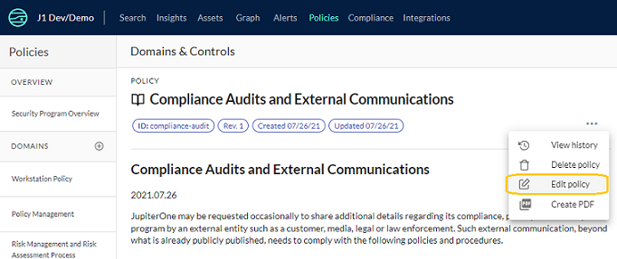
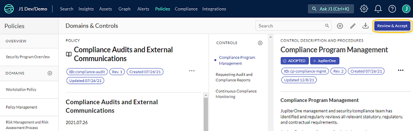

# Managing Policies and Procedures on JupiterOne

J1 Policies enables you to generate and manage corporate security policies and procedures. It has the following capabilities:

- Generating policies and procedures from templates
- Managing policies and procedures online
- Mapping controls/procedures to compliance requirements
- Using the Policy Builder CLI

## Generating Policies and Procedures from Templates

J1 Policies provides a set of over 120 policy and procedure templates to help your organization build your security program and operations from zero. These templates are derived from the J1 internal policies and procedures, and have been through several iterations of compliance assessments.

To create a policy from a template:

1. Click **Policies** at the top of the J1 navigation bar.

2. Select in the left column the policy template you want to use and customize.

3. From the three-dot menu in the upper-corner of a policy, click **Edit Policy**. You can also edit  controls and procedures by selecting the edit option for the respective menu.

   You must have Administrator access to your JupiterOne account to edit or export policies.
   

    

   

It may take a few minutes for the policy and procedure documents to be generated for the first time. After you create documents, someone in your team must review and accept them. The reviewer must have the Person entity class with an associated email address. 

 

## Managing Policies and Procedures

Similar to the concept of micro-services, the policies and procedures are written as micro-docs.  Each policy and procedure document is written in its own individual file, in Markdown format, and linked together via a configuration.

The templates are open source and you can [see more details here](https://github.com/JupiterOne/security-policy-templates).

### Variables

The Markdown text contains both global and local variables -- in this format: `{{variableName}}`. Do not edit the variables in the templates since they would be auto-replaced by the relevant text.

A **Procedure** document may contain an optional local `{{provider}}` variable. This allows you to configure the control provider that implements or has been designated the responsibility to fulfill that procedure. For example, the provider for "Single Sign On" could be "Okta", "OneLogin", "JumpCloud", "Google", etc. This `provider` value can be entered near the top of the document editor when it is open, right below the Document Title.

The procedure editor also presents you a short summary guidance description. Additionally, you may toggle the "Adopted" flag on or off depending on your readiness to adopt a particular procedure.

### Versioning

Edits to policies and procedure documents are automatically versioned upon save. The `{{defaultRevision}}` variable is populated with the date the document was last edited.

Currently the web app does not have a UI to view previous versions of documents.

### Download/Export Policy and Procedure Documents

The Export / Download Zip button at the upper right corner of the screen will generate a zip file containing the following three sets of files:

- templates in Markdown format
- final policies and procedures in Markdown format
- final policies and procedures in HTML format

## Policy Builder CLI

JupiterOne provides an offline CLI that enables you to manage your policies and procedures offline (for example, as code in a Git repo), and publish to your JupiterOne account, as needed.

Detailed usage can be found in the `jupiter-policy-builder` repo and README: <https://github.com/JupiterOne/jupiter-policy-builder>.

### Using Your Own Existing Policies

J1 Policies is an optional component of the J1 platform. It is not a prerequisite for the rest of the platform. J1 Compliance is the only app that depends on J1 Policies for appropriate mappings to compliance framework requirements and controls.

You are not required to use the J1-provided policy/procedure templates. If your organization already has written documents for security policies and procedures, and you would like to take advantage of J1 Compliance and its mapping capabilities, you can transform your existing policies and publish them to JupiterOne.

The structure is defined here: <https://github.com/JupiterOne/security-policy-templates>
