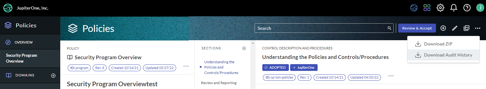
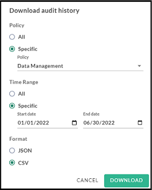

# Downloading a Policies Audit Trail

JupiterOne provides the ability to download an audit trail and system of record of the changes made to the policies and procedures of you organization over a specified timeframe. The downloaded evidence is a file you can present to your auditors. 

To download an audit trail:

1. Go to J1 Policies, and click the  menu.

   ​

    

   ​

2. From the dropdown menu, select **Download Audit History**.

3. In the Download audit history window, select to download the history of all policies or of only one specific policy.

4. Select a specific timeframe or select All. 

5. Select which format in which you want to download the audit history file.
   ​

     

   ​

6. Click **Download**.

   ​

   ​