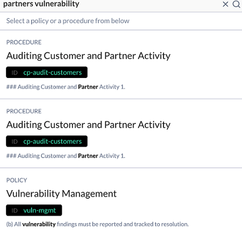
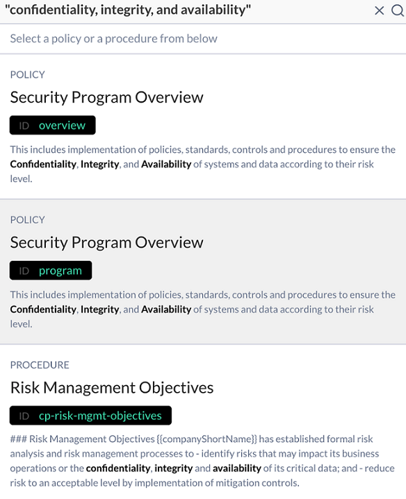
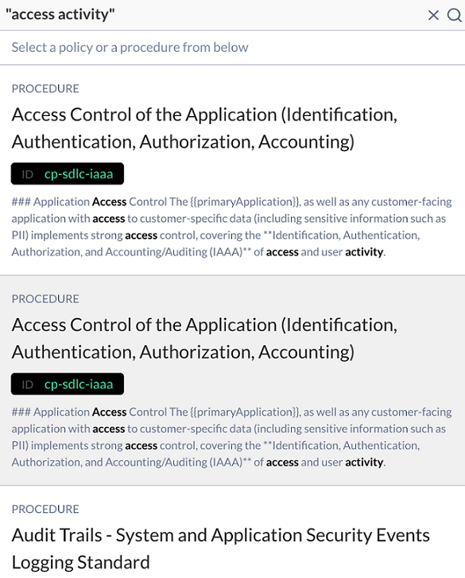

# Searching in the Policies App

The search function in the Policies app allows you to perform OR searches and exact-string searches.

### OR Searches

When you want to perform an OR search, you do not need to use quotation marks. For example, if you are looking for results that contain either “partners”, or “vulnerability”, or both words but not necessarily in an exact phrase then, in the search bar, enter `partners vulnerability` without quotation marks. 

### Exact-string Searches

When you want to search results that are an exact string match, in the search bar, enter the exact string inside quotation marks. 

### No Exact-Match Results 

If you perform an exact-string search and there are no exact-phrase matches, the J1 returns documents containing the words in the string but not necessarily as an exact phrase. For example, if the user searches `"access activity”` and there are no exact-phrase match, the results of that query returns documents containing both words, but not necessarily as exact phrases. 

