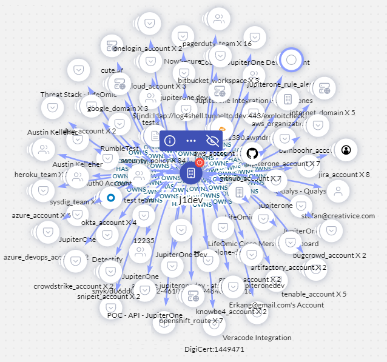
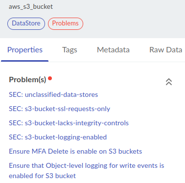
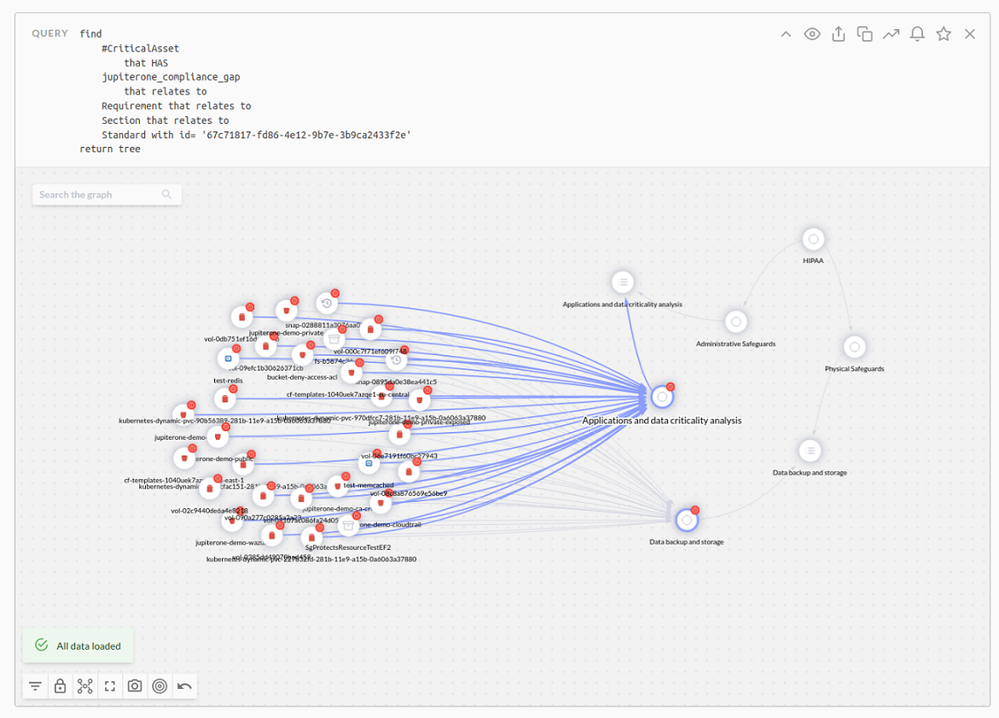
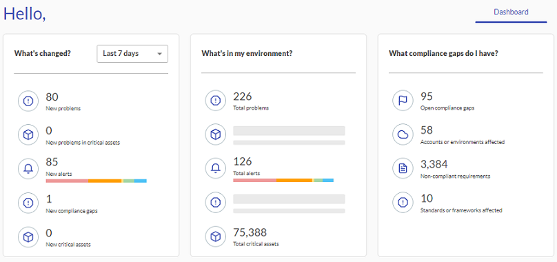
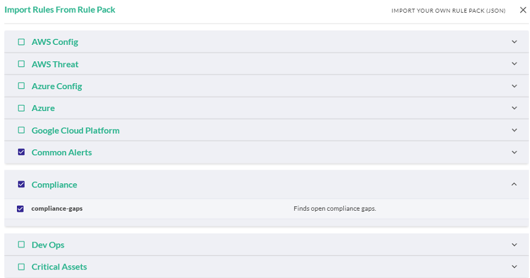

# Working with Problems

JupiterOne groups [compliance gaps](./compliance-gap-analysis.md) and non-informational [rule alerts](../security-operations/manage-alerts.md) in a class called Problems. This concept enables you to see all your issues grouped together, making it easier to focus on what problems you must resolve in your environment. 

When a problem is detected, J1 automatically builds a relationship between the  `Problem`  asset, and the assets that have contributed to the detection of the problem. Assets in the J1 graph have a red dot next to them if a relationship to a problem exists. 

  

Click the red dot to see the menu, and click the blue i icon to open the information panel to the right.

 

Click any of the problems to go to the compliance gap or rule alert to learn more about the specific problem.

You ask questions like "How many open compliance gaps do I have?" with a query such as:
 `find jupiterone_compliance_gap as gap return count(gap)`.  Your J1QL query results also depict problems with a red dot to the left of the issue.

You can also run a query to determine how many compliance frameworks have an open compliance gap by using:

 `find unique Standard that has (compliance_section) that has compliance_requirement that violates << jupiterone_compliance_gap return count(Standard)`.

To know which critical assets related to compliance gaps may need remediation, you can run queries such as:  `find #CriticalAsset that has jupiterone_compliance_gap` as shown in this example:

## Problems as a KPI

In J1, on your landing page, the number of problems in your environment is a Key Progress Indicator (KPI) for the status of your cloud security posture.

Click any of the KPIs to see more information. J1 recommends that you import the compliance gaps [alert rules pack](../security-operations/manage-alerts.md) in J1 Alerts.

