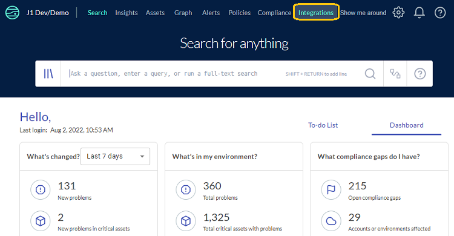
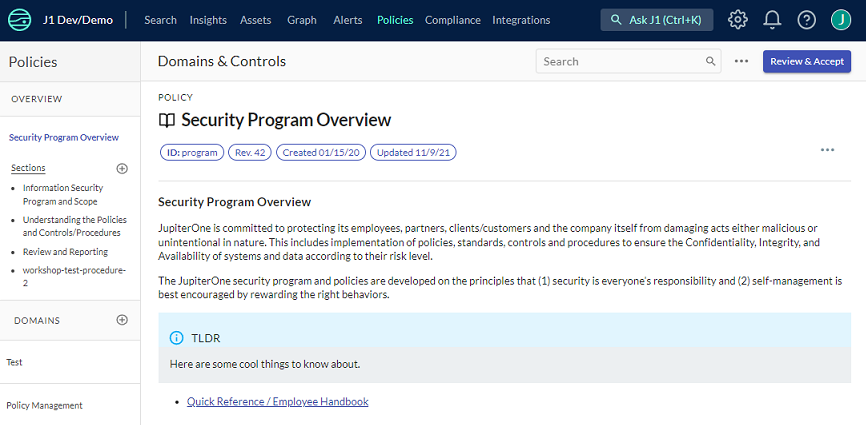
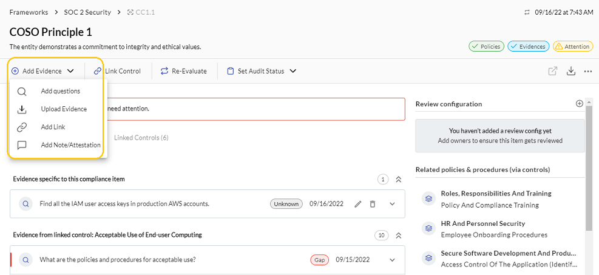

# Supporting SOC 2 Audits Using JupiterOne

There are several tasks involved in ensuring your SOC 2 compliance is current and complete.

1. Configure J1 integrations.
2. Review your compliance policies and procedures.
3. Import the SOC 2 compliance framework.
4. Link compliance controls.
5. Review linked evidence.
6. Add additional queries.

### Configure J1 Integrations

The first step is to ensure all relevant, managed integrations are properly configured and working. For SOC 2, you must determine which integrations are necessary based on your in-scope environment, such as the relevant system components, infrastructure, tooling, and so on that provide your service or product to your customers. 

After you configure them, the integrations automatically start collecting data about your environment at a recurring cadence.

 

Go to [J1 integrations](https://apps.us.jupiterone.io/integrations) and follow the instructions in the [J1 docs](../getting-started_and-admin/configure-integrations.md).

### Review the Policies and Procedures

Go to [J1 Policies](https://apps.us.jupiterone.io/policies/program) and review all of the templated, default policies and procedures. Ensure the policies accurately represent the  principles and processes of your organization. You can edit and modify the default policies, customizing them and/or adding your own policies and procedures documentation, where relevant. Remove or delete documents that are not relevant to your organization.

Reviewing and tailoring instructions are provided for the default policies and procedures in the UI. If you the policies were not configured during the setup of your J1 account, you should go into J1 Policies and use the policy builder to prefill the templated policies and procedures.

Additional support documentation is available:

- [Managing policies and procedures](./policies-app.md)
- [Using the policy builder CLI](./policy-builder-cli.md)
- [Policies and procedures structure](./policies-app.md)
- [Compliance policies mapping](./compliance-mapping-policies.md)

### Import the Compliance Framework

Import the SOC 2 Security compliance framework in [J1 Compliance](https://apps.us.jupiterone.io/compliance). 

 

Read more about [Importing compliance standards or security questionnaires](./compliance-import.md).

### Managing Controls

Within the default SOC 2 framework, templated controls are mapped to the common criteria required to meet the Security trust service category. 

In [J1 Compliance](https://apps.us.jupiterone.io/compliance), you can add controls, remove controls, and/or update the control link.

 

Read more about the [J1 Controls library](./compliance-controls.md).

## Review Control Evidence

For each control, you must provide corresponding evidence that demonstrate reasonable assurance the control has been designed and implemented (SOC 2 Type I) and operating effectively over the review period (SOC 2 Type II). 

By default, for the standard controls within the SOC 2 framework in J1 Compliance, more than half the controls have partial to full evidence already mapped, by way of JupiterOne query language (J1QL) managed queries.

1. For each control, review the default mapped evidence, if applicable.
2. If the evidence is satisfactory, go to the next control.
3. If the evidence is unsatisfactory because it is incorrect or incomplete, edit the mapped queries so the returned output is as expected. 
    

Additional support documentation: 

- [J1QL query tutorial](../jupiterOne-query-language_(J1QL)/tutorial-j1ql.md)
- [Search quickstart](../getting-started_and-admin/quickstart-search.md)
- [J1QL language specs](../jupiterOne-query-language_(J1QL)/jupiterOne-query-language.md) 

### Add Additional Queries
You can add more queries to ascertain SOC 2 compliance.

Read more: 

- [J1QL query tutorial](../jupiterOne-query-language_(J1QL)/tutorial-j1ql.md)
- [Search quickstart](../getting-started_and-admin/quickstart-search.md)
- [J1QL language specs](../jupiterOne-query-language_(J1QL)/jupiterOne-query-language.md)

You can also map a prewritten, templated query from the hundreds in the J1 library.

 

Additional support documentation:

- [Common questions + queries](../jupiterOne-query-language_(J1QL)/common-qq-index.md)

- [All questions + queries](https://ask.us.jupiterone.io/filter?tagFilter=all)

### Adding Additional Evidence
You can also link additional evidence such as hyperlinks, uploaded files (spreadsheets, compressed files), notes, and attestations.

 

## 

### Reporting on/Monitoring SOC 2 Progress/Readiness + Workflows

For visibility, the default SOC 2 compliance framework landing page has the status of both evidence collection and a gap analysis to quickly identify which controls require your attention.

Clicking any of the four progress bars provides a more detailed summary, with any of the reported details, clickable to quickly filter all of the controls with the same status.

 

### Internal Auditor Workflows

J1 Compliance enables a workflow functionality that allows your team to internally track workflow status, as well as the ability to invite your external auditors to use J1 to conduct the assessment with the same workflow functionality.

 

[Watch this video](https://try.jupiterone.com/blog/video-workflows-within-the-j1-compliance-app) for more information about compliance workflows for collaboration. 

#### Managing Access

You can invite internal team members or external auditors, into your J1 environment.

- Access is managed by role-based access control (RBAC) groups.
- Users are invited via email address.
- Granular access permissions are available.

Read more in [Invite your team members](../getting-started_and-admin/quickstart-invite-users.md).

 

#### Recurring Review Configuration

For continuous compliance monitoring, you can set the recurring review configuration workflow to assign specific team members to receive notifications to review or maintain individual controls, groups of controls, or entire frameworks.

By default, controls with queries/questions mapped for evidence are re-evaluated daily. 

 

## Exporting Compliance Artifacts

J1 provides the capability to export compliance artifacts such as control evidence, policies and procedures, reports, and others.

You can export a summary report (PDF) or download a zip file of all the evidence for the whole framework. 

In addition, you can download evidence for a single control.

 