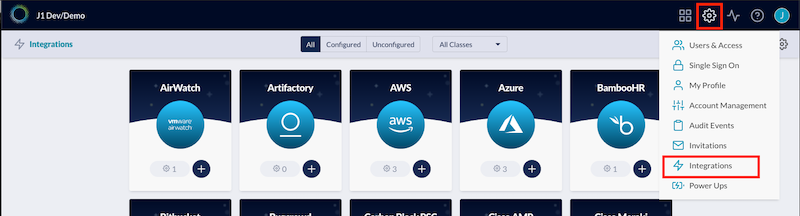
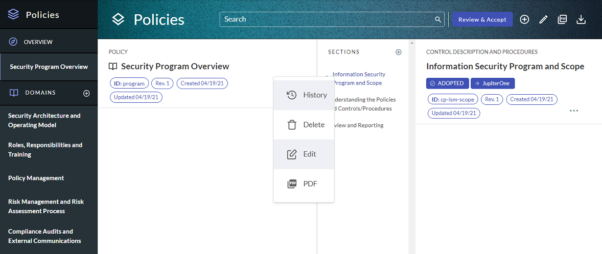
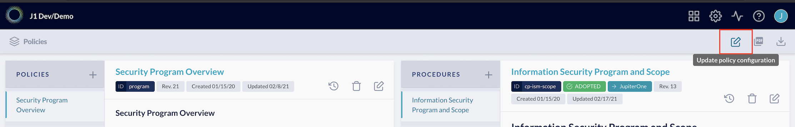
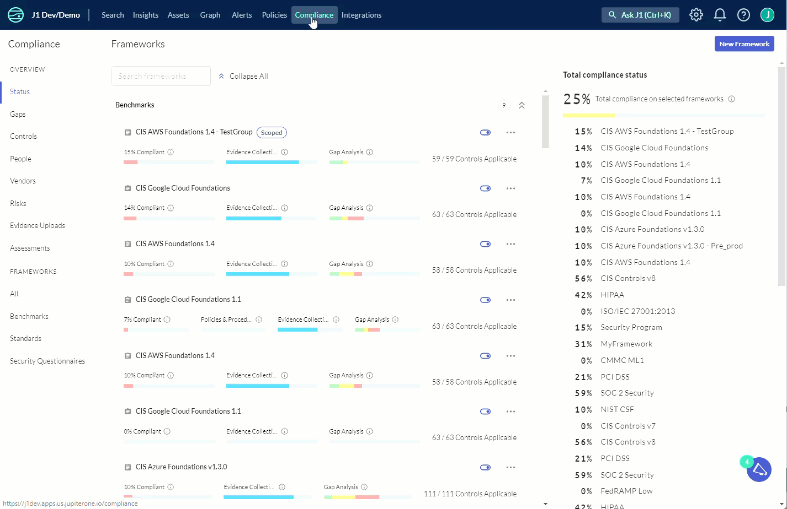
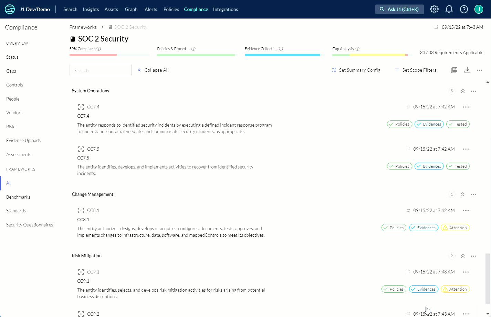

# Supporting SOC 2 Audits Using JupiterOne

## 1. Configure integrations

Ensure all relevant managed integrations are properly configured to be working. For SOC 2, you’ll need to make a determination as to which integrations are necessary based on your in-scope environment, e.g., the relevant system components, infrastructure, tooling, etc. that are necessary to provide your service or product to your customers. 

Once configured, integrations will automatically start collecting data about your environment at a recurring cadence.

[In-app integrations setup](https://apps.us.jupiterone.io/integrations)

Additional support documentation:

[Configure integrations](../Getting-Started_and-Admin/configure-integrations.md)

## 2. Policies and Procedures

Review all of the templated, out-of-the-box policies + procedures, ensuring they accurately represent your organization’s principles/processes, tailoring and/or adding your own documentation where relevant. 

Out of the box, the policies app comes with templated policies + procedures that can be edited/modified. Additionally, you can add your own policies + procedures
+ remove/delete documents that aren’t relevant to your organization.

Reviewing + tailoring instructions are provided for the default, templated policies + procedures in the UI.

If not completed during JupiterOne account setup, the policy builder should be populated to prefill the templated policies + procedures.

[In-app policies setup](https://apps.us.jupiterone.io/policies)

Additional support documentation:

[Managing policies + procedures](./policies-app.md)
[Using the policy builder CLI](../compliance_and-reporting/policy-builder-cli.md)
[Policies + procedures structure](./policies-app.md)
[Compliance policies mapping](./compliance-mapping-policies.md)

## 3. Import compliance framework

Import the **SOC 2 Security Controls** compliance framework within the Compliance app. 

[In-app compliance setup](https://apps.us.jupiterone.io/compliance)

Additional support documentation:

[Import compliance standard or security questionnaire](./compliance-import.md)

## 4. Adding, editing, removing controls (control mapping)

Within the default SOC 2 framework, templated controls are mapped to the Common Criteria required to meet the 'Security' Trust Service Category. 

There is the functionality within JupiterOne to add controls, remove controls, and/or update control wording by editing the JSON (or CSV) framework specification.

## 5. Review evidence mapping

For each control, the desired outcome is the corresponding evidence will suffice to demonstrate reasonable assurance the control has been designed + implemented (SOC 2 Type I) + operating effectively over the review period (SOC 2 Type II). 

By default, for the standard controls within the SOC 2 framework in JupiterOne, more than half the controls have partial to full evidence already mapped, by way of JupiterOne query language (J1QL) managed queries.

1. For each control, review default mapped evidence, if applicable.
    1. If the evidence is satisfactory (as you'd expect for output), move on to the next control.
    2. If the evidence isn’t satisfactory, i.e., incorrect or incomplete:
        1.  Review the mapped queries + tailor the queries so the returned output is as expected.

Additional support documentation: 

[J1QL query tutorial](../jupiterOne-query-language_(J1QL)/tutorial-j1ql.md)
[Search quickstart](../Getting-Started_and-Admin/quickstart-search.md)
[J1QL language specs](../jupiterOne-query-language_(J1QL)/jupiterOne-query-language.md) 

### Add additional queries
1. Adding a new query

Additional support documentation: 

[J1QL query tutorial](../jupiterOne-query-language_(J1QL)/tutorial-j1ql.md)
[Search quickstart](../Getting-Started_and-Admin/quickstart-search.md)
[J1QL language specs](../jupiterOne-query-language_(J1QL)/jupiterOne-query-language.md)

2. Mapping a prewritten, templated query (over 400 are in our library)

Additional support documentation:

[Common questions + queries](../Getting-Started_and-Admin/common-qq-index.md)

[All questions + queries](https://ask.us.jupiterone.io/filter?tagFilter=all)

### Adding additional evidence
1. Link additional evidence, i.e., hyperlink
2. Upload additional evidence, e.g., spreadsheets, compressed files, etc.
3. Add notes/attestations

## 6. Reporting on/monitoring SOC 2 progress/readiness + workflows

### Reporting/monitoring

For visibility, the default SOC 2 compliance framework landing page has the status of both evidence collection + a gap analysis to quickly identify which controls require your attention.

Hovering over any of the three (3) progress bars will provide a more detailed summary, with any of the reported details, clickable to quickly filter all of the controls with the same status:

### Internal + auditor workflows

With the Compliance app in JupiterOne, you can enable workflow functionality that will allow your team to internally track workflow status, along with the ability to invite your external auditors to use JupiterOne to conduct the assessment with the same workflow functionality.

[Watch this video](https://try.jupiterone.com/blog/video-workflows-within-the-j1-compliance-app) for more information about compliance workflows for collaboration. 

#### Managing access

You can invite internal team members or external users, e.g., auditors, into your JupiterOne instance/environment.

- Access is managed by RBAC groups
- Users are invited via email address
- Granular access permissions are available

Additional support documentation:

[Invite your team members](../Getting-Started_and-Admin/quickstart-invite-users.md)

#### Recurring review configuration

For ongoing/continuous compliance monitoring, you can set the recurring review configuration workflow to assign specific team members to receive notifications to review/maintain individual controls, groups of controls, or entire frameworks.

By default, controls with queries/questions mapped for evidence are re-evaluated daily.

## 7. Exporting compliance artifacts

JupiterOne provides the capability to export compliance artifacts, e.g, control evidence, policies + procedures, reports, etc.

- Exporting evidence for a single control
- Exporting evidence across all controls within the SOC 2 framework, either as a summary, or the entire evidence output
- Exporting a SOC 2 summary report

