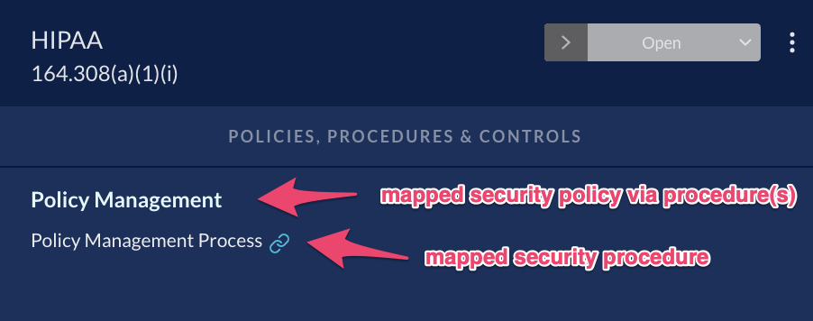

# Example of Adding a New Doc

## Adding an image. Just like with previous markdown file.

As a markdown file is converted to a vanilla 'article', the asset referenced is uploaded to vanilla (10mb limit each) and the image link in your markdown file will be replaced with vanilla's version of that asset.

Example image:

> 

## Adding an Internal Link to Another Document

You can reference other markdown files within a doc. The (internal) links added will be replaced with the link to the vanilla location of referenced doc.

Example internal markdown link:
xyz

- [look at this other doc](../getting-started-admin/catalog.md)

Example internal link with reference list:

See [this doc][1] for a complete list and description of each metadata property

## Naming of Articles and Knowledge Categories

- Directories become Vanilla's Knowledge Categories
- Markdown files become Vanilla's Articles

Underscores and dashes become spaces during the generation of the item's name and each word becomes capitalized.

Examples:

'knowledgeBase/demo/sub-category/additional.md' creates a new (if it didnt exist before) 'Demo' Knowledge Category, a dependant 'Sub Category' knowledge category, and a dependant 'Additional' article.

'knowledgeBase/apis-integrations/airwatch/index.md' will create a new 'Apis Integrations' knowledge category and dependant 'AirWatch' article.

## Quick Rundown of How it Works

- Check of changes to the KnowledgeBase folder on merge.
- Each change is converted to a series of procedures. (Must be synchronous because we cant add dependants without their parents.)

- Example Change: 'knowledgeBase/demo'
  - Check demo directory for children. Markdown files within 'demo' become dependant on the creation of 'demo'. 'sub-category' becomes dependant on the creation of demo. 'additional.md' is dependant on demo.
  - This leads to a list of 'procedures' that need to be completed in a certain order. The knowledge categories and articles need to be created one at a time. Items that dont exist locally, but exist on vanilla's platform are flagged for delete.
  - We compare the stucture we have locally against what articles and knowledge categories we have on the vanilla forum.
  - Additional data is added to the procedures for existing items. This allows us to delete/edit items.
- Knowledge Categories are created or flagged for delete if they dont exist locally.
- Articles are deleted if they exist on Vanilla, but not in the knowledgeBase folder
- Articles are created after their parents are successfully created on vanillas platform.
- BEFORE articles are created, We check them for images, upload the image (PNG, gif, jpeg are supported) and replace the markdown references to the ones returned by a successful upload to vanilla. The size limit is approximatly 10mb.
- Articles are then added to their already-created knowledge category.
- Articles with internal references are then altered to have the correct link to their now-or-previously-existing-articles.
- Removal of items flagged for delete
  - Non-empty knowledge categories cannot be deleted until they are empty
  - Articles are removed first since they are not dependant
  - Longest flagged for delete 'change' removed recursively

[1]: ../docs/metadata.md
