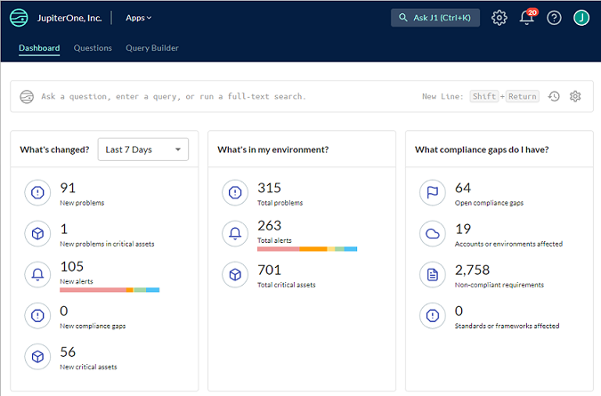
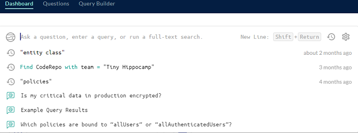
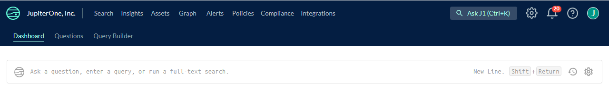
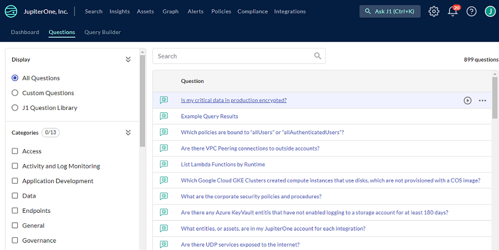

# Understanding JupiterOne

JupiterOne (J1) is a cloud-native security platform that connects across your siloed security tools, empowering unobstructed visibility into security risks across your entire cyber asset universe. This extensible platform connects the dots between complex relationships and data, providing ultimate visibility to your environment, infrastructure, and operations.

## Sign In and Search

Over time, J1 collects key performance indicator (KPI) information for your organization and displays it in a dashboard. Your dashboard enables you to quickly see what has changed in your security program, the status of your environment, and where your compliance gaps are.

From the J1 Dashboard, you can [enter questions in the search bar](./quickstart-search.md). By default, J1 autocompletes the text and lists any questions related to your keywords.

 

 J1 keeps a history of the questions you ask which is helpful when wanting the run the same questions or create questions based on past searches. The most recent questions display when you start typing in the search bar, and to see a list of all the history, click  at the right in the search bar. Click to opt to include recently deleted entities in the question/search or to enable autocomplete for [J1QL](../jupiterOne-query-language_(J1QL)/jupiterOne-query-language.md) queries.

 

## Using J1 Integrations

The first step in using J1 is to bring your data into J1. There are numerous ready-made integrations that are easy to install and use to achieve end-to-end cyber asset visibility, context, and automation across every dimension of your digital universe. J1 provides [instructions](../getting-started_and-admin/configure-integrations.md) on how to import the data to J1 and understand the data model and mapping.

## J1 Navigation Bar

All of the J1 products that assist you in all the major components of security management are available from the top navigation bar. You can use your browser buttons to go back or forward between pages, or copy the URL of a page to share with others. 

### Assets

After you import your data, you can analyze and visualize your complete infrastructure and [security cyber asset inventory](../asset-management/asset-inventory-filters.md) using the J1 Assets app. In addition, the Assets app helps you can understand the types and classes of cyber assets you have, and the relationships between them. 

### Policies

The JupiterOne Policies app enables you to articulate your organization policies and associate them to your compliance requirements. 

Each policy and procedure document is written in its own individual Markdown file, and you can configure each policy file to link to other files. The templates are open-source that you can edit directly online using the Policies app.

To help you get started, JupiterOne provides 120+ [policy and procedure templates](../compliance_and-reportingmanage-policies/policies-app.md) to help your organization build your security program and operations. These templates derive from JupiterOne company internal policies and procedures, and have been through several rounds of compliance assessments.

### Alerts

JupiterOne enables you to [configure alert rules](../security-operations/manage-alerts.md) in the Alerts app, using any JupiterOne Query Language query for continuous auditing and threat monitoring. You must have at least one active alert rule to trigger any alert. The easiest way to add some rules to an alert is to import rule packs that JupiterOne provides. You can also create custom rules.  

### Compliance

JupiterOne provides a flexible platform for you to manage any compliance standard or framework as a set of controls or requirements. The platform enables you to:

- [Import a compliance standard or security questionnaire](../compliance_and-reporting/compliance-import.md)
- [Map policy procedures to each control or requirement](../compliance_and-reporting/compliance-mapping-policies.md)
- [Map data-driven compliance evidence by query questions](../compliance_and-reporting/compliance-mapping-evidence.md)
- [Perform automated gap analysis based on query results](../compliance_and-reporting/compliance-gap-analysis.md)
- [Export compliance artifacts (summary or full evidence package)](../compliance_and-reporting/compliance-export.md)

### Graph Viewer

JupiterOne is built on a [data-driven graph](../getting-started_and-admin/quickstart-graph.md) platform. JupiterOne Query Language (J1QL) is designed to traverse this graph and return a sub-graph or data from the entities and edges (such as relationships) of a sub-graph. You can view and interact with the sub-graph from any J1QL query result.

### Insights

The [JupiterOne Insights app](../compliance_and-reporting/insights-dashboards.md) enables you to build reporting dashboards using J1QL queries.

You can configure each dashboard as either a team board that is shared with other account users or a personal board for the individual user. The layout of each board is individually saved per user, including the layout for team boards, so that each user can configure layouts according to their own preferences without impacting others. Administrators can save a team board layout as the default for other users.

You can build your own custom dashboards or utilize any of the existing boards that JupiterOne has already built.

## J1 Questions Library

JupiterOne has hundreds of prebuilt, categorized, and managed questions for assessing the current state of your cyber assets. You can filter the questions on a specific category or tag, duplicate existing questions to create custom questions of your own, and save frequent searches for easy future reference. Click Questions at the top of the J1 home page to access the J1 questions library.

 

## JupiterOne Query Language

The [JupiterOne Query Language](../jupiterOne-query-language_(J1QL)/jupiterone-query-language.md) (J1QL) is a query language for finding the entities and relationships within your digital environment. J1QL blends together the capabilities of asking questions, performing full text search, and querying the complex entity-relationship graph.

J1QL is complex but a [tutorial](../jupiterOne-query-language_(J1QL)/tutorial-j1ql.md) is available to help you learn. In addition, JupiterOne offers [J1VQB](../jupiterOne-query-language_(J1QL)/j1-vqb.md), a visual query building app, a codefree tool for creating queries.
