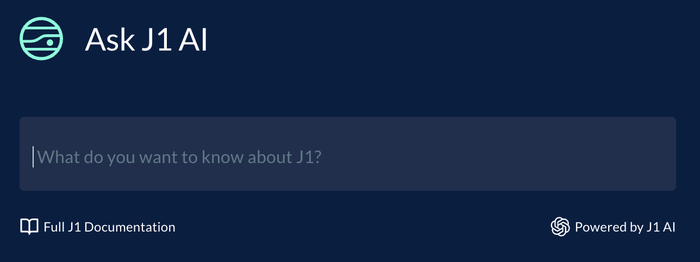
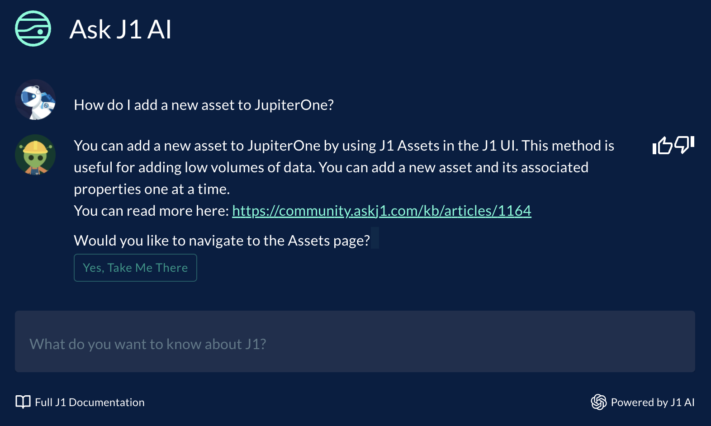

# Ask J1 AI

Ask J1 AI is an application powered by ChatGPT to answer your questions about the JupiterOne platform that lives within your JupiterOne workspace. With Ask J1 AI, you can quickly find relevant information and get answers to your questions without having to search through lengthy documentation.

> **Note** this feature is currently in beta. If you'd like access to this feature, please contact your Customer Success representative. 

## Data usage disclosure

Ask J1 AI only uses information from JupiterOne’s app documentation and blogs combined with general knowledge from OpenAI’s ChatGPT model to answer questions. **It does not have access to any sensitive or customer-specific data.**

## Using Ask J1 AI

To ask a question, simply type your query into the search bar and press **Enter** on your keyboard. You can ask questions relating to any aspect of the JupiterOne platform, such as its features, functionality, best practices, and even troubleshooting assistance.

Here are some example queries to get you started:

- How do I add a new asset to JupiterOne?
- What are some best practices for managing security policies?
- How do I create a custom alert in JupiterOne?

### Ask J1 AI Responses

Ask J1 AI will provide a clear and concise response to your question based on its understanding of the JupiterOne platform. 

The response may include:
- Step-by-step instructions
- Links to relevant documentation
- Code snippets or examples
- Tips or best practices

If the J1 Docs do not contain sufficient information to answer your question, the system will supplement the Docs with public knowledge and then attempt to answer the question. When this occurs, the response will be prefaced with “Answer not found in j1 docs. My best answer:”.

If the response is not satisfactory, you can rephrase your question or provide more context to help Ask J1 AI better understand your query. In general, more detailed input questions will result in higher quality responses.

### Providing feedback

Your feedback is essential for improving the accuracy and usefulness of Ask J1 AI. After receiving a response, you can rate the answer as helpful or unhelpful using the **thumbs up** and **thumbs down** buttons to the right. 

