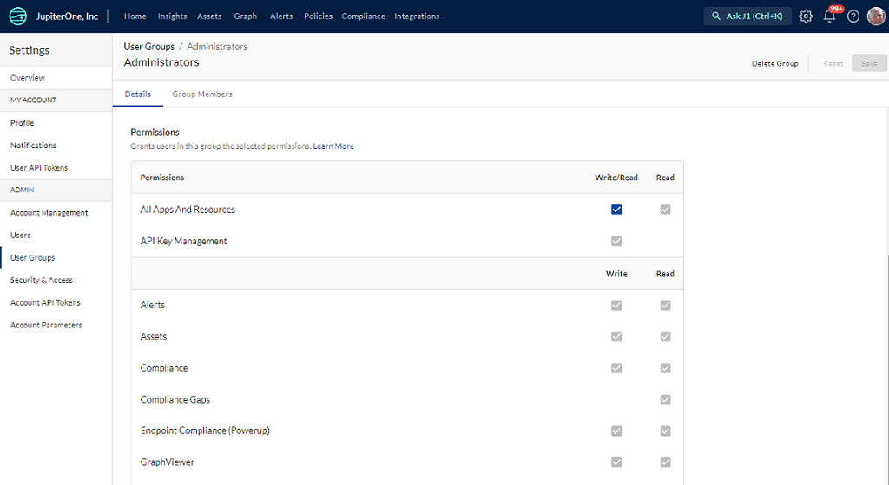
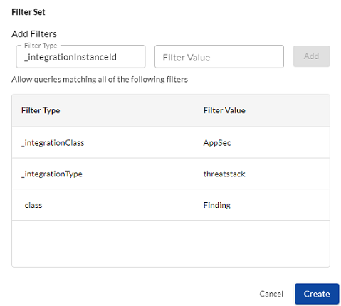

# JupiterOne Access Controls

JupiterOne has two levels of access control: administrators and all other users. Users in the Administrators group have full access to all resources. All other users have read-only access with the additional permission to save J1QL queries as questions. 

### Configure Access Permissions

As an administrator, you can create user groups and add permissions to a user group.

To configure access permissions:

1. Go to **Settings** gear icon in the top-right of JupiterOne and select **User Groups**.
2. Select the user group you want to edit or click **New User** to create a new group. 
3. In the Permissions section, edit or add permissions for the group and click **Save**. 
  

### Set Query Permissions

Administrators can set query permissions for a user group. A query permission applies the filter constraints on the data that users in the group are allowed to query. You can configure permission filters by:

- Entity class
- Entity type
- Integration class
- Integration type
- Integration configuration instance

You can add as many filters as you want to the permission set. To configure query permissions:

1. Go to **Settings** gear icon and select **User Groups**.
2. Select the user group you want to edit. 
3. In the Query Policy section, select and add the query type and values for each filter and click **Create**. 

J1 enables queries on data that meet ALL of the filters in the permission set. In this example, J1 enables queries on data that is in GitHub AND in Jira issues AND linked to digital certificate users. 

If you want to set up queries based on sets of filters that you want to then link by OR logic, create separate permission sets.

### Set App Permissions

Permissions are configured per group, and any users in a group can perform the actions assigned to them. 

Most apps have Read and/or Write permission. Read permissions allow access to retrieving the resource, and write access allows editing of the resource. **Write** permission **does not** implicitly grant **Read** permission in this case, unlike how admin permissions grant read-only permissions implicitly in the case of app permissions.

Shared permissions are not bound to a specific app, but are relevant to resources that span different apps. The shared permissions are:

- **Graph Data** (used anywhere entity and relationship data is retrieved on demand or when entities / relationships are mutated directly; also used for raw data associated with entities)

- **Questions** (saved J1 queries used in the Landing page Questions Library and in Compliance app for mapping to compliance requirements)

Some of these permissions are needed for an app to function fully. For example, you are not able to use the Insights app without read permissions for Graph Data because the dashboards and widgets cannot load the data.

### App Level Permissions

**App level permissions** such as for JupiterOne Alerts and JupiterOne Assets apply to the application pages. However, a few other categories have been added including Integrations and Endpoint Compliance Agent despite their not strictly be apps, they function as one and it is easy to group their responsibilities together.

Admin permissions for each app allows certain administrative actions unique to each app. For example, add a new standard/questionnaire in JupiterOne Compliance, and save a board layout as default in JupiterOne Insights. Certain actions also require shared permissions to global resources to be enabled.

Users not assigned any access receive an "Access Denied" error message when attempting to navigate to the app.

The full list of the apps is here, along with shared permissions that may be used by features in each app:

**Note:** 
    You may see a subset of these apps in your settings based on your account subscription level.

- Alerts
  > Shared permissions used by this app: **Read / Write Questions** and **Read Graph Data** for access to Questions Library and running J1QL queries respectively. Optionally **Write Graph Data** for editing entities from query results.

- Assets 

  > Shared permissions used by this app: **Read / Write Graph Data** (app is unusable without Read Graph Data, Write Graph Data used for editing entities).

- Policies

  > Shared permissions used by this app: **Read Graph Data** for loading the policy elements and raw data, and **Write Graph Data** for saving changes to the policy entities.

- Alerts

  > Shared permissions used by this app: **Read Graph Data** (need only for the Vulnerability Findings view, the Alerts view will load results from a historical snapshot and does _not_ need Read Graph Data permission).

- Compliance

  > Shared permissions used by this app: **Read Graph Data** for expanding
  > queries used as evidence to view results, **Read / Write Questions** for
  > editing the questions used in this app.

- Graph Viewer

  > Shared permissions used by this app: **Read Graph Data**. App will not function without this permission as it is focused on graph exploration.

- Insights 

  > Shared permissions used by this app: **Read Graph Data**. Dashboards and widgets will not load without this permission.

- Integrations (URL ending with `/integrations`)

  > Shared permissions used by this app: none.

- Endpoint Compliance Agent "Power up" (URL ending with `/powerups/endpoint-agent`)

  > Shared permissions used by this app: **Read Graph Data**, used to fetch users and devices.

### Recommended Permissions

#### Default User Group

For the default _Users_ group with the most limited access, set a minimum **Query Permission Set**. The minimum recommended group is `_class`:`Root`. This permission group only includes the root organization:

Set the _Read-only_ permission for **Policies** in **App Permissions** to allow users to _Review & Accept_ organizations policies.

#### Compliance and Audit Group

For a group of users focused on compliance and audit processes, the integrations relevant to the scope of the audit must be included in the query permissions. It is recommended that **App Permissions** for this  group include write access to JupiterOne Compliance and JupiterOne Policies, as well as read-only access to JupiterOne Assets.

#### Integration Service Admin

For a group where configuration of integrated services is necessary, the recommended App Permissions for this group include Admin access to Integrations. In cases were _Endpoint Compliance_ is used, _Admin_ access is necessary for this **App Permission** as well. The minimum **Query Permission Set**, `_class`:`Root`, is recommended for this group, but may be necessary to expand in special cases.

It may be necessary to expand access for this group in cases where SAML and SSO configuration must be configured.
