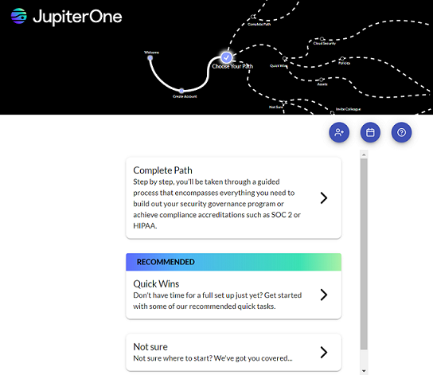
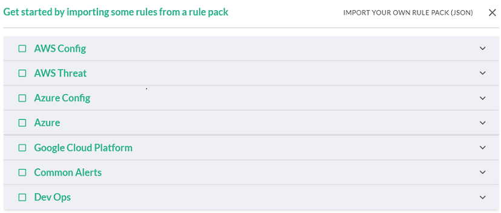
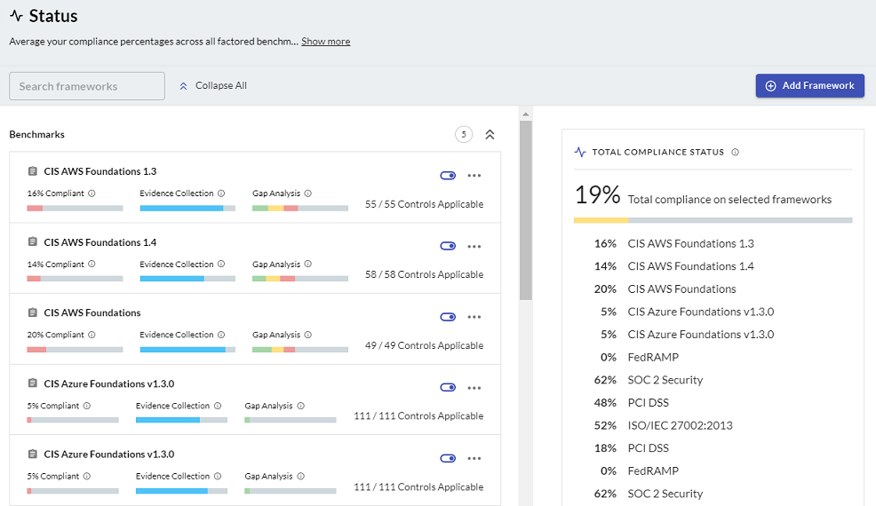
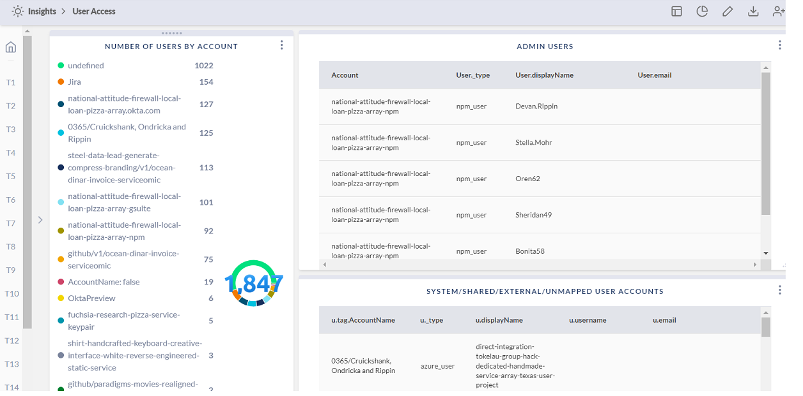

# Practice with the J1 Playground

Before you start working with your organization data, you can use the J1 playground
to get to know the features and functionality.

## Access the Playground

To access the J1 playground:

1. From the J1 landing page, go to Resources   and select **Onboarding**.
2. In the top-right of the onboarding page, click Sample Data .
   ​
   
   ​
3. On the Enable J1 Playground page, click **Get Access** to receive an invitation to the playground.
    ​
    
       ​
4. When you receive the invitation email, click **Signup** or **Login** to get started, and follow the instructions on the Accept Invitation page to get to the playground.
5. You know you are in the playground when the you see a J1 landing page with play as its title in the top-left corner.
   
   ​

You access all of the J1 apps from the home page by clicking . If you need more assistance learning about the J1 user interface, read the [introduction documentation](./j1-what-is-it.md).

To exit from the playground and go back to your production account, click your user icon in the top-right corner and toggle back to your JupiterOne account. 

## Discover Your Assets

Your assets are operational entities such as code repositories, data stores, IAM policies and roles, security controls, people, and even vulnerability findings.

Modern security and visibility requires in-depth knowledge of your cyber assets and the insights that come from the relationships that connect them. J1 Assets provides meaningful context that you can use to strengthen your security program.

Look around at the playground data in J1 Assets by selecting a class and type of asset to filter on. and read more in the [product documentation](./asset-inventory-filters.md). 

## Try Some Queries

J1 provides a [questions library](https://ask.us.jupiterone.io/filter?tagFilter=all) that updates on a regular basis. Have a look and try the queries associated with the questions. 

J1 also provides a JupiterOne Query Language (J1QL) [tutorial](./tutorial-j1ql.md) to get familiar with the concept of queries. In general, you can consider every action that you want to do as a query. 

## Understand Alerts

You can use a  J1QL query for continuous auditing and threat monitoring. To be able to implement alerts, you must configure alerts rules first.  J1 provides some rules pack you can import to play with.

Try editing and running the rules queries and get used to how the interface works.

Read more about alerts in the [documentation](../compliance/compliance-overview.md). Try some alerts queries in the [questions library](https://ask.us.jupiterone.io/filter?tagFilter=all).

## Understand the Compliance Dashboard

Playing with the Compliance app is also one action you should try in the J1 playground. The compliance dashboard enables you to quickly review your compliance status and download evidence against controls, policies, and procedures for HIPAA, SOC 2, PCI, and other frameworks.

In the left navigation pane, click through the controls, frameworks, benchmarks, standards, and evidence uploads to see how they work together. Read more about the Compliance app in the [documentation](../compliance_and-reporting/compliance-overview.md). Try some compliance queries in the [questions library](https://ask.us.jupiterone.io/filter?tagFilter=all).

## Review Insights

JupiterOne Insights enable you to build reporting dashboards using J1QL queries. You can configure each dashboard either as a Team board that is shared with other account users or a Personal board for the individual user.

Read about [how Insights works](../compliance_and-reporting/insights-dashboards.md) and then go to the Insights app to understand which information is provided. You can also try some some insights queries in the [questions library](https://ask.us.jupiterone.io/filter?tagFilter=all).

