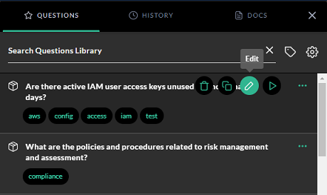
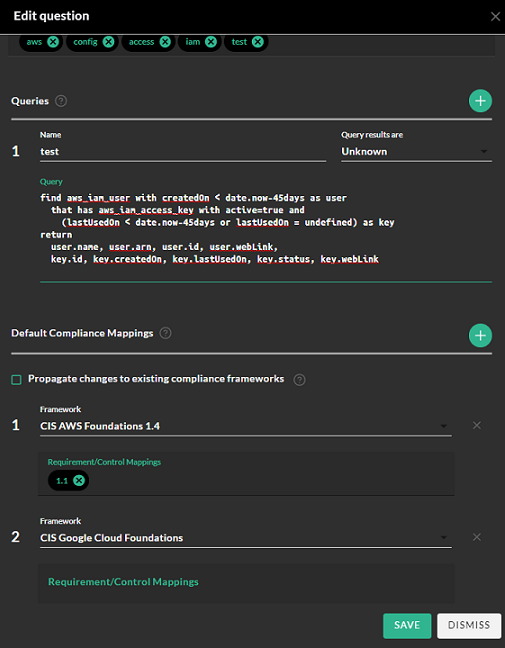

# Get Started with Search

You can quickly search and get insight across your entire digital environment integrated with JupiterOne, from the Search for Anything landing page. There are three modes of search:

- **Ask questions** - you can enter any keywords to search across all packaged and saved questions. 
- **Full-text search** - an easy way to search across all assets based on their property values.
- **JupiterOne query language (J1QL)** is best for detailed querying of assets and relationships. 

You can toggle results in four different display modes: **Table**, **Graph**, **Raw JSON**, or **Pretty JSON**.

**Note**: For performance reasons, search results are limited to return a maximum 250 items. If you believe something is missing from a large result set, try fine-tuning the query to generate more precise results.

## Ask Questions

Enter any keyword or combination of keywords such as these (without quotations):

- compliance
- access
- traffic
- ssh
- data encrypted
- production

Or ask a question like:

- Who are my vendors?
- What lambda functions do I have in AWS?
- What is connected to the Internet?
- Who has access to ...?

## Edit Questions

You can edit any of the questions in the J1 Questions Library to customize the question to your specific requirements. Click the pencil icon.

 

Edit any of the fields, add tags, or modify the query. In addition, you can edit the compliance mappings. When you map a framework and compliance requirement to a question, the next time that framework is imported, the question is added to the requirement

By default, J1 adds [compliance frameworks](../compliance_and-reporting/compliance-import.md) to which your question is mapped. 

 


For each of the mapped frameworks, you can add compliance requirement and control mappings. Click the **Propagate changes to existing compliance frameworks** checkbox if you want to apply your edits to existing frameworks. 

## Full-Text Search

Put your keywords in quotations (for example, "keyword") to start a full text search. Or simply enter your keywords and click **Enter**. For example:

- "sg-123ab45c" finds an AWS EC2 security group with that group ID.
- "Charlie" finds a person and/or user with that first name, and potentially other resources related to that person/user.
- "jupiterone database" finds database entities with property values that include the keyword jupiterone".

## JupiterOne Query Language (J1QL)

You can use the JupiterOne Query Language (J1QL) for searching for anything across all of your entities and relationships.

The basic query structure is:

- Start with an asset:

  `FIND {class or type of an asset}`

- Optionally, add some property filters:

  `WITH {property}={value} AND|OR {property}={value}`

- Get its relationships:

  `THAT {relationship_verb}|RELATES TO {class/type of another asset}`

For example:

```j1ql
FIND * WITH tag.Production='true'
```

The wildcard `*` includes everything.

```j1ql
FIND User THAT IS Person
```

If you do not know the exact relationship, you can just use the keyword `RELATES TO` to cover any or all relationships:

```j1ql
FIND User THAT RELATES TO Person
```

You can name an asset or relationship with an alias with the `AS {something}`. You can then use the alias in `WHERE` for additional filtering or comparison, or in `RETURN` for returning specific properties.

For example:

```j1ql
FIND Firewall AS fw
  THAT ALLOWS AS rule (Network|Host) AS n
WHERE
  rule.ingress=true and rule.fromPort=22
RETURN
  fw._type, fw.displayName, fw.tag.AccountName,
  n._type, n.displayName, n.tag.AccountName
```

The query language is case-insensitive except for the following: 

- `TitleCase` asset keywords after `Find` and the `{relationship verb}`  search for entities of that class. (for example, `CodeRepo`).
- `lowercase` asset keywords after `Find` and the `{relationship verb}`  search for assets of that type. An asset type with more than one word is generally in `snake_case` (for example, `github_repo`).
- Asset property names and values, and alias names defined as part of the query, are case-sensitive. 

Read the [J1QL query tutorial](../jupiterOne-query-language_(J1QL)/tutorial-j1ql.md) and the [complete J1QL documentation](../jupiterOne-query-language_(J1QL)/jupiterOne-query-language.md) for more advanced examples.

## Combining Full-Text Search with J1QL

You can also start with a full text search and then use J1QL to further filter the results from the initial search. For example:

```j1ql
Find "Administrator" with _class='AccessPolicy' that ASSIGNED (User|AccessRole)
```

```j1ql
Find 'security officer' with _type='employee'
```

```j1ql
Find 'roles responsibilities' with _class=('Policy' or 'Procedure')
```

**Note**: Either single quotes (`'`) or double quotes (`"`) work for both full-text search keywords and property string values.
