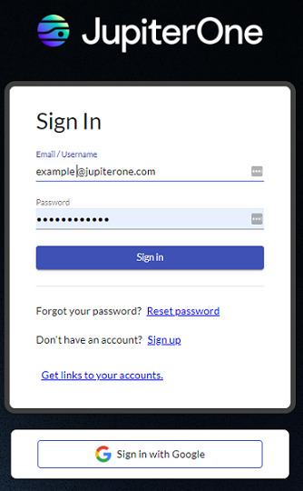

# Access to JupiterOne

This information helps you:

- Reset your password
- Access all your accounts
  ​

 

### Reset Your Password

If you forget your password, click **Reset password**. When you enter your email address, J1 sends you an email with password reset instructions. 

**Note**: Your email address is case-sensitive.

### Access All Your Accounts

For easy access to all your J1 accounts, click **Get links to your accounts**. Enter your email address and click **Get links**.

**Note**: Your email address is case-sensitive.

  

You receive an email containing links to all your organization accounts that you have access. This list includes SSO organization accounts that you must sign in to from the designated URL.

 