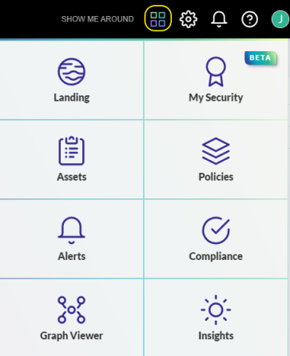

# final test

JupiterOne (J1) is a cloud-native security platform that connects across your siloed security tools, empowering unobstructed visibility into security risks across your entire cyber asset universe. This extensible platform connects the dots between complex relationships and data, providing ultimate visibility to your environment, infrastructure, and operations.

## Using J1 Integrations

The first step in using J1 is to bring your data into J1. There are numerous ready-made integrations that are easy to install and use to achieve end-to-end cyber asset visibility, context, and automation across every dimension of your digital universe. J1 provides [instructions](./configure-integrations.md) on how to import the data to J1 and understand the data model and mapping.

## J1 Apps

JupiterOne has separate apps that assist you in all the major components of security management. Click  to view the apps.

