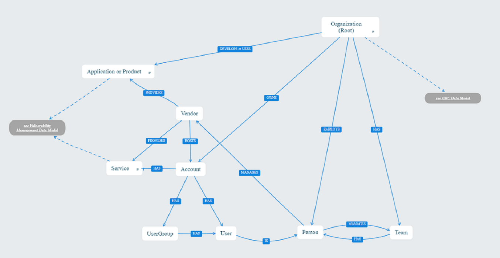

# JupiterOne Data Model for Organization, Account, and Vendor Management

As we build integrations for products that have organization, account, or vendor management features we start with this reference model and attempt to collect these types of entities and map these kinds of relationships so that customers using these products will be able to use the same queries for any product integrated with JupiterOne.  Based on the product and what is available to JupiterOne for import, adjustments are made that will be unique to each product.

