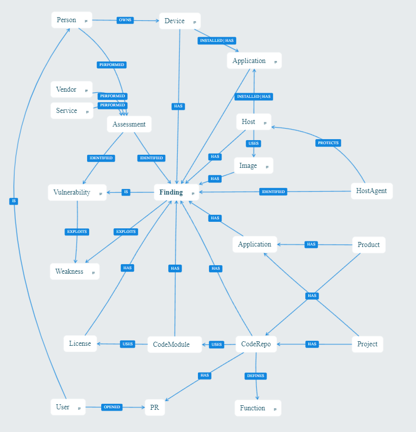

# JupiterOne Data Model for Vulnerability Management

As we build integrations for products that identify findings and vulnerabilities we start with this reference model and attempt to collect these types of entities and map these kinds of relationships so that customers using these products will be able to use the same queries for any integration they have enabled.  Based on the product and what is available to JupiterOne for import, adjustments are made that will be unique to each product.    

