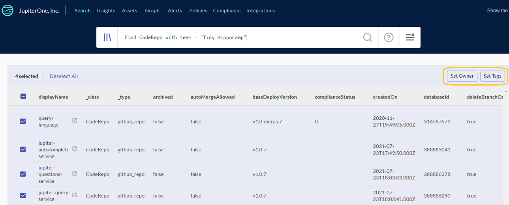

# Query Resources with/without Specific Tags

Tagging is highly recommended for resources in cloud environments such as AWS, Azure, and GCP. For example, it is common to use tags to track `cost-center` or `project`. It is recommended that you assign `classification` tag to all databases and data stores, such as buckets, blobs, disks.

Tags you apply in JupiterOne remain within JupiterOne and do not apply back to the source resources.

## Query Resources with Tags

Use this example query:

```j1ql
Find (Host|Function|DataStore) with [tag.cost-center] = undefined
```

**For tags with special characters such as `-`, use `[ ]` around the tag property:**

```j1ql
Find * with _integrationType = 'aws' and [tag.cost-center] = undefined
```

**Why not just use `Find *` to cover everything?**

`Find *` searches across all resources, including all integrations, mapped entities, and those pushed via API or created via the UI. This query returns _many_ false positives, and makes the query slow.

**More fine tuning to reduce noise:*

Many entities such as `Account`, `Service`, `AccessPolicy` such as`aws_iam_policy` are likely to not have these custom tags applied, so even querying with `_integrationType = 'aws'` generates some noise. However, it is painful to write a query for each resource type -- there could be 100 of them!

This is where leveraging the `class` and combination syntax in the query becomes extremely helpful. For example:

```j1ql
Find (Host|Function|DataStore) with [tag.cost-center] = undefined
```

Still a single query, without the noise. The three classes `Host`, `Function`, and `DataStore` include a couple dozens of types, and covers resources you are not using today but may start using in the future that are of those classes. You can add additional classes to the query as needed.

## Query Resources without Tags

**To find resources that do _not_ have a certain tag, do the following:**

```j1ql
Find * with _integrationType = 'aws' and tag.project = undefined
```

From the above, `undefined` means the property does not exist on the entity. And `_integrationType = 'aws'` filters only resources from AWS. Change it to `azure` or something else as appropriate.

## Bulk Actions from the UI

J1 enables you to bulk set tags from the UI for any resources that you find that do not have the tags or owners. From your query results, select all and click **Set Owner** or **Set Tags**.


 


