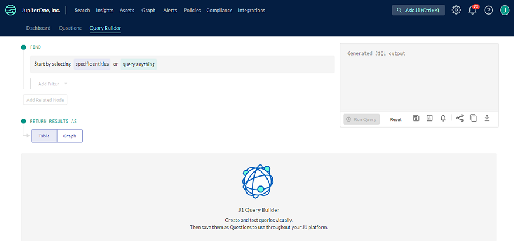

# J1 Query Builder

J1 Query Builder is a tool that provides a visual way to build a query in [J1QL](./jupiterOne-query-language.md) without having to know the language. 

 

To create a query in Query Builder:

1. At the top of the J1 homepage, click the **Query Builder** tab.

2. Click **query anything** if you want to query all of your assets or click **specific entities** to select the exact assets you want to find. You can use the search bar to search assets by their class or type.

3. Click **Add Filter** to filter by a specific property, tag, or metadata. Add an operator and specific value you want to query on, if applicable. You can also filter your assets by filter group [don't understand this]. You can as many filters as you want.

4. Click **RELATES TO** to select from the dropdown menu the [specific relationship verbs](./jupiterOne-query-language.md##basic-keywords) you want to use in your query. You can add as many relationships as you want.

5. Click Table or Graph to choose how you want to return the results. You can toggle between the options by clicking **Run Query** after you make your selection.

6. Click **Run Query** in the box on the right of the page. 

   

Using the icons in the box at the top right of the page, you can:

- Reset the query to start again
- Save the query as a question in the questions library
- Add the query results to [J1 Insights](../compliance_and-reporting/insights-dashboards.md)
- Create an [alert](../security-operations/manage-alerts.md)
- Generate a link to the query that you can share
- Copy the query to the clipboard
- Download the query

